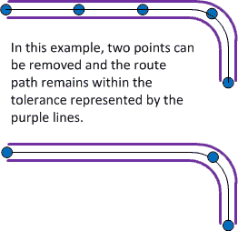

# Calculate a Route

Use the following URL templates to get a walking, driving or transit route by specifying a series of waypoints. A waypoint is a specified geographical location defined by longitude and latitude that is used for navigational purposes. The route includes information such as route instructions, travel duration, travel distance or transit information. You can also request a set of route points.  
  
 See [Calculate a Truck Route](calculate-a-truck-route.md) documentation for information on making truck based routing requests.  
  
 To overlay a route on a static map by using the Imagery API, see [Get a Static Map](../imagery/get-a-static-map.md).  
  
## URL Templates  
  
[!INCLUDE [get-bing-map-key-note](../../includes/get-bing-map-key-note.md)]
  
 You can specify up to 25 waypoints for a route. Each set of waypoints creates a separate route leg. Between any two (2) waypoints, you can have up to 10 intermediate viaWayPoints. ViaWaypoints define the route path and do not create route legs.  
  
 **Find a driving route.**  
  
```url
http://dev.virtualearth.net/REST/v1/Routes?wayPoint.1={wayPpoint1}&viaWaypoint.2={viaWaypoint2}&waypoint.3={waypoint3}&wayPoint.n={waypointN}&heading={heading}&optimize={optimize}&avoid={avoid}&distanceBeforeFirstTurn={distanceBeforeFirstTurn}&routeAttributes={routeAttributes}&timeType={timeType}&dateTime={dateTime}&maxSolutions={maxSolutions}&tolerances={tolerances}&distanceUnit={distanceUnit}&key={BingMapsKey}
```  
  
 **Find a walking, driving or transit route by specifying the mode of travel.**  
  
 For a list of transit agencies, see [Bing Maps Transit Coverage](/bing-maps/docs/coverage/bing-maps-transit-coverage.md). You can request up to three (3) driving or transit route options between two waypoints by using the maxSolutions parameter.  
  
```url 
http://dev.virtualearth.net/REST/v1/Routes/{travelMode}?wayPoint.1={wayPpoint1}&viaWaypoint.2={viaWaypoint2}&waypoint.3={waypoint3}&wayPoint.n={waypointN}&heading={heading}&optimize={optimize}&avoid={avoid}&distanceBeforeFirstTurn={distanceBeforeFirstTurn}&routeAttributes={routeAttributes}&timeType={timeType}&dateTime={dateTime}&maxSolutions={maxSolutions}&tolerances={tolerances}&distanceUnit={distanceUnit}&key={BingMapsKey}
```  
  
### Template Parameters  
  
> [!NOTE]
>  See the [Common Parameters and Types](../common-parameters-and-types/index.md) section for additional common parameters to use with these URLs.  
>   
>  Common parameters include:  
>   
>  -   [Output Parameters](../common-parameters-and-types/output-parameters.md): Includes response output types and the JSON callback parameters.  
> -   [Culture Parameter](../common-parameters-and-types/culture-parameter.md): Includes a list of the supported cultures.  
> -   [User Context Parameters](../common-parameters-and-types/user-context-parameters.md): Includes parameters that set user location and viewport values to help determine locations. For example, these values may help prioritize a set of possible locations when you specify a partial address for a waypoint.  
>   
>  When an alias is provided, you can use the alias to shorten the length of the query parameter. For example, waypoint.1=47.610,-122.107 can be shortened to wp.1=47.610,-122.107.  
>   
>  Parameter values are not case-sensitive.  
  
|Parameter|Alias|Description|Values|  
|---------------|-----------|-----------------|------------|  
|waypoint.n<br /><br /> viaWaypoint.n|wp.n<br /><br /> vwp.n|**waypoint.n: Required.** Specifies two or more locations that define the route and that are in sequential order.<br /><br /> **viaWaypoint.n: Optional** Specifies one or more locations that define intermediate points of a route between waypoints.|A route is defined by a set of waypoints and viaWaypoints (intermediate locations that the route must pass through). The index (n value) for the set of waypoints and viaWaypoints is an integer starting with 0 or 1. The waypoint and viaWaypoint index values must be sequential and must always increment by 1.<br /><br /> Both waypoint and viaWaypoint locations can be specified as a Point, a landmark, or an address. For more information about Point values, see [Location and Area Types](../common-parameters-and-types/location-and-area-types.md).<br /><br /> You can have a maximum of 25 waypoints, and a maximum of 10 viaWaypoints between each set of waypoints. The start and end points of the route cannot be viaWaypoints.<br /><br /> For transit routes and when more than one route is requested (maxSolutions > 1), you must specify only two waypoints, and viaWaypoints are not supported.<br /><br /> **Examples**:<br /><br /> waypoint.1=47.610,-122.107 [Point]<br /><br /> wp.1=Seattle,WA  [landmark]<br /><br /> waypoint.1=1%20Microsoft%20Way%20Redmond%20WA%20 [address]<br /><br /> &waypoint.1=Seattle&viaWaypoint.2=Kirkland&waypoint.3=Redmond [viaWaypoint]<br /><br /> **Incorrect set of waypoints.**<br /><br /> The following set of values is not valid because there is no waypoint.2.<br /><br /> &waypoint.1=San%20Francisco&waypoint.3=Seattle<br /><br /> The following set of values is not valid because a viaWaypoint is specified as the starting waypoint.<br /><br /> &viaWaypoint.1=1%20Microsoft%20Way%20Redmond%20WA&waypoint.2=Bellevue&waypoint.3=Seattle|  
|avoid||**Optional.**Specifies the road types to minimize or avoid when a route is created for the driving travel mode.|A comma-separated list of values from the following list that limit the use of highways and toll roads in the route. In the definitions below, “highway” also refers to a “limited-access highway”.<br /><br /> If no values are specified, highways and tolls are allowed in the route.<br /><br /> -   **highways**: Avoids the use of highways  in the route.<br />-   **tolls**: Avoids the use of toll roads in the route.<br />-   **minimizeHighways**: Minimizes (tries to avoid) the use of highways in the route.<br />-   **minimizeTolls**: Minimizes (tries to avoid) the use of toll roads in the route. **Note:**  If you specify more than one option for a road type, then the most restrictive option is used. For example, if you set the avoid parameter to both highways and minimizeHighways, the highways option is used and all highways are avoided. <br /><br /> **Examples**:<br /><br /> avoid=highways<br /><br /> avoid=highways,tolls|  
|distanceBeforeFirstTurn|dbft|**Optional.** Specifies the distance before the first turn is allowed in the route. This option only applies to the driving travel mode.|An integer distance specified in meters. Use this parameter to make sure that the moving vehicle has enough distance to make the first turn.<br /><br /> **Examples**:<br /><br /> distanceBeforeFirstTurn=500<br /><br /> dbft=500|  
|heading|hd|**Optional.** Specifies the initial heading for the route.|An integer value between 0 and 359 that represents degrees from north where north is 0 degrees and the heading is specified clockwise from north. For example, setting the heading of 270 degrees creates a route that initially heads west.<br /><br /> **Example**:<br /><br /> heading=90|  
|optimize|optmz|**Optional.** Specifies what parameters to use to optimize the route.|One of the following values:<br /><br /> -   **distance**: The route is calculated to minimize the distance. Traffic information is not used.<br />-   **time [default]**: The route is calculated to minimize the time. Traffic information is not used.<br />-   **timeWithTraffic**: The route is calculated to minimize the time and uses current traffic information.<br />-   **timeAvoidClosure**: The route is calculated to minimize the time and avoid road closures. Traffic information is not used in the calculation.<br /><br /> **Example**: optimize=time|  
|routeAttributes|ra|**Optional.** Specify to include or exclude parts of the routes response.|One or more of the following values:<br /><br /> -   **excludeItinerary**: Do not include detailed directions in the response. Detailed directions are provided as itinerary items and contain details such as written instructions and traffic location codes.<br />-   **routePath**: Include a set of point (latitude and longitude) values that describe the route’s path in the response.<br />-   **transitStops**: Include information about transit stops for transit routes.<br />-   **routeSummariesOnly**: Include only travel time and distance for the route, and do not provide other information. Only supported for 2 waypoint routes.<br />-   **all**: Used to specify the following attributes as a group: excluteItinerary, routePath, and transitStops.<br /><br /> **Note**: When you set the routeAttributes parameter, the routePathOutput parameter is ignored.<br /><br /> **Example**: ra=routePath,transitStops|  
|routePathOutput|rpo|**Optional.**  Specifies whether the response should include information about Point (latitude and longitude) values for the route’s path.|**Note**: This is a legacy parameter. The current recommended way to get route points is to use the routeAttributes parameter.<br /><br /> One of the following values:<br /><br /> -   **Points**: A list of Point values for the route’s path is provided in the response.<br />-   **None [default]**: No information about the route’s path is provided in the response.<br /><br /> **Example**: routePathOutput=Points<br /><br /> **Note**: The current recommended way to get route points is to use routeAttributes parameter.<br /><br /> -   The parameter setting routeAttributes=routePath returns the same values as routePathOutput=Points.<br />-   If the routeAttributes parameter is included in the request with any value (not only routePath), the routePathOutput parameter is ignored.|  
|tolerances|tl|**Optional.**  Specifies a series of tolerance values. Each value produces a subset of points that approximates the route that is described by the full set of points.<br /><br /> This parameter is only valid when the routePathOutput parameter is set to Points.|A set of comma-separated double values. Each value specifies a tolerance that is used to reduce the number of points needed to display a route on a map and still maintain the route shape. If a point is removed and the new route still falls within the specified tolerance of the old route, then the point is not included in the subset of points returned for that tolerance.<br /><br /> You may find it useful to define tolerances for different zoom levels, screen resolutions or other display parameters.<br /><br /> You can specify a maximum of seven (7) tolerance values.<br /><br /> The tolerance is specified in degrees. A degree of latitude is approximately 60 nautical miles, 111 kilometers or 69 statute miles. Therefore, a tolerance value of 0.00001 represents a distance of about one (1) meter in the north-south direction. The distance represented by a degree of longitude varies with latitude. For example at 45 degrees of longitude, a degree of latitude is 111.132 km and a degree of longitude is 78.847 km. At the equator, these values are almost equal with latitude at 100.754 km and longitude at 111.320 km. As you approach the poles, the distance associated with a degree of latitude decreases, and fewer points will be excluded for the same tolerance value. For more information about how longitude distances change with latitude, see [Longitude (Wikipedia)](http://en.wikipedia.org/wiki/Longitude).<br /><br /> The following diagram illustrates how a tolerance value is used.<br /><br /> <br /><br /> **Example**: tl=0.00000344978|  
|distanceUnit|du|**Optional.** The units to use for distance in the response.|One of the following values:<br /><br /> -   Mile or mi<br />-   Kilometer or km **[default]**<br /><br /> **Example**: distanceUnit=mi|  
|dateTime|dt|**Required when the travel mode is Transit**. The dateTime parameter identifies the desired transit time, such as arrival time or departure time. The transit time type is specified by the timeType parameter.<br /><br /> **Optional for Driving**. When specified and the route is optimized for timeWithTraffic, predictive traffic data is used to calculate the best route for the specified date time.|A string that contains the date and time formatted as a [DateTime](http://msdn.microsoft.com/en-us/library/03ybds8y.aspx) value. For information about the string representation options for DateTime values, see [DateTime.Parse Method (String)](http://msdn.microsoft.com/en-us/library/1k1skd40.aspx).<br /><br /> **Examples**:<br /><br /> -   dateTime=03/01/2011 05:42:00<br />-   dateTime=05:42:00 [assumes the current day]<br />-   dateTime=03/01/2011 [assumes the current time]|  
|timeType|tt|**Required when the travel mode is Transit** Specifies how to interpret the date and transit time value that is specified by the dateTime parameter.|One of the following values:<br /><br /> -   **Arrival**: The dateTime parameter contains the desired arrival time for a transit request.<br />-   **Departure**: The dateTime parameter contains the desired departure time for a transit request.<br />-   **LastAvailable**: The dateTime parameter contains the latest departure time available for a transit request.|  
|maxSolutions|maxSolns|**Optional**. Specifies the maximum number of transit or driving routes to return.|A string that contains an integer value between 1 and 3. The default value is 1.<br /><br /> **Example**: maxSolns=3 **Note:**  This parameter is available for the Driving and Transit travel modes for routes between two waypoints. This parameter does not support routes with more than two waypoints. For driving routes, you must not set the `avoid` and `distanceBeforeFirstTurn` parameters. The maxSolutions parameter is supported for routes in the United States, Canada, Mexico, United Kingdom, Australia, and India.|  
|travelMode||**Optional.** The mode of travel for the route.|One of the following values:<br /><br /> -   Driving **[default]**<br />-   Walking<br />-   Transit|  
  
## Response  
 A Route resource is returned when you make a request with one of the following URLs. For more information about the Route resource, see [Route Data](../routes/route-data.md). For more information about the common response syntax for the Bing Maps REST Services, see [Common Response Description](../common-response-description.md). JSON and XML responses are provided for the URL examples in the following section.  
  
 These URLs support JSON (application/json) and XML (application/xml) response formats. A JSON response is provided by default, unless you request XML output by setting the output (o) parameter. For more information, see [Output Parameters](../common-parameters-and-types/output-parameters.md).  
  
## Examples  
 **Find a driving route.**  
  
 The following example shows how to request a driving route between two locations that minimizes the use of toll roads. To view the complete XML and JSON responses, see [Driving Route Example](../examples/driving-route-example.md).  
  
```url
http://dev.virtualearth.net/REST/V1/Routes/Driving?o=xml&wp.0=london&wp.1=leeds&avoid=minimizeTolls&key=BingMapsKey  
```  
  
 **Find a driving route that includes an intermediate route point (viaWaypoint).**  
  
 The following example shows how to request a driving route between two locations that includes an intermediate viaWaypoint. ViaWaypoints are used to direct a route through specific locations and do not create a new route leg like waypoints.  
  
```url
http://dev.virtualearth.net/REST/V1/Routes/Driving?o=xml&wp.0=Seattle,WA&vwp.1=Portland,OR&wp.2=Bend,OR&avoid=minimizeTolls&key=BingMapsKey  
```  
  
 **Find a walking route that minimizes distance.**  
  
 This example returns a walking route from the Eiffel Tower to the Louvre Museum in Paris, France. The route is optimized for distance and returns the results in XML. To view the complete XML and JSON responses, see [Walking Route Example](../examples/walking-route-example.md).  
  
```url
http://dev.virtualearth.net/REST/V1/Routes/Walking?wp.0=Eiffel%20Tower&wp.1=louvre%20museum&optmz=distance&output=xml&key=BingMapsKey  
```  
  
 **Find a transit route.**  
  
 The following example shows how to request a transit route between the Golden Gate Bridge and Fisherman’s Wharf in San Francisco for 3 PM on the current day. To view the complete XML and JSON responses, see [Transit Route Example](../example/transit-route-example.md).  
  
```url
%http://dev.virtualearth.net/REST/V1/Routes/Transit?wp.0=Golden%20Gate%20Bridge&wp.1=Fishermans%20Wharf&timeType=Departure&dateTime=3:00:00PM&output=xml&key=BingMapsKey  
```  
  
 **Find up to three driving route options between New York, NY and Philadelphia, PA.**  
  
 The following example requests up to three (3) driving route options between New York, New York and Philadelphia, Pennsylvania.  
  
```url
http://dev.virtualearth.net/REST/V1/Routes?wp.0=New%20York,NY&wp.1=Philadelphia,PA&maxSolns=3&key=BingMapsKey  
```  
  
 **Find up to three driving route options between New York, NY and Philadelphia, PA.**  
  
 The following example requests up to three (3) driving route options between New York, New York and Philadelphia, Pennsylvania and exclude detailed instructions for alternate routes.  
  
```url
http://dev.virtualearth.net/REST/V1/Routes?wp.0=New%20York,NY&wp.1=Philadelphia,PA&maxSolns=3&mfa=1&key=BingMapsKey  
```  
  
 **Two ways to specify waypoints for a driving route: Point (latitude and longitude coordinates) and location names.**  
  
 The following two examples show how to request a route between San Francisco and San Diego by using latitude and longitude coordinates and by using location names.  
  
```url
http://dev.virtualearth.net/REST/V1/Routes?wp.0=37.779160067439079,-122.42004945874214&wp.1=32.715685218572617,-117.16172486543655&key=BingMapsKey  
```  
  
```url
http://dev.virtualearth.net/REST/V1/Routes?wp.0=San%20Francisco&wp.1=San%20Diego&key=BingMapsKey  
```  
  
 **Find a driving route between Redmond, Washington and Seattle, Washington that specifies an initial heading of 90 degrees (east) and that requests the results uses miles as the distance unit.**  
  
```url
http://dev.virtualearth.net/REST/v1/Routes/Driving?waypoint.0=redmond&heading=90&waypoint.1=seattle&du=mi&key=BingMapsKey  
```  
  
 **Find a walking route between two addresses.**  
  
 This example shows how to request a walking route between two addresses.  
  
```url
http://dev.virtualearth.net/REST/V1/Routes/Walking?wp.0=11025%20NE%208th%20St%20Bellevue%20WA&wp.1=700%20Bellevue%20Way%20NE%20Bellevue WA&key=BingMapsKey  
```  
  
 **Find a driving route that minimizes the distance and specifies that the first turn must be at least 500 meters from the starting point.**  
  
 The following example optimizes a route between two locations for distance. The first turn on the route must be 500 meters or more from the starting point.  
  
```url
http://dev.virtualearth.net/REST/V1/Routes?wp.0=11025%20NE%208th%20St%20Bellevue&wp.1=1%20Microsoft%20Way%20Redmond%20WA&optmz=distance&dblt=500&key=BingMapsKey  
```  
  
 **Find a driving route that minimizes travel time based on current traffic conditions.**  
  
 The following example optimizes a route between two locations and takes the current traffic conditions into account.  
  
```url
http://dev.virtualearth.net/REST/V1/Routes?wp.0=Bellevue,WA&wp.1=Bothell,WA&optmz=timeWithTraffic&key=BingMapsKey  
```  
  
 **Find a driving route that does not use highways or toll roads.**  
  
 The following example returns a driving route between the cities of Buffalo and Syracuse in New York State. The avoid parameter specifies to not use toll roads or highways. Therefore, the returned route does not use the interstate highway I-90 which would otherwise be part of the route.  
  
```url
http://dev.virtualearth.net/REST/V1/Routes/Driving?wp.0=Buffalo&wp.1=Syracuse&avoid=tolls,highways&key=BingMapsKey  
  
```  
  
 **Find a driving route and request a set of points that define the route.**  
  
 This example returns a driving route from the Minneapolis, Minnesota to St. Paul, Minnesota. The route is optimized for distance and requests point values for the route’s path. The results are returned in JSON. To view the complete XML and JSON responses, see [Driving Route with Route Path Example](../examples/driving-route-with-route-path-example.md).  
  
```url
http://dev.virtualearth.net/REST/V1/Routes/Driving?wp.0=Minneapolis,MN&wp.1=St%20Paul,MN&optmz=distance&routeAttributes=routePath&key=BingMapsKey  
```  
  
 **Find a driving route and exclude the detailed directions (itinerary items).**  
  
 This example returns a driving route from the Minneapolis, Minnesota to St. Paul, Minnesota, and excludes the detailed itinerary items from the response.  
  
```url
http://dev.virtualearth.net/REST/V1/Routes/Driving?wp.0=Minneapolis,MN&wp.1=St%20Paul,MN&routeAttributes=excludeItinerary&key=BingMapsKey  
```  
  
 **Find a driving route and request a route path and a subset of route path points based on tolerance values.**  
  
 This example returns a driving route from the Minneapolis, Minnesota to St. Paul, Minnesota. The route is optimized for distance and requests point values for the route’s path. In addition to the full set of route points, a list of tolerances is specified. For each tolerance value, a subset of points is returned in the response. The route defined by each subset of points approximates the route defined by all the points. The difference allowed between the two routes is defined by the tolerance value. To view examples of these subsets of points in the response, see [Driving Route using Tolerances Example](../examples/driving-route-using-tolerances-example.md).  
  
```url
http://dev.virtualearth.net/REST/V1/Routes/Driving?o=xml&wp.0=44.979035,-93.26493&wp.1=44.943828508257866,-93.09332862496376&optmz=distance&routeAttributes=routePath&tl=0.00000344978,0.0000218840,0.000220577,0.00188803,0.0169860,0.0950130,0.846703&key=BingMapsKey  
```  
  
## HTTP Status Codes  
  
[!INCLUDE [get-status-code-note](../../includes/get-status-code-note.md)]
  
 When the request is successful, the following HTTP status code is returned.  
  
-   200  
  
 When the request is not successful, the response returns one of the following errors.  
  
-   400    
-   401    
-   404    
-   500    
-   503  
  
## See Also  
 * [Driving Route Example](../examples/driving-route-example.md)   
 * [Walking Route Example](../examples/walking-route-example.md)   
 * [Transit Route Example](../examples/transit-route-example.md)   
 * [Driving Route with Route Path Example](../examples/driving-route-with-route-path-example.md)   
 * [Driving Route using Tolerances Example](../examples/driving-route-using-tolerances-example.md)
