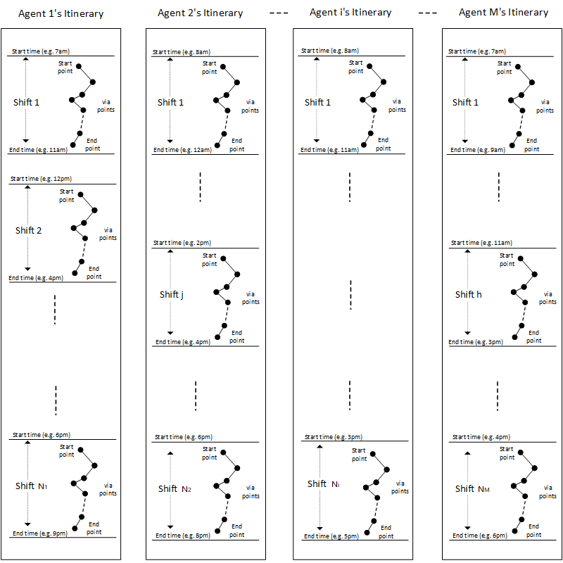

# Optimized Itinerary

The Bing Maps Optimize Itinerary API returns an itinerary schedule for one or more agents to travel between multiple itinerary items. Each agent has one or more working shifts (e.g. an agent with a lunch break will have at least two shifts every day: the shifts before and after lunch). In the response, the API returns for each agent the delivery locations, expected delivery durations, and driving directions for each item assigned to that agent. Item schedules are optimized by either driving distance, delivery time, or item priorities.

A maximum of two agent shifts are allowed for synchronous Optimize Itinerary API requests, meaning that only either 

- (a) two agents, each with a single shift, or 
- (b) a single agent with two or fewer shifts 

can be used with synchronous calls. For synchronous calls, there is also a maximum of twenty (20) itinerary items.

If more than two shifts or agents need to be scheduled, an asynchronous request must be used. With asynchronous requests, a total of fifteen of fewer shifts are allowed, and up to one hundred itinerary items may be scheduled.  

This API is ideal for solving delivery scheduling problems. For example, a city office could use this service to schedule inspections for food safety officials. Each official will have variable shifts throughout the day during which time they will travel from business to business in the city to carry out inspections. Care must be made during scheduling to ensure that each inspector has enough time to finish their inspection during each restaurant's or food truck's business hours. In this scenario, there could be `M` food inspectors (where `M < 16`) where each inspector has one more shifts and the number of shifts shall not exceed one hundred. 

Below is a visual representation of each of the `M` agents and their assigned itineraries, where each agent `1`, `2`, ..., `M` can have a variable number of shifts `4`, `X`, ..., `Z`.



For a more in-depth example of the Multi-Itinerary API, see [Create an Optimized Itinerary](../../articles/create-an-optimized-itinerary.md).

The Optimize Itinerary API supports both HTTP GET and POST requests, and successful requests return an `OptimizedItineray` resource which includes a list of agent itineraries with travel instructions and route information. 

For more information about these resources, see [Optimized Itinerary Data](optimized-itinerary-Data.md).

See [Asynchronous Requests](../common-parameters-and-types/asynchronous-requests.md) for how to use Bing Maps REST asynchronous requests.

## API Templates

> [!NOTE]
> 
> We recommend that developers keep URLs under 2083 characters in length, and for Optimized Itinerary API URL requests with many agents and item waypoints, an HTTP POST request should be used instead of an HTTP GET request.

### Synchronous GET Optimize Itinerary

Get a synchronous optimized itinerary from agent shift and waypoint item lists specified with the `itineraryAgents` and `itineraryItems` parameters.

```url
https://dev.virtualearth.net/REST/V1/Routes/OptimizeItinerary?itineraryAgents={Agent/Shift Information}&itineraryItems={Waypoint Items}&type={type}&roadnetwork={roadnetwork}&costvalue={value}&key={BingMapsKey}
```
### Synchronous POST Optimize Itinerary

Send an HTTP POST synchronous request to get an optimized itinerary from agent shift and waypoint item lists specified with the `itineraryAgents` and `itineraryItems` parameters.

POST header: `Content-Type: application/json`

```url
https://dev.virtualearth.net/REST/V1/Routes/OptimizeItinerary?key={BingMapsKey}
```

Here is a template POST body, in JSON format, which should be used for both synchronous and asynchronous POST requests: 

```json
{
    "agents": [
        {
            "name": "agentName",
            "shifts": [
                {
                    "startTime": "...",
                    "startLocation": {
                        "latitude": ...,
                        "longitude": ...
                    },
                    "endTime": "...",
                    "endLocation": {
                        "latitude": ...,
                        "longitude": ...
                    }
                }
            ]
        }
    ],
    "itineraryItems": [
        {
            "openingTime": "...",
            "closingTime": "...",
            "dwellTime": "...",
            "priority": ...,
            "location": {
                "latitude": ...,
                "longitude": ...
            }
        }
    ]
}
```

### Asynchronous GET Optimize Itinerary 

Get an asynchronous optimized itinerary from agent shift and item itinerary information specified with the `itineraryAgents` and `itineraryItems` parameters.


```url
https://dev.virtualearth.net/REST/V1/Routes/OptimizeItineraryAsync
```
### Asynchronous POST Optimize Itinerary 

Post an asynchronous optimized itinerary from agent shift and item itinerary information specified with the `itineraryAgents` and `itineraryItems`. parameters in the POST body of the URL request. 

```url
https://dev.virtualearth.net/REST/V1/Routes/OptimizeItineraryAsync?key={BingMapsKey}
```

## API Parameters

There are two basic parameters for the Optimize Itinerary API: 

- `itineraryAgents`: a *list of agent shift information* which includes the name, shift times and shift starting and ending locations for agent, and 
- `itineraryItems`: a *list of item information* with location, priority, and dwell time, and business closing and opening times for each item to be scheduled.

The information for these parameters must be formatted using the following syntactic signatures:

|Parameter | Syntax Signature |
|------:|:-----------------|
|`itineraryAgents` |`{agent_name}_{shift_0};{shift_1}; ... {shift_n};`|
|`shift_n`|`{start_time}`&#124;`{start_lat,lon}`&#124;`{end_time}`&#124;`{end_lat,lon}`|
|`itineraryItems`| `{opening_time}_{closing_time}_{dwell_time}_{lat,lon}_{priority}`|

> [!NOTE]
>
> The dwell time is the total estimated time a visit to a scheduled item will take, and  priority must be an integer between `1` and `100`, inclusive.


Here is the list of parameters.

|Parameter|Alias|Description|Values|
|:-------:|:---:|-----------|------|
|`itineraryAgents`|`itinAgt` | **Required**. List of agent itinerary information. | A semi-colon separated string of Agent/Shift information. See below for examples.|
|`itineraryItems`|`itinItm` | **Required**. List of itinerary items to be scheduled among the specified agents. | A semi-colon separated list of Itinerary Items. See below for examples.|
|`type`| | **Optional**. Specifies whether traffic data should used to optimize the order of waypoint items. | A string with the following values:<br /><br />- `SimpleRequest` [**Default**]: No traffic data is used.<br /><br />- `TrafficRequest`: Traffic data is used.|
|`roadnetwork`|`rn` | **Optional**. If `true`, uses actual road network information, and both travel distances and travel times between the itinerary locations to calculate optimizations. If `false`, a constant radius is used to measure distances and a constant travel speed is used to calculate travel times between locations. | A string, either `true` or `false`.|
|`costvalue`|`cv` | **Optional**. The parameter used to optimize itineraries. | A string, with one of the following values:<br /><br />- `TravelTime`: Optimize according to travel time.<br />- `Distance`: Optimize according to distance traveled.<br />- `Priority`: Optimize according to item priorities. |

## Responses

See [Optimized Itinerary Data](optimized-Itinerary-data.md) for information on response data.

## Examples

The Optimized Itinerary API uses a special syntax to specify the working shifts for each agent and item information. For example, suppose we have two agents, which we'll name `agentX` and `agentY`, with the following shift and location information. Locations can be specified using coordinates or an address string, and times are given in local datetime strings.

|Agent|Shift Start Time|Start Location|Shift End Time|End Location|
|:---:|----------------|--------------|--------------|------------|
|`agentX`|`11/09/2017+08:00:00`|`47.694117204371,-122.378188970181`|`11/09/2017+20:00:00`|`47.7070790545669,-122.355226696231`|
|`agentY`|`11/09/2017+08:00:00`|`47.694117204371,-122.378188970181`|`11/09/2017+20:00:00`|`1317 E Republican St, Seattle, WA 98102`|

This information is expressed in the Agent/Shift information format below:

```url
itineraryAgents=
    agentX_11/09/2017+08:00:00|47.694117204371,-122.378188970181|11/09/2017+20:00:00|47.7070790545669,-122.355226696231;
    agentY_11/09/2017+08:00:00|47.694117204371,-122.378188970181|11/09/2017+20:00:00|1317 E Republican St, Seattle, WA 98102
```

The following are sample Itinerary Items information. 

Opening Time|Closing Time|Dwell Time|Location|Priority|
|------------|------------|----------|--------|--------|
|`11/09/2017+09:00:00`| `11/09/2017+18:00:00` | `01:31:08.3850000`| `47.692290770423,-122.385954752402` | 5 |
|`11/09/2017+09:00:00` | `11/09/2017+18:00:00` | `01:00:32.6770000` | `47.6798098928389,-122.383036445391` | 88 |
|`11/09/2017+09:00:00`|`11/09/2017+18:00:00`|`01:18:33.1900000` | `47.6846639223203,-122.364839942855` | 1|
|`11/09/2017+09:00:00` | `11/09/2017+18:00:00` | `01:04:48.7630000` | `47.6867440824094,-122.354711700877` | 3|
|`11/09/2017+09:00:00` | `11/09/2017+18:00:00` | `02:34:48.5430000` | `47.6962193175262,-122.342180147243` | 16 |

These itinerary items are expressed using the API syntax signature as follows:

```url
itineraryItems=
    11/09/2017+09:00:00_11/09/2017+18:00:00_01:31:08.3850000_47.692290770423,-122.385954752402_5;
    11/09/2017+09:00:00_11/09/2017+18:00:00_01:00:32.6770000_47.6798098928389,-122.383036445391_88;
    11/09/2017+09:00:00_11/09/2017+18:00:00_01:18:33.1900000_47.6846639223203,-122.364839942855_1;
    11/09/2017+09:00:00_11/09/2017+18:00:00_01:04:48.7630000_47.6867440824094,-122.354711700877_3;
    11/09/2017+09:00:00_11/09/2017+18:00:00_02:34:48.5430000_47.6962193175262,-122.342180147243_16
```

### Synchronous GET Optimize Itinerary Example

Using the above example, the HTTP GET request URL is as follows:

```url
http://dev.virtualearth.net/REST/V1/Routes/OptimizeItinerary?itineraryAgents=%20agentName_11/09/2017+08:00:00|47.694117204371,-122.378188970181|11/09/2017+11:00:00|47.7070790545669,-122.355226696231_11/09/2017+13:00:00|47.694117204371,-122.378188970181|11/09/2017+19:00:00|47.7070790545669,-122.355226696231&itineraryItems=11/09/2017+09:00:00_11/09/2017+18:00:00_01:31:08.3850000_47.692290770423,-122.385954752402_5;11/09/2017+09:00:00_11/09/2017+18:00:00_01:00:32.6770000_47.6798098928389,-122.383036445391_88;11/09/2017+09:00:00_11/09/2017+18:00:00_01:18:33.1900000_47.6846639223203,-122.364839942855_1;11/09/2017+09:00:00_11/09/2017+18:00:00_01:04:48.7630000_47.6867440824094,-122.354711700877_3;11/09/2017+09:00:00_11/09/2017+18:00:00_02:34:48.5430000_47.6962193175262,-122.342180147243_16&key=k{BingMapsAPIKey}
```

The Synchronous JSON response is below:

```json
{
  "authenticationResultCode": "ValidCredentials",
  "brandLogoUri": "http://dev.virtualearth.net/Branding/logo_powered_by.png",
  "copyright": "Copyright © 2018 Microsoft and its suppliers. All rights reserved. This API cannot be accessed and the content and any results may not be used, reproduced or transmitted in any manner without express written permission from Microsoft Corporation.",
  "resourceSets": [
    {
      "estimatedTotal": 1,
      "resources": [
        {
          "__type": "OptimizeItinerary:http://schemas.microsoft.com/search/local/ws/rest/v1",
          "agentItineraries": [
            {
              "agent": {
                "name": " agentName",
                "shifts": [
                  {
                    "endLocation": {
                      "latitude": 47.7070790545669,
                      "longitude": -122.355226696231
                    },
                    "endTime": "2017-11-09T11:00:00",
                    "startLocation": {
                      "latitude": 47.694117204371,
                      "longitude": -122.378188970181
                    },
                    "startTime": "2017-11-09T08:00:00"
                  },
                  {
                    "endLocation": {
                      "latitude": 47.7070790545669,
                      "longitude": -122.355226696231
                    },
                    "endTime": "2017-11-09T19:00:00",
                    "startLocation": {
                      "latitude": 47.694117204371,
                      "longitude": -122.378188970181
                    },
                    "startTime": "2017-11-09T13:00:00"
                  }
                ]
              },
              "instructions": [
                {
                  "distance": 0,
                  "instructionType": "LeaveFromStartPoint",
                  "itineraryItem": {
                    "closingTime": "0001-01-01T00:00:00",
                    "dwellTime": "00:00:00",
                    "location": {
                      "latitude": 47.694117204371,
                      "longitude": -122.378188970181
                    },
                    "openingTime": "0001-01-01T00:00:00",
                    "priority": 0
                  },
                  "startTime": "2017-11-09T08:55:00"
                },
                {
                  "distance": 2037,
                  "duration": "00:05:00",
                  "endTime": "2017-11-09T09:00:00",
                  "instructionType": "TravelBetweenLocations",
                  "startTime": "2017-11-09T08:55:00"
                },
                {
                  "distance": 0,
                  "duration": "01:18:00",
                  "endTime": "2017-11-09T10:18:00",
                  "instructionType": "VisitLocation",
                  "itineraryItem": {
                    "closingTime": "2017-11-09T18:00:00",
                    "dwellTime": "01:18:33.1900000",
                    "location": {
                      "latitude": 47.6846639223203,
                      "longitude": -122.364839942855
                    },
                    "openingTime": "2017-11-09T09:00:00",
                    "priority": 1
                  },
                  "startTime": "2017-11-09T09:00:00"
                },
                {
                  "distance": 3025,
                  "duration": "00:06:00",
                  "endTime": "2017-11-09T10:24:00",
                  "instructionType": "TravelBetweenLocations",
                  "startTime": "2017-11-09T10:18:00"
                },
                {
                  "distance": 0,
                  "instructionType": "ArriveToEndPoint",
                  "itineraryItem": {
                    "closingTime": "0001-01-01T00:00:00",
                    "dwellTime": "00:00:00",
                    "location": {
                      "latitude": 47.7070790545669,
                      "longitude": -122.355226696231
                    },
                    "openingTime": "0001-01-01T00:00:00",
                    "priority": 0
                  },
                  "startTime": "2017-11-09T10:24:00"
                },
                {
                  "distance": 0,
                  "instructionType": "LeaveFromStartPoint",
                  "itineraryItem": {
                    "closingTime": "0001-01-01T00:00:00",
                    "dwellTime": "00:00:00",
                    "location": {
                      "latitude": 47.694117204371,
                      "longitude": -122.378188970181
                    },
                    "openingTime": "0001-01-01T00:00:00",
                    "priority": 0
                  },
                  "startTime": "2017-11-09T13:00:00"
                },
                {
                  "distance": 3300,
                  "duration": "00:07:00",
                  "endTime": "2017-11-09T13:07:00",
                  "instructionType": "TravelBetweenLocations",
                  "startTime": "2017-11-09T13:00:00"
                },
                {
                  "distance": 0,
                  "duration": "02:34:00",
                  "endTime": "2017-11-09T15:41:00",
                  "instructionType": "VisitLocation",
                  "itineraryItem": {
                    "closingTime": "2017-11-09T18:00:00",
                    "dwellTime": "02:34:48.5430000",
                    "location": {
                      "latitude": 47.6962193175262,
                      "longitude": -122.342180147243
                    },
                    "openingTime": "2017-11-09T09:00:00",
                    "priority": 16
                  },
                  "startTime": "2017-11-09T13:07:00"
                },
                {
                  "distance": 4966,
                  "duration": "00:09:00",
                  "endTime": "2017-11-09T15:50:00",
                  "instructionType": "TravelBetweenLocations",
                  "startTime": "2017-11-09T15:41:00"
                },
                {
                  "distance": 0,
                  "duration": "01:00:00",
                  "endTime": "2017-11-09T16:50:00",
                  "instructionType": "VisitLocation",
                  "itineraryItem": {
                    "closingTime": "2017-11-09T18:00:00",
                    "dwellTime": "01:00:32.6770000",
                    "location": {
                      "latitude": 47.6798098928389,
                      "longitude": -122.383036445391
                    },
                    "openingTime": "2017-11-09T09:00:00",
                    "priority": 88
                  },
                  "startTime": "2017-11-09T15:50:00"
                },
                {
                  "distance": 2942,
                  "duration": "00:06:00",
                  "endTime": "2017-11-09T16:56:00",
                  "instructionType": "TravelBetweenLocations",
                  "startTime": "2017-11-09T16:50:00"
                },
                {
                  "distance": 0,
                  "duration": "01:04:00",
                  "endTime": "2017-11-09T18:00:00",
                  "instructionType": "VisitLocation",
                  "itineraryItem": {
                    "closingTime": "2017-11-09T18:00:00",
                    "dwellTime": "01:04:48.7630000",
                    "location": {
                      "latitude": 47.6867440824094,
                      "longitude": -122.354711700877
                    },
                    "openingTime": "2017-11-09T09:00:00",
                    "priority": 3
                  },
                  "startTime": "2017-11-09T16:56:00"
                },
                {
                  "distance": 2306,
                  "duration": "00:04:00",
                  "endTime": "2017-11-09T18:04:00",
                  "instructionType": "TravelBetweenLocations",
                  "startTime": "2017-11-09T18:00:00"
                },
                {
                  "distance": 0,
                  "instructionType": "ArriveToEndPoint",
                  "itineraryItem": {
                    "closingTime": "0001-01-01T00:00:00",
                    "dwellTime": "00:00:00",
                    "location": {
                      "latitude": 47.7070790545669,
                      "longitude": -122.355226696231
                    },
                    "openingTime": "0001-01-01T00:00:00",
                    "priority": 0
                  },
                  "startTime": "2017-11-09T18:04:00"
                }
              ],
              "route": {
                "endLocation": {
                  "latitude": 47.7070790545669,
                  "longitude": -122.355226696231
                },
                "endTime": "2017-11-09T18:04:00",
                "startLocation": {
                  "latitude": 47.694117204371,
                  "longitude": -122.378188970181
                },
                "startTime": "2017-11-09T08:55:00",
                "totalTravelDistance": 18576,
                "totalTravelTime": "00:37:00",
                "wayPoints": [
                  {
                    "latitude": 47.6846639223203,
                    "longitude": -122.364839942855
                  },
                  {
                    "latitude": 47.7070790545669,
                    "longitude": -122.355226696231
                  },
                  {
                    "latitude": 47.694117204371,
                    "longitude": -122.378188970181
                  },
                  {
                    "latitude": 47.6962193175262,
                    "longitude": -122.342180147243
                  },
                  {
                    "latitude": 47.6798098928389,
                    "longitude": -122.383036445391
                  },
                  {
                    "latitude": 47.6867440824094,
                    "longitude": -122.354711700877
                  }
                ]
              }
            }
          ],
          "isAccepted": true,
          "isCompleted": true
        }
      ]
    }
  ],
  "statusCode": 200,
  "statusDescription": "OK",
  "traceId": "8d73bf71acc04e29b302869bd02fb09a|CO3C4CD6C0|7.7.0.0"
}
```

And here is the same response, but formatted in XML: 

```xml
<Response>
    <Copyright>Copyright © 2018 Microsoft and its suppliers. All rights reserved. This API cannot be accessed and the content and any results may not be used, reproduced or transmitted in any manner without express written permission from Microsoft Corporation.</Copyright>
    <BrandLogoUri>http://dev.virtualearth.net/Branding/logo_powered_by.png</BrandLogoUri>
    <StatusCode>200</StatusCode>
    <StatusDescription>OK</StatusDescription>
    <AuthenticationResultCode>ValidCredentials</AuthenticationResultCode>
    <TraceId>ac04051a05f84c37a42bc961aa08ea1a|CO3C4CD6C0|7.7.0.0</TraceId>
    <ResourceSets>
        <ResourceSet>
            <EstimatedTotal>1</EstimatedTotal>
            <Resources>
                <Resource xsi:type="OptimizeItinerary">
                    <AgentItineraries>
                        <OptimizeAgentItinerary>
                            <Agent>
                                <Name> agentName</Name>
                                <Shifts>
                                    <OptimizeShift>
                                        <StartTime>2017-11-09T08:00:00</StartTime>
                                        <StartLocation>
                                            <Latitude>47.694117204371</Latitude>
                                            <Longitude>-122.378188970181</Longitude>
                                        </StartLocation>
                                        <EndTime>2017-11-09T11:00:00</EndTime>
                                        <EndLocation>
                                            <Latitude>47.7070790545669</Latitude>
                                            <Longitude>-122.355226696231</Longitude>
                                        </EndLocation>
                                    </OptimizeShift>
                                    <OptimizeShift>
                                        <StartTime>2017-11-09T13:00:00</StartTime>
                                        <StartLocation>
                                            <Latitude>47.694117204371</Latitude>
                                            <Longitude>-122.378188970181</Longitude>
                                        </StartLocation>
                                        <EndTime>2017-11-09T19:00:00</EndTime>
                                        <EndLocation>
                                            <Latitude>47.7070790545669</Latitude>
                                            <Longitude>-122.355226696231</Longitude>
                                        </EndLocation>
                                    </OptimizeShift>
                                </Shifts>
                            </Agent>
                            <Instructions>
                                <OptimizeItineraryInstruction>
                                    <InstructionType>LeaveFromStartPoint</InstructionType>
                                    <ItineraryItem>
                                        <OpeningTime>0001-01-01T00:00:00</OpeningTime>
                                        <ClosingTime>0001-01-01T00:00:00</ClosingTime>
                                        <DwellTime>00:00:00</DwellTime>
                                        <Location>
                                            <Latitude>47.694117204371</Latitude>
                                            <Longitude>-122.378188970181</Longitude>
                                        </Location>
                                        <Priority>0</Priority>
                                    </ItineraryItem>
                                    <StartTime>2017-11-09T08:55:00</StartTime>
                                    <Distance>0</Distance>
                                </OptimizeItineraryInstruction>
                                <OptimizeItineraryInstruction>
                                    <InstructionType>TravelBetweenLocations</InstructionType>
                                    <StartTime>2017-11-09T08:55:00</StartTime>
                                    <EndTime>2017-11-09T09:00:00</EndTime>
                                    <Duration>00:05:00</Duration>
                                    <Distance>2037</Distance>
                                </OptimizeItineraryInstruction>
                                <OptimizeItineraryInstruction>
                                    <InstructionType>VisitLocation</InstructionType>
                                    <ItineraryItem>
                                        <OpeningTime>2017-11-09T09:00:00</OpeningTime>
                                        <ClosingTime>2017-11-09T18:00:00</ClosingTime>
                                        <DwellTime>01:18:33.1900000</DwellTime>
                                        <Location>
                                            <Latitude>47.6846639223203</Latitude>
                                            <Longitude>-122.364839942855</Longitude>
                                        </Location>
                                        <Priority>1</Priority>
                                    </ItineraryItem>
                                    <StartTime>2017-11-09T09:00:00</StartTime>
                                    <EndTime>2017-11-09T10:18:00</EndTime>
                                    <Duration>01:18:00</Duration>
                                    <Distance>0</Distance>
                                </OptimizeItineraryInstruction>
                                <OptimizeItineraryInstruction>
                                    <InstructionType>TravelBetweenLocations</InstructionType>
                                    <StartTime>2017-11-09T10:18:00</StartTime>
                                    <EndTime>2017-11-09T10:24:00</EndTime>
                                    <Duration>00:06:00</Duration>
                                    <Distance>3025</Distance>
                                </OptimizeItineraryInstruction>
                                <OptimizeItineraryInstruction>
                                    <InstructionType>ArriveToEndPoint</InstructionType>
                                    <ItineraryItem>
                                        <OpeningTime>0001-01-01T00:00:00</OpeningTime>
                                        <ClosingTime>0001-01-01T00:00:00</ClosingTime>
                                        <DwellTime>00:00:00</DwellTime>
                                        <Location>
                                            <Latitude>47.7070790545669</Latitude>
                                            <Longitude>-122.355226696231</Longitude>
                                        </Location>
                                        <Priority>0</Priority>
                                    </ItineraryItem>
                                    <StartTime>2017-11-09T10:24:00</StartTime>
                                    <Distance>0</Distance>
                                </OptimizeItineraryInstruction>
                                <OptimizeItineraryInstruction>
                                    <InstructionType>LeaveFromStartPoint</InstructionType>
                                    <ItineraryItem>
                                        <OpeningTime>0001-01-01T00:00:00</OpeningTime>
                                        <ClosingTime>0001-01-01T00:00:00</ClosingTime>
                                        <DwellTime>00:00:00</DwellTime>
                                        <Location>
                                            <Latitude>47.694117204371</Latitude>
                                            <Longitude>-122.378188970181</Longitude>
                                        </Location>
                                        <Priority>0</Priority>
                                    </ItineraryItem>
                                    <StartTime>2017-11-09T13:00:00</StartTime>
                                    <Distance>0</Distance>
                                </OptimizeItineraryInstruction>
                                <OptimizeItineraryInstruction>
                                    <InstructionType>TravelBetweenLocations</InstructionType>
                                    <StartTime>2017-11-09T13:00:00</StartTime>
                                    <EndTime>2017-11-09T13:07:00</EndTime>
                                    <Duration>00:07:00</Duration>
                                    <Distance>3300</Distance>
                                </OptimizeItineraryInstruction>
                                <OptimizeItineraryInstruction>
                                    <InstructionType>VisitLocation</InstructionType>
                                    <ItineraryItem>
                                        <OpeningTime>2017-11-09T09:00:00</OpeningTime>
                                        <ClosingTime>2017-11-09T18:00:00</ClosingTime>
                                        <DwellTime>02:34:48.5430000</DwellTime>
                                        <Location>
                                            <Latitude>47.6962193175262</Latitude>
                                            <Longitude>-122.342180147243</Longitude>
                                        </Location>
                                        <Priority>16</Priority>
                                    </ItineraryItem>
                                    <StartTime>2017-11-09T13:07:00</StartTime>
                                    <EndTime>2017-11-09T15:41:00</EndTime>
                                    <Duration>02:34:00</Duration>
                                    <Distance>0</Distance>
                                </OptimizeItineraryInstruction>
                                <OptimizeItineraryInstruction>
                                    <InstructionType>TravelBetweenLocations</InstructionType>
                                    <StartTime>2017-11-09T15:41:00</StartTime>
                                    <EndTime>2017-11-09T15:50:00</EndTime>
                                    <Duration>00:09:00</Duration>
                                    <Distance>4966</Distance>
                                </OptimizeItineraryInstruction>
                                <OptimizeItineraryInstruction>
                                    <InstructionType>VisitLocation</InstructionType>
                                    <ItineraryItem>
                                        <OpeningTime>2017-11-09T09:00:00</OpeningTime>
                                        <ClosingTime>2017-11-09T18:00:00</ClosingTime>
                                        <DwellTime>01:00:32.6770000</DwellTime>
                                        <Location>
                                            <Latitude>47.6798098928389</Latitude>
                                            <Longitude>-122.383036445391</Longitude>
                                        </Location>
                                        <Priority>88</Priority>
                                    </ItineraryItem>
                                    <StartTime>2017-11-09T15:50:00</StartTime>
                                    <EndTime>2017-11-09T16:50:00</EndTime>
                                    <Duration>01:00:00</Duration>
                                    <Distance>0</Distance>
                                </OptimizeItineraryInstruction>
                                <OptimizeItineraryInstruction>
                                    <InstructionType>TravelBetweenLocations</InstructionType>
                                    <StartTime>2017-11-09T16:50:00</StartTime>
                                    <EndTime>2017-11-09T16:56:00</EndTime>
                                    <Duration>00:06:00</Duration>
                                    <Distance>2942</Distance>
                                </OptimizeItineraryInstruction>
                                <OptimizeItineraryInstruction>
                                    <InstructionType>VisitLocation</InstructionType>
                                    <ItineraryItem>
                                        <OpeningTime>2017-11-09T09:00:00</OpeningTime>
                                        <ClosingTime>2017-11-09T18:00:00</ClosingTime>
                                        <DwellTime>01:04:48.7630000</DwellTime>
                                        <Location>
                                            <Latitude>47.6867440824094</Latitude>
                                            <Longitude>-122.354711700877</Longitude>
                                        </Location>
                                        <Priority>3</Priority>
                                    </ItineraryItem>
                                    <StartTime>2017-11-09T16:56:00</StartTime>
                                    <EndTime>2017-11-09T18:00:00</EndTime>
                                    <Duration>01:04:00</Duration>
                                    <Distance>0</Distance>
                                </OptimizeItineraryInstruction>
                                <OptimizeItineraryInstruction>
                                    <InstructionType>TravelBetweenLocations</InstructionType>
                                    <StartTime>2017-11-09T18:00:00</StartTime>
                                    <EndTime>2017-11-09T18:04:00</EndTime>
                                    <Duration>00:04:00</Duration>
                                    <Distance>2306</Distance>
                                </OptimizeItineraryInstruction>
                                <OptimizeItineraryInstruction>
                                    <InstructionType>ArriveToEndPoint</InstructionType>
                                    <ItineraryItem>
                                        <OpeningTime>0001-01-01T00:00:00</OpeningTime>
                                        <ClosingTime>0001-01-01T00:00:00</ClosingTime>
                                        <DwellTime>00:00:00</DwellTime>
                                        <Location>
                                            <Latitude>47.7070790545669</Latitude>
                                            <Longitude>-122.355226696231</Longitude>
                                        </Location>
                                        <Priority>0</Priority>
                                    </ItineraryItem>
                                    <StartTime>2017-11-09T18:04:00</StartTime>
                                    <Distance>0</Distance>
                                </OptimizeItineraryInstruction>
                            </Instructions>
                            <Route>
                                <StartTime>2017-11-09T08:55:00</StartTime>
                                <StartLocation>
                                    <Latitude>47.694117204371</Latitude>
                                    <Longitude>-122.378188970181</Longitude>
                                </StartLocation>
                                <EndTime>2017-11-09T18:04:00</EndTime>
                                <EndLocation>
                                    <Latitude>47.7070790545669</Latitude>
                                    <Longitude>-122.355226696231</Longitude>
                                </EndLocation>
                                <Waypoints>
                                    <Coordinate>
                                        <Latitude>47.6846639223203</Latitude>
                                        <Longitude>-122.364839942855</Longitude>
                                    </Coordinate>
                                    <Coordinate>
                                        <Latitude>47.7070790545669</Latitude>
                                        <Longitude>-122.355226696231</Longitude>
                                    </Coordinate>
                                    <Coordinate>
                                        <Latitude>47.694117204371</Latitude>
                                        <Longitude>-122.378188970181</Longitude>
                                    </Coordinate>
                                    <Coordinate>
                                        <Latitude>47.6962193175262</Latitude>
                                        <Longitude>-122.342180147243</Longitude>
                                    </Coordinate>
                                    <Coordinate>
                                        <Latitude>47.6798098928389</Latitude>
                                        <Longitude>-122.383036445391</Longitude>
                                    </Coordinate>
                                    <Coordinate>
                                        <Latitude>47.6867440824094</Latitude>
                                        <Longitude>-122.354711700877</Longitude>
                                    </Coordinate>
                                </Waypoints>
                                <TotalTravelTime>00:37:00</TotalTravelTime>
                                <TotalTravelDistance>18576</TotalTravelDistance>
                            </Route>
                        </OptimizeAgentItinerary>
                    </AgentItineraries>
                    <IsAccepted>true</IsAccepted>
                    <IsCompleted>true</IsCompleted>
                </Resource>
            </Resources>
        </ResourceSet>
    </ResourceSets>
</Response>
```

### Synchronous GET Optimize Itinerary Example

To send a synchronous POST request, set the POST head `Content-Type: application/json`, and add the above agent and waypoint item information to the body of the POST request:

```json
{
    "agents": [
        {
            "name": "agentName",
            "shifts": [
                {
                    "startTime": "2017-11-09T08:00:00",
                    "startLocation": {
                        "latitude": 47.694117204371,
                        "longitude": -122.378188970181
                    },
                    "endTime": "2017-11-09T11:00:00",
                    "endLocation": {
                        "latitude": 47.7070790545669,
                        "longitude": -122.355226696231
                    }
                },
                {
                    "startTime": "2017-11-09T13:00:00",
                    "startLocation": {
                        "latitude": 47.695117204371,
                        "longitude": -122.380188970181
                    },
                    "endTime": "2017-11-09T19:00:00",
                    "endLocation": {
                        "latitude": 47.7370790545669,
                        "longitude": -122.395226696231
                    }
                }
            ]
        }
    ],
    "itineraryItems": [
        {
            "OpeningTime": "2017-11-09T09:00:00",
            "ClosingTime": "2017-11-09T18:00:00",
            "DwellTime": "01:31:08.3850000",
            "Priority": 5,
            "Location": {
                "Latitude": 47.692290770423,
                "Longitude": -122.385954752402
            }
        },
        {
            "OpeningTime": "2017-11-09T09:00:00",
            "ClosingTime": "2017-11-09T18:00:00",
            "DwellTime": "01:00:32.6770000",
            "Priority": 88,
            "Location": {
                "Latitude": 47.6798098928389,
                "Longitude": -122.383036445391
            }
        },
        {
            "OpeningTime": "2017-11-09T09:00:00",
            "ClosingTime": "2017-11-09T18:00:00",
            "DwellTime": "01:18:33.1900000",
            "Priority": 1,
            "Location": {
                "Latitude": 47.6846639223203,
                "Longitude": -122.364839942855
            }
        },
        {
            "OpeningTime": "2017-11-09T09:00:00",
            "ClosingTime": "2017-11-09T18:00:00",
            "DwellTime": "01:04:48.7630000",
            "Priority": 3,
            "Location": {
                "Latitude": 47.6867440824094,
                "Longitude": -122.354711700877
            }
        },
        {
            "OpeningTime": "2017-11-09T09:00:00",
            "ClosingTime": "2017-11-09T18:00:00",
            "DwellTime": "02:34:48.5430000",
            "Priority": 16,
            "Location": {
                "Latitude": 47.6962193175262,
                "Longitude": -122.342180147243
            }
        }
    ]
}
```

The response is the same as the GET request above.


### Asynchronous GET Optimize Itinerary Example 

Using the same information as above, an asynchronous request can be made with the follow URL:

```url
http://dev.virtualearth.net/REST/V1/Routes/OptimizeItineraryAsync?itineraryAgents=%20agentName_11/09/2017+08:00:00|47.694117204371,-122.378188970181|11/09/2017+11:00:00|47.7070790545669,-122.355226696231_11/09/2017+13:00:00|47.694117204371,-122.378188970181|11/09/2017+19:00:00|47.7070790545669,-122.355226696231&itineraryItems=11/09/2017+09:00:00_11/09/2017+18:00:00_01:31:08.3850000_47.692290770423,-122.385954752402_5;11/09/2017+09:00:00_11/09/2017+18:00:00_01:00:32.6770000_47.6798098928389,-122.383036445391_88;11/09/2017+09:00:00_11/09/2017+18:00:00_01:18:33.1900000_47.6846639223203,-122.364839942855_1;11/09/2017+09:00:00_11/09/2017+18:00:00_01:04:48.7630000_47.6867440824094,-122.354711700877_3;11/09/2017+09:00:00_11/09/2017+18:00:00_02:34:48.5430000_47.6962193175262,-122.342180147243_16&key={BingMapsAPIKey}
```

The JSON response returns information about the Async request:

```JSON
{
  "authenticationResultCode": "ValidCredentials",
  "brandLogoUri": "http://dev.virtualearth.net/Branding/logo_powered_by.png",
  "copyright": "Copyright © 2018 Microsoft and its suppliers. All rights reserved. This API cannot be accessed and the content and any results may not be used, reproduced or transmitted in any manner without express written permission from Microsoft Corporation.",
  "resourceSets": [
    {
      "estimatedTotal": 1,
      "resources": [
        {
          "__type": "RouteProxyAsyncResult:http://schemas.microsoft.com/search/local/ws/rest/v1",
          "callbackInSeconds": 1,
          "callbackUrl": "http://dev.virtualearth.net/REST/V1/Routes/OptimizeItineraryAsyncCallback?key={BingMapsAPIKey}",
          "isAccepted": true,
          "isCompleted": false,
          "requestId": "9cdc842e-51ad-46c4-ac37-3ab465c7e877"
        }
      ]
    }
  ],
  "statusCode": 200,
  "statusDescription": "OK",
  "traceId": "b7049d3fe4d1448d929c04f25b491d2f|CO31CF6474|7.7.0.0"
}
```
Here we see that the request has been accepted, but the request has not yet been completed. We can call the `callbackUrl` to get updates on the Async request. When the asynchronous request is completed, a JSON response will be returned with the optimized itinerary information in the same format as the synchronous request.

## HTTP Status Codes

When the request is successful, the following HTTP status code is returned. 

- 200 

When the request is not successful, the response returns one of the following errors. 

- 400 
- 401 
- 404 
- 429 
- 500 
- 503