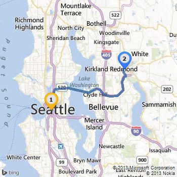

# What&#39;s New in the REST Services
The Bing Maps REST Services contains the following new features.  
  
 **October, 2017**  
  
 **New Distance Matrix API**  
  
 The Bing Maps Distance Matrix API that provides travel time and distances for a set of origins and destinations. The distances and times returned are based on the routes calculated by the Bing Maps Route API. Times are based on predictive traffic information, depending on the start time specified in the request. Distance matrices can be calculated for driving, walking and public transit routes. This API can also generate distance matrices that optionally includes a histogram of travel times over a period of time with a set interval that takes into consideration the predicted traffic at those times. See the documentation on how to [Calculate a Distance Matrix](../rest-services/calculate-a-distance-matrix.md).  
  
 **April, 2014**  
  
 **Get route information without detailed route instructions (itinerary items) or return route path points with the new routeAttributes parameter.** [[Calculate a Route](../rest-services/calculate-a-route.md), [Calculate Routes from Major Roads](../rest-services/calculate-routes-from-major-roads.md), [Route Data](../rest-services/route-data.md)]  
  
 The new `routeAttributes` parameter provides options for what information is returned when you request a route. Currently, this new parameter can have one or both of the following values:  
  
-   `excludeItinerary`: Specifies to exclude itinerary items from the response.  
  
-   `routePath`: Specifies to return a set of coordinates (latitude&#124;longitude) that define the route. This route attribute gives the same result as setting routePathOutput=Points in the request and is now the recommended way to get route path coordinates (see note below).  
  
 **Why you should use the routeAttributes=routePath instead of routePathOutput**  
  
 The new `routeAttributes=routePath` method for getting route points is now recommended over the routePathOutput parameter. The results are the same. However, the routeAttributes parameter can take other values (see [Calculate a Route](../rest-services/calculate-a-route.md)), and when it is set, the routePathOutput parameter is ignored. If you are using routePathOutput in your application, consider updating your request to use the routeAttributes parameter.  
  
 **Get alternate route information without detailed instructions (itinerary items).** [[Calculate a Route](../rest-services/calculate-a-route.md), [Calculate Routes from Major Roads](../rest-services/calculate-routes-from-major-roads.md), [Route Data](../rest-services/route-data.md)]  
  
 When set to `1` (true), the new `mfa` (metadata for alternate routes) parameter excludes itinerary items for alternate routes in the response. Alternate routes may be returned when you set the `maxSolutions` parameter to a number greater than `1`. By default, only one route is returned.  
  
 **Get route summary information between waypoints and via-waypoints with new route sub-leg fields** [[Calculate a Route](../rest-services/calculate-a-route.md), [Route Data](../rest-services/route-data.md)]  
  
 For each route leg (defined by two waypoints) of a route, new `routeSubLeg` response fields summarize sections of the route leg between waypoints and any intermediate via-waypoints. For example, if the route leg describes the route between Philadelphia and New York with a via-waypoint of Asbury Park, you would receive route sub-leg information for Philadelphia to Asbury Park and for Asbury Park to New York.  
  
 **January, 2014**  
  
 **New API Release History**  
  
 Starting with January, 2014, the Bing Maps REST Services API documentation includes [Release History](../rest-services/release-history.md).  
  
 **You now have an additional 40 pushpin icons to use with static maps. [[Get a Static Map](../rest-services/get-a-static-map.md)]**  
  
 See [Pushpin Syntax and Icon Styles](../rest-services/pushpin-syntax-and-icon-styles.md) to view the new icons with IDs 73-112.  
  
 **Specify include=cios2 to receive the two-letter ISO country code when you geocode or reverse-geocode. [[Locations](../rest-services/locations-api.md)]**  
  
 When you specify `include=cios2` in your Locations API request, the [two-letter ISO 3166 country code](http://www.iso.org/iso/country_codes.htm) is returned in for each address in the response in a new a `CountryRegionIso2` field.  
  
 **Example**  
  
```  
http://dev.virtualearth.net/REST/v1/Locations/US/WA/98052/Redmond/1%20Microsoft%20Way?o=xml&include=ciso2&key=BingMapsKey  
```  
  
 **Example address response**  
  
```  
<Address>  
  <AddressLine>1 Microsoft Way</AddressLine>  
  <AdminDistrict>WA</AdminDistrict>  
  <AdminDistrict2>King Co.</AdminDistrict2>  
  <CountryRegion>United States</CountryRegion>  
  <FormattedAddress>1 Microsoft Way, Redmond, WA 98052</FormattedAddress>  
  <Locality>Redmond</Locality>  
  <PostalCode>98052</PostalCode>  
  <CountryRegionIso2>US</CountryRegionIso2>  
</Address>  
```  
  
 **October, 2013**  
  
 **You can now select the icons for route waypoints on static maps [[Get a Static Map](../rest-services/get-a-static-map.md)]**  
  
 A new feature allows you to specify any pushpin icon style and a label for every route waypoint when you a make a static map route request (Walking/Routing/Transit). Prior to this new feature, pushpin icon styles 50 and 53 were used to display route waypoints on a static map. With this new feature, you can optionally choose any pushpin icon and create labels up to three characters. The new waypoint syntax is `wp.n=location;iconID;label`.  
  
 The following road map example uses icons 64 and 66 to display the road route endpoints which are identified as “1” and “2”.  
  
```  
http://dev.virtualearth.net/REST/v1/Imagery/Map/Road/Routes?wp.0=Seattle,WA;64;1&wp.1=Redmond,WA;66;2&key=BingMapsKey  
```  
  
 