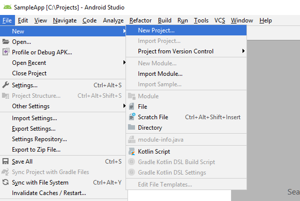
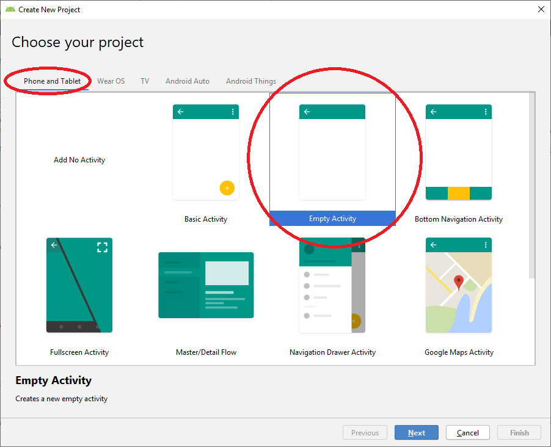
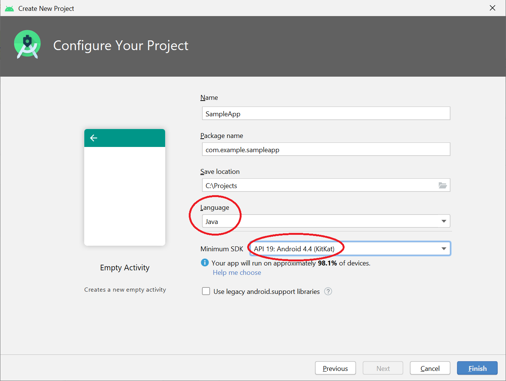

# Getting Started with Android

[!INCLUDE [bing-maps-sdk-for-android-iOS-retirement](../../includes/bing-maps-sdk-for-android-iOS-retirement.md)]

This tutorial goes through creating an Android app with a Bing Maps Native Control step-by-step.

## Prerequisites

1. **Bing Maps Key.** Must be obtained to use the Bing Maps SDK. The Bing Maps Key will need to be specified through the API to use the Bing Maps native control and to make API requests to Bing Maps services. Visit the [Bing Maps Dev Center Help page](/bingmaps/getting-started/bing-maps-dev-center-help/getting-a-bing-maps-key) for detailed steps on obtaining one.
2. **Android Studio.** This example is built using Android Studio. You can download it [here](https://developer.android.com/studio/#downloads).

## Creating a project

After Android Studio is installed, create a new project in it.

1. Launch Android Studio and choose **File > New > New Project**

    

2. Select **Phone and Tablet** tab, choose **Empty Activity**, and press **Next**

    

3. Select **API 19** as your Minimum API level, choose a name, package, location for your project, and and press **Finish**  
When it comes to language, this tutorial is in **Java**, though feel free to use Kotlin if that's your preference.

    

## Including Bing Maps Native Control in your project

In your project's `app` folder, create a file named `secrets.gradle` and put there your Bing Maps Key like shown:

>```
>ext.credentialsKey = "ENTER YOUR KEY HERE"


In your `project/build.gradle` file, inside `allprojects`, insert the following block in `repositories`:

>```
> repositories {
>         jcenter()
>          maven {
>              url 'https://microsoftmaps.jfrog.io/artifactory/Maven/'
>          }
> }
>```

In your `app/build.gradle` file, apply this line at the top to import the external variables from newly created file:

>```
> apply from: 'secrets.gradle'

Next, in the same file, inside `buildTypes` block, insert following block next to `release` block to add a build config field with your Bing Maps key in order to be able to use it from Java code:

>```    
> buildTypes.each {
>        it.buildConfigField "String", "CREDENTIALS_KEY", "\"$credentialsKey\""
>    }

And finally, inside `dependencies` block, add the following lines and build your project:

>```
> implementation 'com.microsoft.maps:maps-sdk:1.2.0'

## Adding a map view to your activity

Add following markup to your activity layout (`app/res/layout/{your_layout_file}.xml`). This will be the map view:

>```xml
> <FrameLayout
>     android:id="@+id/map_view"
>     android:layout_width="match_parent"
>     android:layout_height="match_parent"
> />
>```

Add these imports to your source file:

>```java
> import com.microsoft.maps.MapRenderMode;
> import com.microsoft.maps.MapView;
>```

At the top of your activity class, declare a MapView:

>```java
> private MapView mMapView;
>```

>```java
> @Override
> protected void onCreate(Bundle savedInstanceState) {
>   super.onCreate(savedInstanceState);
>   setContentView(R.layout.{your_layout_file});
>   mMapView = new MapView(this, MapRenderMode.VECTOR);  // or use MapRenderMode.RASTER for 2D map
>   mMapView.setCredentialsKey(BuildConfig.CREDENTIALS_KEY);
>   ((FrameLayout)findViewById(R.id.map_view)).addView(mMapView);
>   mMapView.onCreate(savedInstanceState);
>}
>```

### Handling life cycle events

Override Activity and Fragment life cycle methods, `onCreate`, `onStart`, `onResume`, `onPause`, `onSaveInstanceState`, `onStop`, `onDestroy`, and `onLowMemory` to call respective MapView methods from the callbacks as follow:

>```java
> @Override
> public void onCreate(Bundle savedInstanceState)
> {
>     super.onCreate(savedInstanceState);
>     setContentView(R.layout.{your_layout_file});
> 
>     // Code to create your MapView
> 
>     mMapView.onCreate(savedInstanceState);
> }
>```

>```java
> @Override
> protected void onStart() {
>     super.onStart();
>     mMapView.onStart();
> }
>```

>```java
> @Override
> protected void onResume() {
>     super.onResume();
>     mMapView.onResume();
> }
>```

>```java
> @Override
> protected void onPause() {
>     super.onPause();
>     mMapView.onPause();
> }
>```

>```java
> @Override
> protected void onSaveInstanceState(Bundle outState) {
>     super.onSaveInstanceState(outState);
>     mMapView.onSaveInstanceState(outState);
> }
>```

>```java
> @Override
> protected void onStop() {
>     super.onStop();
>     mMapView.onStop();
> }
>```

>```java
> @Override
> protected void onDestroy() {
>     super.onDestroy();
>     mMapView.onDestroy();
> }
>```

>```java
> @Override
> public void onLowMemory() {
>     super.onLowMemory();
>     mMapView.onLowMemory();
> }
>```

Ready to run!

## Further customization

### Scenes

Let's go through a common scenario to set map scene to a specific location on startup.

First, add following imports:

>```java
> import com.microsoft.maps.Geopoint;
> import com.microsoft.maps.MapAnimationKind;
> import com.microsoft.maps.MapScene;
>```

Next step is declaring the location. Say, we want to show Seattle and Bellevue and choose Lake Washington in between:

>```java
> private static final Geopoint LAKE_WASHINGTON = new Geopoint(47.609466, -122.265185);
>```

Then override your activity's `onStart` method with a `setScene` call:

>```java
> @Override
> protected void onStart() {
>     super.onStart();
>     mMapView.setScene(
>         MapScene.createFromLocationAndZoomLevel(LAKE_WASHINGTON, 10),
>         MapAnimationKind.NONE);
> }
>```

### Pins

You can attach pins to locations on the map using custom element layer populated with `MapImage` elements. Here's an example:

First, you'll need these imports:

>```java
> import com.microsoft.maps.Geopoint;
> import com.microsoft.maps.MapElementLayer;
> import com.microsoft.maps.MapIcon;
> import com.microsoft.maps.MapImage;
>```

Then, declare the element layer as class member:

>```java
> private MapElementLayer mPinLayer;
>```

Next step, initialize and add it to map view's layers in your `onCreate` method:

>```java
> mPinLayer = new MapElementLayer();
> mMapView.getLayers().add(mPinLayer);
>```

Use the following snippet to add pins:

>```java
> Geopoint location = ...  // your pin lat-long coordinates
> String title = ...       // title to be shown next to the pin
> Bitmap pinBitmap = ...   // your pin graphic (optional)
>
> MapIcon pushpin = new MapIcon();
> pushpin.setLocation(location);
> pushpin.setTitle(title);
> pushpin.setImage(new MapImage(pinBitmap));
>
>mPinLayer.getElements().add(pushpin);
>```

***Note**: if pins in your scenario use the same graphic, it is recommended to reuse the associated `MapImage` object. Rather than creating a new one for each pin, consider declaring and initializing it similarly to your `MapElementLayer` instance.*

To clear existing pins, just call `clear()` on `Elements` member of the associated layer:

>```java
> mPinLayer.getElements().clear();
>```

### Styling

There's a set of predefined styles exposed by MapStyleSheets class:

* `empty`: renders nothing. Useful if you want to display a custom set of tiles with no underlying map data.
* `roadLight`: symbolic map, light color scheme. Default look.
* `roadDark`: symbolic map, dark color scheme.
* `roadCanvasLight`: symbolic map, light low-contrast color scheme.
* `roadHighContrastLight`: symbolic map, light high-contrast color scheme.
* `roadHighContrastDark`: symbolic map, dark high-contrast color scheme.
* `aerial`: photorealistic map.
* `aerialWithOverlay`: hybrid map, photorealistic tiles with symbolic entities rendered on top.

Example setting `aerialWithOverlay` map style:

>```java
> import com.microsoft.maps.MapStyleSheets;
> 
> ...
>
> mMapView.setMapStyleSheet(MapStyleSheets.aerialWithOverlay());
>```

Bing Maps Native Control also supports custom styling via JSON, using the same format as desktop and iOS controls. Here's an example applying your own style:
>```java
> import com.microsoft.maps.MapStyleSheet;
>
> ...
>
> MapStyleSheet style = MapStyleSheet.fromJson(yourCustomStyleJsonString);
> if (style != null) {
>     mMapView.setMapStyleSheet(style);
> } else {
>     // Custom style JSON is invalid
> }
>```

### Map projection

Bing Maps Native Control runs on a 3D engine and it supports switching map projection between Web Mercator and Globe on demand and in real time. Here's an example:

>```java
> import com.microsoft.maps.MapProjection;
>
> ...
>
> mMapView.setMapProjection(MapProjection.GLOBE);
> mMapView.setMapProjection(MapProjection.WEB_MERCATOR);
>```
