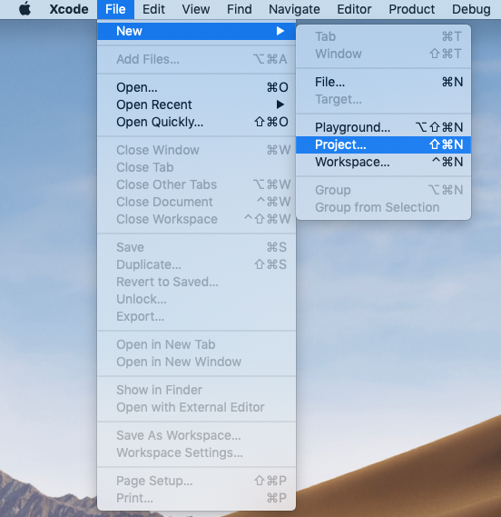
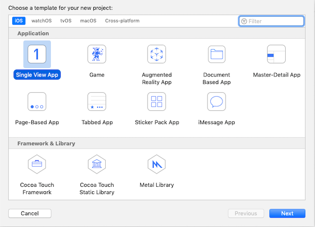
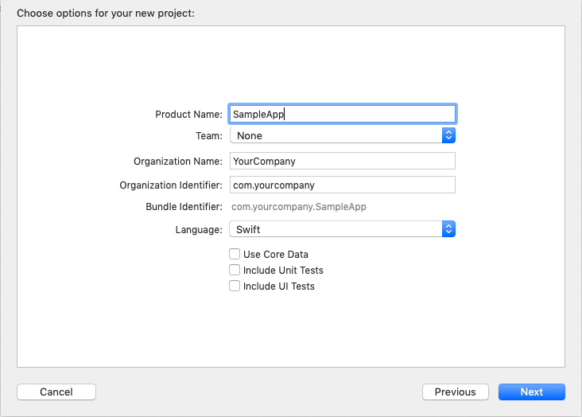
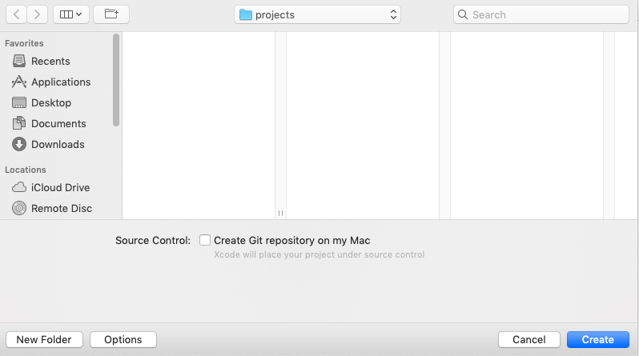
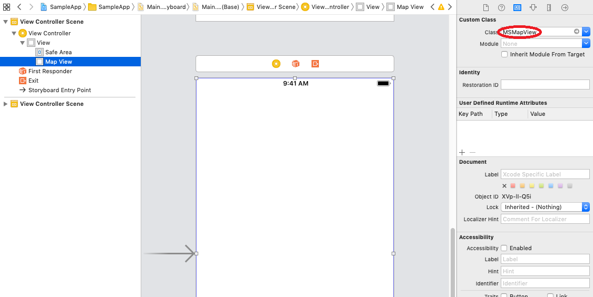
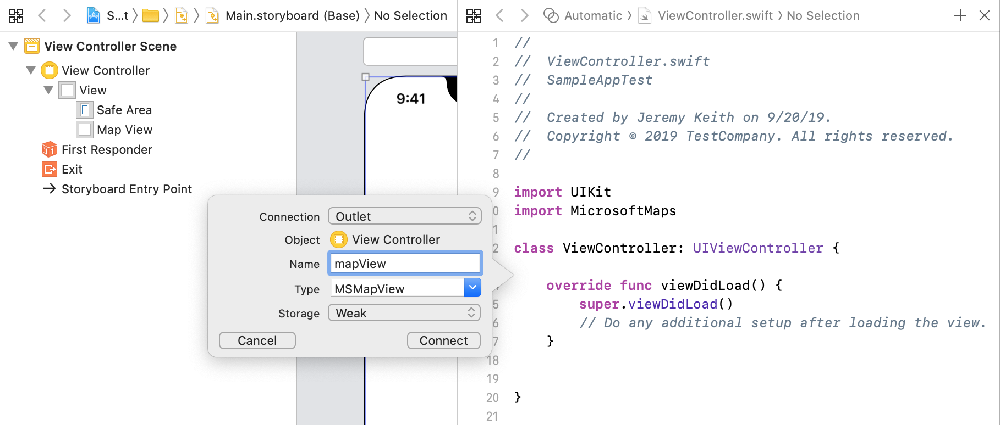

# Getting Started with iOS

This tutorial goes through creating an iOS app with a Bing Maps Native Control step-by-step.

## Prerequisites

1. **Bing Maps Key.** Must be obtained to use the Bing Maps SDK. The Bing Maps Key will need to be set through the API to use the Bing Maps native control and to make API requests to Bing Maps services. Visit the [Bing Maps Dev Center Help page](https://docs.microsoft.com/en-us/bingmaps/getting-started/bing-maps-dev-center-help/getting-a-bing-maps-key) for detailed steps on obtaining one.
2. **CocoaPods.** Dependency manager for Swift and Objective-C Cocoa projects, which is required to add the Bing Maps SDK to the app. [Here's a page](https://guides.cocoapods.org/using/getting-started.html) for instruction to install the manager.
3. **XCode.**  This example is built using XCode. You can download it [here](https://developer.apple.com/xcode/).

## Creating a project

1. Launch Xcode and choose **File > New > Project**

    

2. Select **iOS > Single View Application** from Project selection view and click **Next**

    

3. Fill options for your project and press **Next**

    

4. Select any folder to save your project and press **Create**

    

## Adding CocoaPods to your project

1. In the terminal, change the working directory to your app folder which contains the xcodeproj file.
2. Run the command `pod init` in the terminal to create `Podfile` which is used to store your project's CocoaPods configuration.

## Including Bing Maps Native Control in your project

1. Open the newly created `Podfile` and specify the following:
>```
> # Uncomment the next line to define a global platform for your project
> source 'https://github.com/CocoaPods/Specs.git'
>
> platform :ios, '9.0'
>
> target 'YOUR_APPLICATION_TARGET_NAME' do
>
>   # Comment the next line if you're not using Swift and don't want to use dynamic frameworks
>   use_frameworks!
>
>   # Pods for SampleApp
>   pod 'MicrosoftMapsSDK', '~> 0.2.0'
> end
>```

2. Save the `Podfile` and run the command `pod install` in the terminal.

3. Open the workspace file in XCode and you are ready to use the API.

## Adding a map view to UIViewControl

1. Add UIView to the scene and set its class to MSMapView  
  

2. Add the following import to UIViewController

>```swift
> import MicrosoftMaps
>```

3. Create IBOutlet for the map  
      

4. Set the map key in viewDidLoad

>```swift
> override func viewDidLoad() {
>     super.viewDidLoad()
>     // Do any additional setup after loading the view.
>
>     mapview.credentialsKey = "Your credentials here"
> }
>```

## Further customization

### Scenes

Let's go through a common scenario to set map scene to a specific location on startup.

First, declare the location. Say, we want to show Seattle and Bellevue and choose Lake Washington in between:

>```swift
> let LOCATION_LAKE_WASHINGTON = MSGeolocation(latitude: 47.609466, longitude: -122.265185)
>```

Then override your ViewController's `viewDidLoad` method with a `setScene` call:

>```swift
> override func viewDidLoad() {
>     super.viewDidLoad()
>     mapView.credentialsKey = "Your credentials here"
>     let scene = MSMapScene(location: LOCATION_LAKE_WASHINGTON, zoomLevel: 10 )
>     self.mapView.setScene(scene, with: .none)
> }
>```

### Pins

You can attach pins to locations on the map using custom element layer populated with `MapImage` elements. Here's an example:

First, declare the element layer as class member:

>```swift
> private var pinLayer: MSMapElementLayer!
>```

Next step, initialize and add it to map view's layers in your `onCreate` method:

>```swift
> pinLayer = MSMapElementLayer()
> mapView.layers.add(pinLayer)
 >```

Use the following snippet to add pins:

>```swift
> let location = MSGeolocation(...) // your pin lat-long coordinates
> let pinBitmap = MSMapImage(...)  // your pin graphic
>
> let pushpin = MSMapIcon()
> pushpin.location = location
> pushpin.image = pinBitmap
>
> pinLayer.elements.add(pushpin)
>```

***Note**: if pins in your scenario use the same graphic, it is recommended to reuse the associated `MSMapImage` object. Rather than creating a new one for each pin, consider declaring and initializing it similarly to your `MapElementLayer` instance.*

To clear existing pins, just call `clear()` on `Elements` member of the associated layer:

>```swift
> pinLayer.elements.clear();
>```

### Styling

There's a set of predefined styles exposed by MapStyleSheets class:

* `empty`: renders nothing. Useful if you want to display a custom set of tiles with no underlying map data.
* `roadLight`: symbolic map, light color scheme. Default look.
* `roadDark`: symbolic map, dark color scheme.
* `roadCanvasLight`: symbolic map, light low-contrast color scheme.
* `roadHighContrastLight`: symbolic map, light high-contrast color scheme.
* `roadHighContrastDark`: symbolic map, dark high-contrast color scheme.
* `aerial`: photorealistic map.
* `aerialWithOverlay`: hybrid map, photorealistic tiles with symbolic entities rendered on top.

Example setting `aerialWithOverlay` map style:

>```swift
> mapView.setStyleSheet(MSMapStyleSheets.aerialWithOverlay())
>```

Bing Maps Native Control also supports custom styling via JSON, using the same format as desktop and iOS controls. Here's an example applying your own style:

>```swift
> var styleSheetFromJson:MSMapStyleSheet!
> let result = MSMapStyleSheets.try(toParseJson: yourCustomStyleJsonString, into:&styleSheetFromJson)
> if (result)
> {
>     mapView.setStyleSheet(styleSheetFromJson)
> } else {
>     // Custom style JSON is invalid
> }
>```


### Map projection

Bing Maps Native Control runs on a 3D engine and it supports switching map projection between Web Mercator and Globe on demand and in real time. Here's an example:

>```swift
> mapView.projection = MSMapProjection.globe
> mapView.projection = MSMapProjection.mercator
>```
