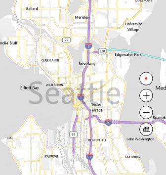
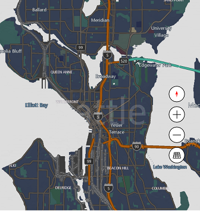

# Changing the appearance of a map

## Prebuilt Map Styles

The Map Style establishes the fundamental mode that a map view will render in.  Available options are specified on [MapStyleSheets](../map-control-api/MapStyleSheets.md)

### Examples

**Java**

>```java
> mMap.setMapStyleSheet(MapStyleSheets.roadLight());
>``` 

**Swift**

>``` swift
> mapView.setStyleSheet(MSMapStyleSheet.roadLight())
>```  

## Custom Map Styles

You can create your own Map Style by writing custom JSON and passing it to `MapStyleSheet.fromJson(string json)`. The accepted JSON format is described [here](https://docs.microsoft.com/en-us/windows/uwp/maps-and-location/elements-of-map-style-sheet). Also, style sheet JSON can be created interactively using [Map Style Sheet Editor](https://www.microsoft.com/p/map-style-sheet-editor/9nbhtcjt72ft) application.

### Examples

The following example shows how to create custom mapStyle sheet from JSON and set the style to an map.  

**Swift**

> ``` swift
> let customMapStyleString = """
> {
>     "version": "1.0",
>     "settings": {
>         "landColor": "#FFFFFF",
>         "spaceColor": "#000000"
>     },
>     "elements": {
>         "mapElement": {
>             "labelColor": "#000000",
>             "labelOutlineColor": "#FFFFFF"
>         },
>         "water": {
>             "fillColor": "#DDDDDD"
>         },
>         "area": {
>             "fillColor": "#EEEEEE"
>         },
>         "political": {
>             "borderStrokeColor": "#CCCCCC",
>             "borderOutlineColor": "#00000000"
>         }
>     }
> }
> """
> var styleSheetFromJson:MSMapStyleSheet? = nil
> if (MSMapStyleSheet.try(toParseJson: customMapStyleString, into:&styleSheetFromJson)) {
>     mapView.setStyleSheet(styleSheetFromJson!)
> }
> ```



Also, you can start with an existing sheet and then use JSON to override any elements that you want. The following example update existing RoadDark style to change only the color of water area.  

**Swift**

> ``` swift
> let customMapStyleString = """
> {
>     "version": "1.0",
>     "elements": {
>         "water": {
>             "fillColor": "#DDDDDD"
>         }
>     }
> }
> """
> if (MSMapStyleSheet.try(toParseJson: customMapStyleString, into:&styleSheetFromJson)) {
>     let builtInSheet = MSMapStyleSheet.roadDark()
>     mapView.setStyleSheet(MSMapStyleSheet.combineStyleSheets([styleSheetFromJson, builtInSheet]))
> }
> ```


