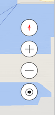

# Enabling/Disabling User Interface Gestures and Controls

By default, our map shows a toolbar with controls that the user can use to navigate the map. These controls are zoom, compass, and location.



Our map also supports multiple gestures to navigate, such as zoom, rotate, pan, and tilt.

In some scenarios, it may be desirable to disable these controls and/or gestures.

## Examples

### Disable Zoom Controls and Gestures

**Android**

>``` Java
> MapUserInterfaceOptions uiOptions = mMap.getUserInterfaceOptions();
> // disable zoom control
> uiOptions.setZoomControlsEnabled(false);
> // disable zoom gesture
> uiOptions.setZoomGesturesEnabled(false);
>```

**Swift**

>``` swift
> let uiOptions = self.mapView.userInterfaceOptions
> // disable zoom control
> uiOptions.isZoomButtonsVisible  = false
> // disable zoom gesture
> uiOptions.isZoomEnabled = false
>```

**Objective-C**

>``` objectivec
> MSMapUserInterfaceOptions *uiOptions = [self.mapView userInterfaceOptions];
> // disable zoom control
> [uiOptions setIsZoomControlVisible:NO]
> // disable zoom gesture
> [uiOptions setIsZoomEnabled:NO]
>```