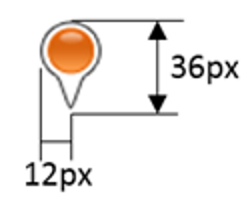

# Anchoring MapIcons

One of the most common issues developers come across when using custom MapIcons is that when they zoom the map it appears as if their MapIcon is drifting to or from the location it is meant to be anchored to. This is due to an incorrect anchor point value in the pushpin options. The anchor point specifies which pixel coordinate of the image, relative to the top left corner of the image, should overlap the pushpins location coordinate.
  
For example, consider the following MapIcon, which is 24 pixels wide and 36 pixels tall. For this pushpin we would want the bottom point of the pushpin to align with the pushpins location coordinate which in this case would need an x offset that is half the wide and a y offset equal to the height of the image. This would require an anchor point of (0.5, 1.0):

Here are some additional MapIcon images and anchor values that can be used to properly position the image.  

  
Align with Center Anchor: (0.5f, 0.5f)  

  
Align with Point Anchor: (0.2f, 1.0f)  

  
Align with Point Anchor: (0.2f, 1.0f)
