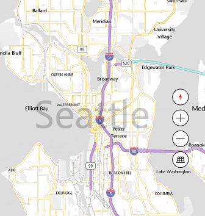
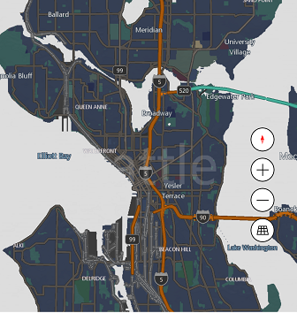

# Changing the appearance of the map

## Default Map Style Sheets

The pre-built Map Style Sheets establish the fundamental mode that a map view will render in.  Available options are specified in [MapStyleSheets](../map-control-api/MapStyleSheets-class.md).

### Examples

**Java**

>```java
> mMap.setMapStyleSheet(MapStyleSheets.roadLight());
>```

**Swift**

>```swift
> mapView.setStyleSheet(MSMapStyleSheets.roadLight())
>```

## Custom Map Style Sheets

You can create your own Map Style Sheet by writing custom JSON and passing it to `MapStyleSheet.fromJson(string json)`. The style sheet JSON API is described [here](https://docs.microsoft.com/windows/uwp/maps-and-location/elements-of-map-style-sheet). The style sheet JSON can also be created interactively using the [Map Style Sheet Editor](https://www.microsoft.com/p/map-style-sheet-editor/9nbhtcjt72ft).

### Examples

The following example shows how to create a custom map style sheet from JSON and set the style of the map.

**Java**

>```java
> String customMapStyleString = 
> "{" +
>     "\"version\": \"1.0\"," +
>     "\"settings\": {" +
>    "\"landColor\": \"#FFFFFF\"," +
>    "\"spaceColor\": \"#000000\"" +
>     "}," +
>     "\"elements\": {" +
>         "\"mapElement\": {" +
>             "\"labelColor\": \"#000000\"," +
>             "\"labelOutlineColor\": \"#FFFFFF\"" +
>         "}," +
>        "\"water\": {" +
>             "\"fillColor\": \"#DDDDDD\"" +
>         "}," +
>         "\"area\": {" +
>             "\"fillColor\": \"#EEEEEE\"" +
>         "}," +
>         "\"political\": {" +
>             "\"borderStrokeColor\": \"#CCCCCC\"," +
>             "\"borderOutlineColor\": \"#00000000\"" +
>         "}" +
>     "}" +
> "}";
>
> final MapStyleSheet styleSheetFromJson = MapStyleSheet.fromJson(customMapStyleString);
> if (styleSheetFromJson != null) 
> {
>   mapView.setMapStyleSheet(styleSheetFromJson);
> }
>```

**Swift**

>```swift
> let customMapStyleString = """
> {
>     "version": "1.0",
>     "settings": {
>         "landColor": "#FFFFFF",
>         "spaceColor": "#000000"
>     },
>     "elements": {
>         "mapElement": {
>             "labelColor": "#000000",
>             "labelOutlineColor": "#FFFFFF"
>         },
>         "water": {
>             "fillColor": "#DDDDDD"
>         },
>         "area": {
>             "fillColor": "#EEEEEE"
>         },
>         "political": {
>             "borderStrokeColor": "#CCCCCC",
>             "borderOutlineColor": "#00000000"
>         }
>     }
> }
> """
> var styleSheetFromJson:MSMapStyleSheet? = nil
> if (MSMapStyleSheets.try(toParseJson: customMapStyleString, into:&styleSheetFromJson)) {
>     mapView.setStyleSheet(styleSheetFromJson!)
> }
>```



Also, you can start with an existing sheet and then use JSON to override any elements that you want. The following example updates the existing RoadDark style to change only the color of water area. 

**Java**

>```java
> String customMapStyleString = 
> "{" +
>     "\"version\": \"1.0\"," +
>     "\"elements\": {" +
>           "\"water\": {" +
>               "\"fillColor\": \"#DDDDDD\"" +
>           "}" +
>     "}" +
> "}";
>
> final MapStyleSheet styleSheetFromJson = MapStyleSheet.fromJson(customMapStyleString);
> if (styleSheetFromJson != null) 
> {
>     final MapStyleSheet builtInSheet = MapStyleSheets.roadDark();
>     mMap.setMapStyleSheet(MapStyleSheet.combine(new ArrayList<MapStyleSheet>() {{ add(styleSheetFromJson); > add(builtInSheet); }}));
> }
>```

**Swift**

>```swift
> let customMapStyleString = """
> {
>     "version": "1.0",
>     "elements": {
>         "water": {
>             "fillColor": "#DDDDDD"
>         }
>     }
> }
> """
> if (MSMapStyleSheets.try(toParseJson: customMapStyleString, into:&styleSheetFromJson)) {
>     let builtInSheet = MSMapStyleSheets.roadDark()
>     mapView.setStyleSheet(MSMapStyleSheets.combineStyleSheets([styleSheetFromJson, builtInSheet]))
> }
>```



_See also_
[Map Style Sheets](map-styles-sheets.md)
