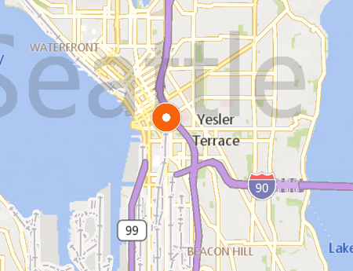
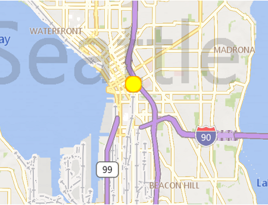

# Display points of interest on the map

Use [MapIcon](../map-control-api/MapIcon-class.md) to add a graphical image and text at a
location within the map.

To get your pushpin to look pixel-perfect, you'll also want to review how to [anchor your MapIcons](anchoring-mapIcons.md) to make them
align with the chosen location on a map.

## Examples

### Add a default pushpin to the map

**Java**

>```Java
> MapIcon icon = new MapIcon();
> icon.setLocation(new Geopoint(0, 0, 0, AltitudeReferenceSystem.SURFACE));
> MapElementLayer elementLayer = new MapElementLayer();
> elementLayer.getElements().add(icon);
> mMap.getLayers().add(elementLayer);
>```

**Swift**

>```swift
> let icon = MSMapIcon()
> icon.location = MSGeopoint(
>     latitude: 0,
>     longitude: 0,
>     altitude: 0,
>     altitudeReferenceSystem: .surface)
> let elementLayer = MSMapElementLayer()
> elementLayer.elements.add(icon)
> mMap.layers.add(elementLayer)
>```

**Objective-C**

>```objectivec
> MSMapIcon *icon = [MSMapIcon icon];
> icon.location = [MSGeopoint geopointWithLatitude:0
>                                        longitude:0
>                                         altitude:0
>                          altitudeReferenceSystem:MSMapAltitudeReferenceSystemSurface];
> MSMapElementLayer* elementLayer = [MSMapElementLayer layer]
> [elementLayer.elements addMapElement:icon];
> [mMap.layers addMapLayer:elementLayer]
>```



### Set a pushpin image

The following example shows how to assign a custom image loaded from resource, and center the image on the location.

**Java**

>```Java
> icon.setImage(new MapImage(BitmapFactory.decodeResource(getResources(), imageIndex)));
> icon.setNormalizedAnchorPoint(new PointF(0.5f, 1.0f));  // Center against the bottom of the image
>```

**Swift**

>```swift
> icon.image = MSMapImage(uiImage:UIImage(named: "pushpin")!)
> icon.normalizedAnchorPoint = CGPoint(x:0.5, y:1.0)
>```

**Objective-C**

>```objectivec
> icon.image = [MSMapImage imageWithUIImage:[UIImage imageNamed:@"pushpin"]];
> icon.normalizedAnchorPoint = CGPointMake(0.5f, 1.0f);  // Center against the bottom of the image
>```

### Add a pushpin with SVG image

You can also use an SVG image to create a [MapImage](../map-control-api/MapImage-class.md) to specify the custom image.

**Swift**

>```swift
> func addSvgIconAtMapCenter() {
>     let mapIcon = MSMapIcon()
>     mapIcon.location = MSGeopoint(latitude: mapView.mapCenter.position.latitude, longitude: mapView.mapCenter.position.longitude)
>     let svgString = "<svg xmlns=\"http://www.w3.org/2000/svg\" width=\"50\" height=\"50\"><circle cx=\"25\" cy=\"25\" r=\"20\" stroke=\"orange\" stroke-width=\"4\" fill=\"yellow\" /></svg>"
>     let svgData = svgString.data(using: .utf8)
>     mapIcon.image = MSMapImage(svgImage: svgData!)
>     let mapIconLayer = MSMapElementLayer()
>     mapView.layers.add(mapIconLayer)
>     mapIconLayer.elements.add(mapIcon)
> }
>```



_See also_:
* [Icons](map-icons.md)
* [MapIcon](../map-control-api/MapIcon-class.md)
* [MapImage](../map-control-api/MapImage-class.md)
* [MapElementLayer](../map-control-api/MapElementLayer-class.md)
