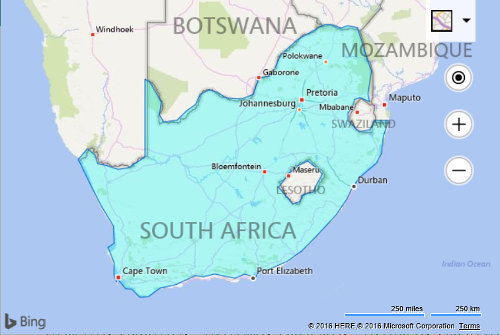

# Code Optimizations in V8

One common piece of feedback the Bing Maps team has received from developers over the years about Bing Maps v7 is that the API is well structured, and easy to use. The development team for Bing Maps V8 really took this to heart and made an effort to not only maintain this when creating new features but to also ensure these features are easy to use with other features in Bing Maps. In addition to this the team spent some time investigating common tasks developers were doing with Bing Maps V7 and looked at ways to reduce the amount of code required to accomplish these tasks. Many of these also provide a small performance improvement as well. The following is a list of some of these common tasks and the code optimizations that have been made available in V8. It is ***very important*** to note that in all of these cases, the v7 code for accomplishing these tasks is still fully supported by V8. If you are migrating a V7 app to V8, you do not need to implement any of these code optimizations, however, you may find these useful if adding additional features to your app, are looking to make performance improvements, or if you want to clean up your code.

## Loading the Map

When loading an instance of Bing Maps, you have to specify the DOM element in which to render the map control (usually a DIV element). In Bing Maps V7 you had to pass in a reference to the DOM element when loading the map. In V8 you can continue to do this, or you can provide an HTML ID selector instead.

**Before: V7**

```javascript
map = new Microsoft.Maps.Map(document.getElementById("myMap"), {
    credentials: "YOUR BING MAPS KEY"
});
```

**After: V8** – Credentials are specified in the map script URL.

```javascript
map = new Microsoft.Maps.Map('#myMap');
```

In this scenario, V8 requires 64% less code than V7.

## Adding an array of shapes to the map

In most versions of Bing Maps, adding an array of shapes to the map requires looping through the array and adding each shape one by one. You can continue to do this in V8 or you can simply pass the whole array to the map.

**Before: V7**

```javascript
var shapes = [];

for (var i = 0; i < shapes.length; i++) {
    map.entities.push(shapes);
}
```

**After: V8**

```javascript
var shapes = [];

map.entities.push(shapes);
```

Not including the code to create the array of shapes, V8 requires 60% less code than V7.

## Changing the Color of the Pushpins

One of the most common questions that developers ask on the forums is how to change the color of the default pushpin. In previous versions of Bing Maps there were [a couple of solution](http://blogs.bing.com/maps/2015/02/05/visualizing-point-based-business-intelligence-data-on-bing-maps);

-   Create a custom pushpin image in an image editor and then pass a URL to this image to the pushpin. However, if you wanted several different colors, this meant creating several different images.

-   Create a custom pushpin image in an image editor and make the color area transparent. In code, use SVG or the HTML canvas to draw the area that you want to control the color of and then draw the image overtop. This provided a programmatic way to change the color but required a decent amount of code to maintain. The canvas solution was also known to be a bit buggy.

In Bing Maps V8 we simply added a color property to the PushpinOptions object. Not only can this be used to change the color of the default pushpin, but you can also add “{color}” as a placeholder in inline SVG and the pushpin will replace this placeholder with the value of the color property. This is a great way to create pushpin templates.

**After: V8 – Change color of default pushpin**

```javascript
var pin = new Microsoft.Maps.Pushpin(center, {
    color: 'red'
});
```

**After: v8 – Change color of Custom Inline SVG Pushpin**

```javascript
var svgPushpinTemplate = '<svg xmlns="http://www.w3.org/2000/svg" width="50" height="50"><circle cx="22" cy="22" r="20" stroke="black" stroke-width="2" fill="{color}" /></svg>';

var pin = new Microsoft.Maps.Pushpin(map.getCenter(), {
    icon: svgPushpinTemplate,
    color: 'rgba(0,120,255,0.5)',
    anchor: new Microsoft.Maps.Point(22, 22)
});
```

**Additional Resources:**

* [Pushpin Interactive Code Samples](http://www.bing.com/api/maps/sdk/mapcontrol/isdk#addDefaultPushpin+JS)
* [Pushpin Class](../map-control-api/pushpin-class.md)
* [Additional Pushpin Code Samples](../map-control-concepts/pushpins/index.md)

## Setting the Color of a Polygon or Polyline

In Bing Maps V7 changing the color of Polygon or Polylines required using the Color class. In V8, colors can be defined in several ways;

* Use the Color class
* Use [CSS3 color strings](http://www.w3.org/wiki/CSS3/Color). All CSS3 colors are supported, including [extended named colors](http://www.w3.org/wiki/CSS3/Color/Extended_color_keywords).

Using CSS colors is a bit more familiar when creating web apps and using them instead of the Color class has a slight performance benefit as there is no need to create an instance of the Color class which would use more memory then a simple CSS color string.

**Before: V7**

```javascript
polygon.setOptions({ fillColor: new Microsoft.Maps.Color(128,255,0,0) });
```

**After: V8**

```javascript
polygon.setOptions({ fillColor: 'rgba(255,0,0,0.5)' }); 
```

In this scenario, V8 requires 26% less code than V7, however the performance improvement of V8 is the real benefit.

**Additional Resources:**

* [Colors in V8](../map-control-concepts/colors.md)
* [Color Class](../map-control-api/color-class.md)

## Getting the Location of a Mouse Event

When using mouse events, it is common to get the location of where the mouse event occurred. To get this information in V7 you have to take the pixel coordinates of where the user clicked on the map and project this to a location on a map. In V8, the event argument object contains a location property, thus saving you doing all this extra work.

**Before: V7**

```javascript
Microsoft.Maps.Events.addHandler(map, 'click', function (e) {
    var point = new Microsoft.Maps.Point(e.getX(), e.getY());
    var loc = e.target.tryPixelToLocation(point);

    //Do something with the location.
});
```

**After: V8**

```javascript
Microsoft.Maps.Events.addHandler(map, 'click', function (e) {
    var loc = e.location;

    //Do something with the location.
});
```

In this scenario, V8 requires 40% less code than V7.

**Additional Resources:**

* [Events Class](../map-control-api/events-class.md)
* [Events interactive code samples](http://www.bing.com/api/maps/sdk/mapcontrol/isdk#addEventHandler+JS)

## Adding Events to an Array of Shapes

A common task is to add a click or some other mouse event to an array of shapes. One common scenario is adding a click event to pushpins so that an infobox is opened when the user clicks the pushpin. In V7 you have loop through the array and add an event handler to each shape. This meant that each shape had to monitor the event itself. In V8, if you add your shapes to a Layer, you can add events to the layer which are applied to all the shapes in the layer. This provides a good performance benefit as only a single event is created.

**Before: V7**

```javascript
var shapes = [];

for (var i = 0; i < shapes.length; i++) {
    Microsoft.Maps.Events.addHandler(shapes[i], 'click', eventHandlerCallback);
    map.entities.push(shapes[i]);
}
```

**After: V8**

```javascript
var shapes = [];

var layer = new Microsoft.Maps.Layer();
layer.add(shapes);

Microsoft.Maps.Events.addHandler(layer, 'click', eventHandlerCallback);
```

In this scenario, V8 requires 15% less code than V7. However, the shapes are stored in a layer which will make handling the data easier, especially if there are multiple layers of data. Additionally, the V8 solution provides a good performance benefits.

**Additional Resources:**

* [Layer class](../map-control-api/layer-class.md)
* [Layer interactive code samples](http://www.bing.com/api/maps/sdk/mapcontrol/isdk#addMultipleLayerItems+JS)

## Polygons with holes

When Bing Maps v7 was released only simply polygons were supported. However, over time as more and more developers started integrating more complex spatial data on Bing Maps support for polygons with holes was needed. A great example is the borders of South Africa. Within the main borders of South Africa is a land locked country called Lesotho. In order to correctly draw the borders of South Africa a hole needs to be cut out of a polygon for Lesotho.



Some developers created [workarounds](https://rbrundritt.wordpress.com/2011/06/10/advance-shapes-in-bing-maps-v7/) in Bing Maps V7 initially, and not long after the Bing Maps team added the AdvancedShapes module. Knowing that this is a more commonly used feature in today’s apps, V8 supports polygons with holes in the core library. An AdvancedShapes module is no longer required, however, to reduce migration efforts, if you do use the AdvancedShapes code from V7, *it will continue to work in V8*.

**Before: v7**

```javascript
var polygon = new Microsoft.Maps.Polygon(/*ring data*/);

Microsoft.Maps.loadModule('Microsoft.Maps.AdvancedShapes', function () {
    map.entities.push(polygon);
});
```

**After: V8**

```javascript
var polygon = new Microsoft.Maps.Polygon(/*ring data*/);

map.entities.push(polygon);
```

Not including the code to create the polygon object, V8 requires writing 74% less code than v7. However, there is no need to make any code changes to a V7 app for this feature when migrating, unless you would like to clean up the code.

**Additional Resource:**

* [Polygon Class](../map-control-api/polygon-class.md)
* [Polygon interactive code samples](http://www.bing.com/api/maps/sdk/mapcontrol/isdk#addDefaultPolygon+JS)

## Loading Multiple Modules

Modules allow you to load additional features and functionalities when needed. Often more than one module may be needed in an application. In V7, if you needed to load two modules at the same time you had to load each module one after the other using the callback functions, otherwise you wouldn’t know when all the modules were loaded. In V8, an array of modules can be loaded at the same time. Only a single callback function is required, which is triggered after all the modules have loaded. Not does this simplify development, it also provides faster loading of the modules as the modules are loaded in parallel rather than synchronously.

**Before: V7**

```javascript
Microsoft.Maps.loadModule('Microsoft.Maps.GeoJson', function () {
    Microsoft.Maps.loadModule('Microsoft.Maps.HeatMap', function () {
    });
});
```

**After: V8**

```javascript
Microsoft.Maps.loadModule(['Microsoft.Maps.GeoJson', 'Microsoft.Maps.HeatMap'], function () {
});
```

V8 requires 32% less code than V7 when loading two modules at the same time. V8 would provide even more savings when loading more than two modules at a time. However, the performance improvement of V8 is the real benefit.

**Additional Resources:**

* [Modular Framework](../map-control-concepts/modular-framework/index.md)
* [Modular Framework interactive code samples](http://www.bing.com/api/maps/sdk/mapcontrol/isdk#loadingModules+JS)

## Adding Tile Layers to the Map

Tile layers are commonly used for overlaying images or large data sets on top of maps. Three common ways tile layers are defined are as follows:

* Quadkey tile system where a unique id is used to retrieve a tile.
* X, Y, Zoom tile system where the x and y position of a tile at a given zoom level are used to retrieve a tile.
* Web Mapping Service which retrieves a map image based on a bounding box.

Bing Maps V7 supports quadkey ids, but adding the other two types as tile layers requires passing in a callback function that creates a URL for each tile instead of simply passing in a formatted tile URL. V8 now supports X, Y, Zoom and WMS bounding box tile layers.

**Before: V7 - Z, Y, Zoom Tile Layer**

```javascript
var xyzTileUrl = 'http://tileServerUrl/{zoom}/{y}/{x}';

var tileLayer = new Microsoft.Maps.TileLayer({
    mercator: new Microsoft.Maps.TileSource({
        uriConstructor: function (tile) {
            return xyzTileUrl.replace('{x}', tile.x).replace('{y}', tile.y).replace('{zoom}', tile.levelOfDetail);
        }
    })
});

map.layers.insert(tileLayer);
```

**Important Note:** In V8, the tiles **levelOfDetail** property name has changed to **zoom**. 

**After: V8 - Z, Y, Zoom Tile Layer**

```javascript
var xyzTileUrl = 'http://tileServerUrl/{zoom}/{y}/{x}';

var tileLayer = new Microsoft.Maps.TileLayer({
    mercator: new Microsoft.Maps.TileSource({
        uriConstructor: xyzTileUrl
    })
});

map.layers.insert(tileLayer);
```

In this scenario, V8 requires 36% less code than V7.

**Before: V7 – WMS Tile Layer**

```javascript
var wmsTileService = 'https://tileServerUrl?SERVICE=WMS&VERSION=1.1.1&REQUEST=GetMap&LAYERS=CoolData&width=256&height=256&BBOX=';

var tileLayer = new Microsoft.Maps.TileLayer({
    mercator: new Microsoft.Maps.TileSource({uriConstructor: function (tile) {
        var mapSize = Math.pow(2, tile.levelOfDetail);

        var west = ((tile.x * 360) / mapSize) - 180;
        var east = (((tile.x + 1) * 360) / mapSize) - 180;

        var efactor = Math.exp((0.5 - tile.y / mapSize) * 4 * Math.PI);
        var north = (Math.asin((efactor - 1) / (efactor + 1))) * (180 / Math.PI);

        efactor = Math.exp((0.5 - (tile.y + 1) / mapSize) * 4 * Math.PI);
        var south = (Math.asin((efactor - 1) / (efactor + 1))) * (180 / Math.PI);
	
        return wmsTileService + west + ',' + south + ',' + east + ',' + north;
    });
};
map.layers.insert(tileLayer);
```

**After: V8 – WMS Tile Layer**

```javascript
var wmsTileService = 'https://tileServerUrl?SERVICE=WMS&VERSION=1.1.1&REQUEST=GetMap&LAYERS=CoolData&width=256&height=256&BBOX='

var tileLayer = new Microsoft.Maps.TileLayer({
    mercator: new Microsoft.Maps.TileSource({
        uriConstructor: wmsTileService + '{bbox}'
    }),
});
map.layers.insert(tileLayer);
```

In this scenario, V8 requires 73% less code than V7.

**Tip:** When using custom tile layers, often the tiles are not everywhere and at all zoom levels. To reduce the number of unneeded tile requests which can slow down your application and also hammer the tile server for no reason you can specify a bounds and zoom level range of your tile layer in the TileSource options.

**Additional Resources:**

* [Tile Layer interactive code samples](http://www.bing.com/api/maps/sdk/mapcontrol/isdk#tileLayerQuadKey+JS)
* [TileSource options](../map-control-api/tilesourceoptions-object.md)

## Bing Maps REST Services

When the Bing Maps V7 control was initially released there was no built in way to geocode locations or calculate routes. As such applications had to connect directly to the Bing Maps REST services as described in these articles in the MSDN documentation:

* [Location API](../rest-services/locations/index.md)
* [Route API](../rest-services/routes/index.md)

Eventually, Search and Direction modules where added to the V7 control which wrapped the REST services and made it easy to use in JavaScript and also provided a number of user friendly features such as draggable routes and nicely formatted instructions. V8 also includes Search and Direction modules. One new feature in the V8 directions module that wasn’t in V7 is a directions input panel option, which provides a nice user interface for requesting directions. Using the modules is highly recommended as it can save you writing a lot of code and it also ensures that best practices are implemented when accessing the services. The REST services can continue to be used and are a good option if you need complete control over how the data is rendered or if you simply need to perform a calculation without any rendering.

If using the REST service or Search module to power a search textbox, you may find that Autosuggest module provides an improved user experience. Note that the Autosuggest module can be used without a map which is useful if your search box is on a separate page from your map.

**Additional Resources:**

* [Autosuggest module](../modules/autosuggest-module/index.md)
* [Autosuggest module interactive code samples](http://www.bing.com/api/maps/sdk/mapcontrol/isdk#autoSuggestUi+JS)
* [Directions module](../modules/directions-module/index.md)
* [Directions module interactive code samples](http://www.bing.com/api/maps/sdk/mapcontrol/isdk#directionsCreateDrivingRoute+JS)
* [Search module](../modules/search-module/index.md)
* [Search module interactive code samples](http://www.bing.com/api/maps/sdk/mapcontrol/isdk#searchByAddress+JS)
* [Bing Maps REST Services](../rest-services/index.md)
