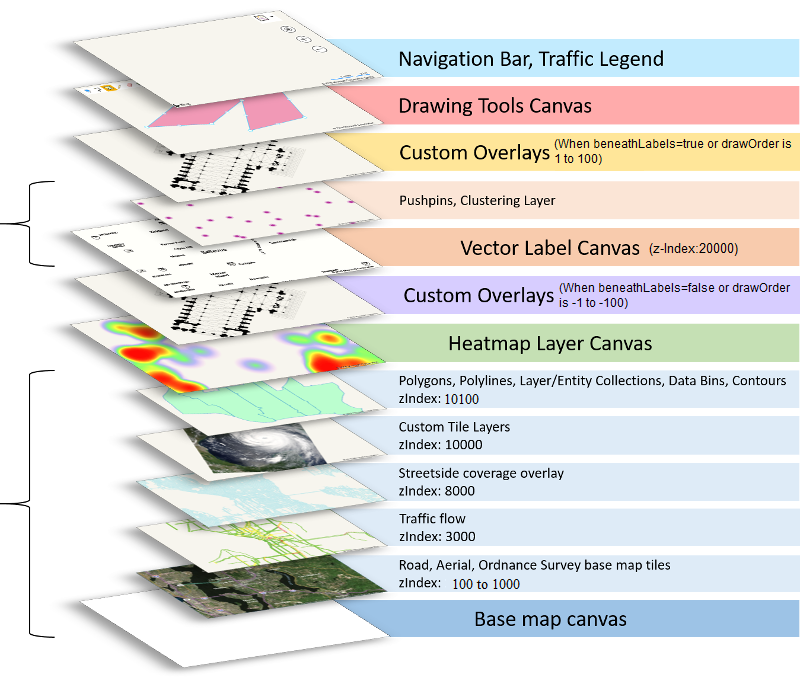

# zIndexing in Bing Maps V8

In past versions of Bing Maps, the map control consisted of thousands of DOM elements, primarily images and SVGs. zIndexing in these controls was easy as they simpy used CSS zIndexing which is built into the browser. However, using DOM elements to create interactive maps greatly limits the amount of data that can be rendered on the map. 

The Bing Maps V8 renders the maps using HTML5 canvases. This provides the ability to render large datasets on the map quickly, but doesn’t have any built in zIndexing logic. The Bing Maps team has exposed the ability to set the zIndexing of many layers including tile, clustering, data binning, and contour layers as well as the Layer class. zIndexing is achieved by sorting the data based on its assigned zIndex and then drawing it onto the canvas from lowest zIndex value to highest. Using this zIndexing framework it is possible to insert layers between the many built in layers such as the traffic layer, which wasn’t possible in the past. However, for performance reasons, zIndexing is only available for layers and not individual shapes.

The following diagram provides an overview of the different layers and their default zIndexes within the Bing Maps V8 control.

 
The Bing Maps V8 control has two main HTML5 canvases. The first is the base map canvas which is used to render the base road and aerial maps, along with many other data sets that you normally prefer to have rendered below the map labels. The second canvas is used to render the vector map labels. Pushpins are also rendered on the same canvas as the vector labels and uses collision detection to hide and move labels so that they do not get overlapped by pushpins. It is possible to use zIndexing to move layers around within these two canvases, but not between them. For example, pushpins can’t be rendered below polygons. Besides these two main canvases, there are a few other high level layers which are used to power features such as a separate canvas for heat maps and animated tile layers. Custom Overlays also allow you to insert DOM elements, including additional HTML5 canvases, for creating custom renderings within the map. Custom overlays are the only feature which can be rendered above and below the vector label layer. Its important to note that the heatmap, animated tile layers and custom overlays cannot be rendered within the base map canvas, only above it. You could set its zIndex to below the base canvas, but then you wouldn’t see it. 
