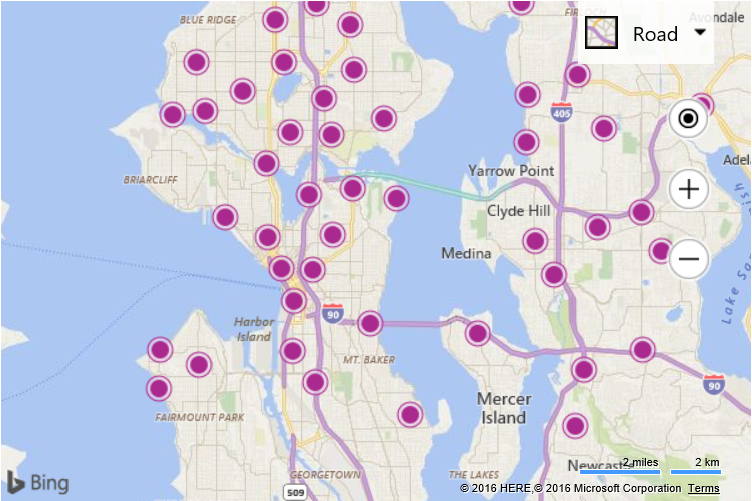

# Basic Intersection Search Example
This example shows how to make a simple intersection query against a data source using the map bounds. As you pan and zoom the map a new query is made to load in new data for the map bounds.

```
<!DOCTYPE html>
<html>
<head>
    <title></title>
    <meta charset="utf-8" />
	<script type='text/javascript'>
    var map;

    //Query URL to the Fourth Coffe Shop data source
    var sdsDataSourceUrl = 'http://spatial.virtualearth.net/REST/v1/data/20181f26d9e94c81acdf9496133d4f23/FourthCoffeeSample/FourthCoffeeShops';

    function GetMap() {
        map = new Microsoft.Maps.Map('#myMap', {});

        //Load the Bing Spatial Data Services module.
        Microsoft.Maps.loadModule('Microsoft.Maps.SpatialDataService', function () {
            //Add an event handler for when the map moves.
            Microsoft.Maps.Events.addHandler(map, 'viewchangeend', getLocationsInView);

            //Trigger an initial search.
            getLocationsInView();
        });
    }

    function getLocationsInView() {
        //Remove any existing data from the map.
        map.entities.clear();

        //Create a query to get data that intrsects the bounds of the map.
        var queryOptions = {
            queryUrl: sdsDataSourceUrl,
            top: 250,
            spatialFilter: {
                spatialFilterType: 'intersects',
                intersects: map.getBounds()
            }
        };

        //Process the query.
        Microsoft.Maps.SpatialDataService.QueryAPIManager.search(queryOptions, map, function (data) {
            //Add results to the map.
            map.entities.push(data);
        });
    }
    </script>
    <script type='text/javascript' src='http://www.bing.com/api/maps/mapcontrol?callback=GetMap&key=[YOUR_BING_MAPS_KEY]' async defer></script>
</head>
<body>
    <div id="myMap" style="position:relative;width:600px;height:400px;"></div>
</body>
</html>
```

When loaded this code will retrieve results from the Fourth Coffee Shop sample data source as you pan and zoom the map that fall within the map bounds. 

