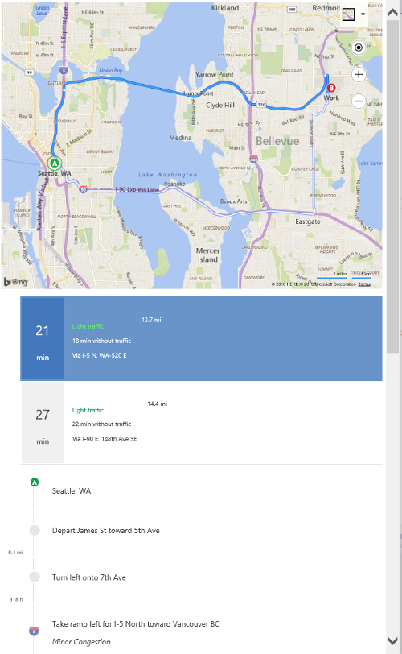

# Calculate Driving Directions
The following example shows how to calculate driving directions from “Seattle, WA” to a “Work” location that has coordinates (47.64, -122.1297). The directions are displayed on the map and instructions are rendered in a div element with an id of `directionsItinerary`.

```
<!DOCTYPE html>
<html>
<head>
    <title></title>
    <meta charset="utf-8" />
	<script type='text/javascript'>
        var map;
        var directionsManager;

        function GetMap()
        {
            map = new Microsoft.Maps.Map('#myMap', {});

            //Load the directions module.
            Microsoft.Maps.loadModule('Microsoft.Maps.Directions', function () {
                //Create an instance of the directions manager.
                directionsManager = new Microsoft.Maps.Directions.DirectionsManager(map);

                //Create waypoints to route between.
                var seattleWaypoint = new Microsoft.Maps.Directions.Waypoint({ address: 'Seattle, WA' });
                directionsManager.addWaypoint(seattleWaypoint);

                var workWaypoint = new Microsoft.Maps.Directions.Waypoint({ address: 'Work', location: new Microsoft.Maps.Location(47.64, -122.1297) });
                directionsManager.addWaypoint(workWaypoint);

                //Specify the element in which the itinerary will be rendered.
                directionsManager.setRenderOptions({ itineraryContainer: '#directionsItinerary' });

                //Calculate directions.
                directionsManager.calculateDirections();
            });
        }
    </script>
    <script type='text/javascript' src='http://www.bing.com/api/maps/mapcontrol?callback=GetMap&key=[YOUR_BING_MAPS_KEY]' async defer></script>
</head>
<body>
    <div id="myMap" style="position:relative;width:800px;height:600px;"></div>
    <div id='directionsItinerary'></div> 
</body>
</html>
```

If you run this code in a web browser, you will see a route drawn on the map with turn by turn instructions displayed underneath it like this.

