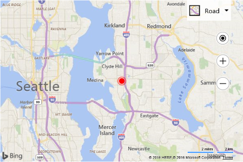

# Changing the color of the default Pushpin
The default pushpin works well for most applications, but sometimes its useful to be able to change its color. Rather than having to having to create a custom pushpin image that is your desired color, you can simply set the color property in the pushpin options. 

```
<!DOCTYPE html>
<html>
<head>
    <title></title>
    <meta charset="utf-8" />
	<script type='text/javascript'>
    function GetMap() {
        var map = new Microsoft.Maps.Map('#myMap', {
            credentials: 'Your Bing Maps Key',
            center: new Microsoft.Maps.Location(47.6149, -122.1941)
        });

        var center = map.getCenter();

        //Create custom Pushpin
        var pin = new Microsoft.Maps.Pushpin(center, {
            color: 'red'
        });

        //Add the pushpin to the map
        map.entities.push(pin);
    }
    </script>
    <script type='text/javascript' src='http://www.bing.com/api/maps/mapcontrol?callback=GetMap' async defer></script>
</head>
<body>
    <div id="myMap" style="position:relative;width:600px;height:400px;"></div>
</body>
</html>
```

Runing this code in a browser will display a red pushpin in the center of the map.

