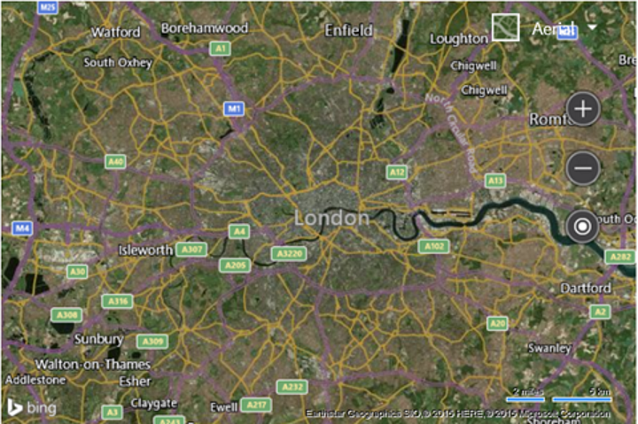

# Customize Map Options on Load Example

[!INCLUDE [bing-maps-web-control-sdk-retirement](../../includes/bing-maps-web-control-sdk-retirement.md)]

You can customize the map as you load it. Use the following code to update how the map is loaded in the GetMap function such that it sets the type to aerial, the zoom level to 10, and the map center over London, UK (51.50632, -0.12714).

```javascript
var map = new Microsoft.Maps.Map('#myMap', {
    credentials: 'Your Bing Maps Key',
    center: new Microsoft.Maps.Location(51.50632, -0.12714),
    mapTypeId: Microsoft.Maps.MapTypeId.aerial,
    zoom: 10
});
```

This results in the map being loaded, zoomed in over London, UK with the aerial imagery displayed.

