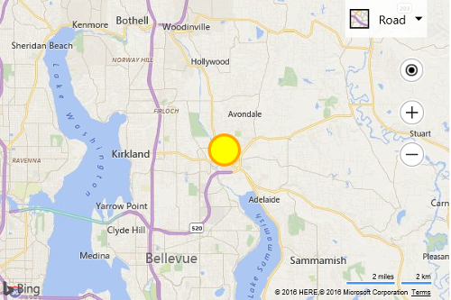

# Custom Inline SVG Pushpin Example
In addition to creating a custom pushpin by loading an SVG file, you can also pass in inline SVG strings as custom pushpins. This is useful if you want to dynamically create an SVG element in code. Take the following SVG markup. 

```
<svg xmlns="http://www.w3.org/2000/svg" width="50" height="50">
    <circle cx="25" cy="25" r="20" stroke="orange" stroke-width="4" fill="yellow" />
</svg>
```

This SVG creates a yellow circle with an orange outline that looks like this: &nbsp; 
 
To create a custom pushpin out of this SVG, convert the SVG into a string and then pass it into the `icon` property of the pushpin, like so:

```
<!DOCTYPE html>
<html>
<head>
    <title></title>
    <meta charset="utf-8" />
	<script type='text/javascript'>
    function GetMap() {
        var map = new Microsoft.Maps.Map('#myMap', {});

        //Create custom Pushpin using an SVG string.
        var pin = new Microsoft.Maps.Pushpin(map.getCenter(), {
            icon: '<svg xmlns="http://www.w3.org/2000/svg" width="50" height="50"><circle cx="25" cy="25" r="20" stroke="orange" stroke-width="4" fill="yellow" /></svg>',
            anchor: new Microsoft.Maps.Point(25, 25)
        });

        //Add the pushpin to the map.
        map.entities.push(pin);
    }
    </script>
    <script type='text/javascript' src='http://www.bing.com/api/maps/mapcontrol?callback=GetMap&key=[YOUR_BING_MAPS_KEY]' async defer></script>
</head>
<body>
    <div id="myMap" style="position:relative;width:600px;height:400px;"></div>
</body>
</html>
```
Here is what this pushpin looks like on the map.


 
[Try it here](http://www.bing.com/api/maps/sdk/mapcontrol/isdk#createPushpinFromSvg+JS)