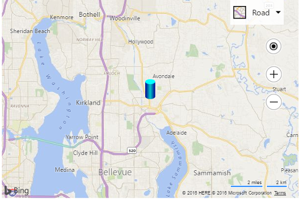

# Custom SVG File Pushpin Example
You can create map images using Scalable Vector Graphics (SVG). These images will look better across different sizes and device display resolutions. This example takes a SVG that is stored in a file called “cylinder.svg” and contains the following markup:

```
<svg xmlns="http://www.w3.org/2000/svg"
     width="20" height="40">
  <defs>
    <linearGradient id="grad1" x1="0%" y1="0%" x2="100%" y2="0%">
      <stop offset="0%" style="stop-color:rgb(0,0,145);" />
      <stop offset="50%" style="stop-color:rgb(0,200,200);" />
      <stop offset="100%" style="stop-color:rgb(0,0,145);" />
    </linearGradient>
  </defs>
  
  <ellipse cx="10" cy="35" rx="10" ry="5" fill="url(#grad1)"/>
  <rect x="0" y="5" width="20" height="30" fill="url(#grad1)"/>
  <ellipse cx="10" cy="5" rx="10" ry="5" fill="rgb(0,255,255)"/>
</svg>
```

This SVG creates a nice 3D cylinder that looks like this: &nbsp;

 
To create a custom pushpin out of this SVG, simply pass the path the SVG file into the `icon` property of the pushpin, like so:

```
<!DOCTYPE html>
<html>
<head>
    <title></title>
    <meta charset="utf-8" />
	<script type='text/javascript'>
    function GetMap() {
        var map = new Microsoft.Maps.Map('#myMap', {});

        var center = map.getCenter();

        //Create custom Pushpin using a url to an SVG.
        var pin = new Microsoft.Maps.Pushpin(center, {
            icon: 'images/cylinder.svg',
            anchor: new Microsoft.Maps.Point(10, 40)
        });

        //Add the pushpin to the map
        map.entities.push(pin);
    }
    </script>
    <script type='text/javascript' src='http://www.bing.com/api/maps/mapcontrol?callback=GetMap&key=[YOUR_BING_MAPS_KEY]' async defer></script>
</head>
<body>
    <div id="myMap" style="position:relative;width:600px;height:400px;"></div>
</body>
</html>
```

Here is what this pushpin looks like on the map.


 