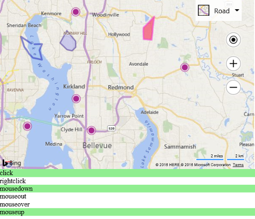

# Data Layer Events
Many applications add mouse events to shapes by looping through each shape and adding an event to it. Doing this results in an event handler being created for each shape. With the Layer class you can add a single event handler to the layer and which applies to all shapes it contains. This requires writing less code, reduces the amount of memory required and provides a small performance benefit. The following code adds some random shapes to a layer and then attaches all the different mouse events to the layer.

```
<!DOCTYPE html>
<html>
<head>
    <title></title>
    <meta charset="utf-8" />
	<script type='text/javascript'>
    var map;

    function GetMap() {
        map = new Microsoft.Maps.Map('#myMap', {});

        //Create a layer.
        var layer = new Microsoft.Maps.Layer();

        //Add some data to it.
        layer.add(Microsoft.Maps.TestDataGenerator.getPushpins(5, map.getBounds()));
        layer.add(Microsoft.Maps.TestDataGenerator.getPolygons(2, map.getBounds()));
        layer.add(Microsoft.Maps.TestDataGenerator.getPolylines(2, map.getBounds()));

        //Add layer to map.
        map.layers.insert(layer);

        //Add mouse events to the layer.
        Microsoft.Maps.Events.addHandler(layer, 'click', function () { highlight('click'); });
        Microsoft.Maps.Events.addHandler(layer, 'rightclick', function () { highlight('rightclick'); });
        Microsoft.Maps.Events.addHandler(layer, 'mousedown', function () { highlight('mousedown'); });
        Microsoft.Maps.Events.addHandler(layer, 'mouseout', function () { highlight('mouseout'); });
        Microsoft.Maps.Events.addHandler(layer, 'mouseover', function () { highlight('mouseover'); });
        Microsoft.Maps.Events.addHandler(layer, 'mouseup', function () { highlight('mouseup'); });
    }

    function highlight(id) {
        //Highlight the mouse event div to indicate that the event has fired.
        document.getElementById(id).style.background = 'LightGreen';

        //Remove the highlighting after a second.
        setTimeout(function () { document.getElementById(id).style.background = 'white'; }, 1000);
    }
    </script>
    <script type='text/javascript' src='http://www.bing.com/api/maps/mapcontrol?callback=GetMap&key=[YOUR_BING_MAPS_KEY]' async defer></script>
</head>
<body>
    <div id="myMap" style="position:relative;width:600px;height:400px;"></div>

    <div id="click">click</div>
    <div id="rightclick">rightclick</div>
    <div id="mousedown">mousedown</div>
    <div id="mouseout">mouseout</div>
    <div id="mouseover">mouseover</div>
    <div id="mouseup">mouseup</div>
</body>
</html>
```

If you run this code and hover and click any of the shapes, you will see all these different events fire.

