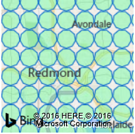
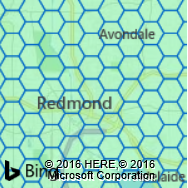
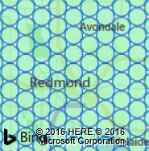
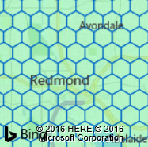
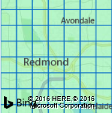

# DataBinType Enumeration
This enumeration is used to specify the shape of data bin rendered in the layer. This enumeration is specified as `Microsoft.Maps.DataBinType.[Name]` where Name can be any of the following values.

| Name          | Description                                             | Example |
|---------------|---------------------------------------------------------|---------|
| `circle`        | Renders data bins as circles in a square grid.          |  |
| `hexagon`       | Renders data bins as hexagons with a flat top edge.     | 
| `hexCircle`     | Renders data bins as circles in a hexagonal grid.       |  |
| `pointyHexagon` | Renders data bins as hexagons with a pointy top corner. |  |
| `square`        | Renders data bins as a square grid.                     |  |