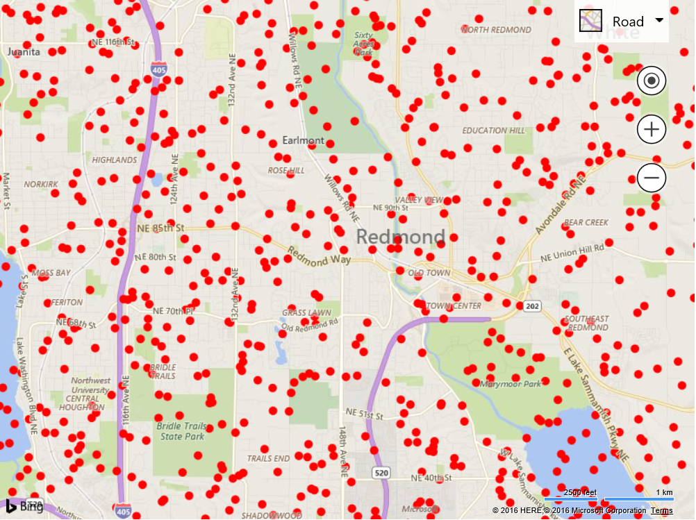

# Dynamic Canvas Overlay
This example shows how to use a canvas to create a custom rendering layer. 
First we will start off by creating a reusable Canvas Overlay module that not only inserts a canvas element into the map, but also scales and translate it when the map is moving to provide a more fluid user experience without having to do the expensive rerendering of data on the canvas. To make this module reusable it takes in a callback function which receives a reference to the canvas which you can then draw your data on top of. The following is the code for the module with is saved in a file called **CanvasOverlayModule.js**.

```
//Define a custom overlay class that inherts from the CustomOverlay class.
CanvasOverlay.prototype = new Microsoft.Maps.CustomOverlay();

//Define the Canvas Overlay constructor which takes in a callback function which draws on the canvas.
//The callback function will recieve a reference to the canvas element.
function CanvasOverlay(drawCallback) {
    //Create a canvas for rendering.
    this.canvas = document.createElement('canvas');
    this.canvas.style.position = 'absolute';
    this.canvas.style.left = '0px';
    this.canvas.style.top = '0px';

    //Variables to track view change events.
    this.viewChangeEvent;
    this.viewChangeEndEvent;

    //Simple function for updating the CSS position and dimensions of the canvas.
    this._updatePosition = function (x, y, w, h) {
        //Update CSS position.
        this.canvas.style.left = x + 'px';
        this.canvas.style.top = y + 'px';

        //Update CSS dimensions.
        this.canvas.style.width = w + 'px';
        this.canvas.style.height = h + 'px';
    };

    //This function is triggered when the canvas needs to be rerendered.
    this._redraw = function () {
        //Clear canvas by updating dimensions. This also ensures canvas stays the same size as the map.
        this.canvas.width = this.getMap().getWidth();
        this.canvas.height = this.getMap().getHeight();

        //Call the defined drawing callback function.
        drawCallback(this.canvas);
    };
}

//Implement the onAdd method to set up DOM elements, and use setHtmlElement to bind it with the overlay.
CanvasOverlay.prototype.onAdd = function () {
    //Add the canvas to the overlay.            
    this.setHtmlElement(this.canvas);
};

//Implement the onLoad method to perform custom operations after adding the overlay to the map.
CanvasOverlay.prototype.onLoad = function () {
    var self = this;
    var map = self.getMap();

    //Get the current map view information.
    var zoomStart = map.getZoom();
    var centerStart = map.getCenter();

    //Redraw the canvas.
    self._redraw();

    self.viewChangeEvent = Microsoft.Maps.Events.addHandler(map, 'viewchange', function (e) {
        if (map.getMapTypeId() == Microsoft.Maps.MapTypeId.streetside) {
            //Don't show the canvas if the map is in Streetside mode.
            self.canvas.style.display = 'none';
        } else {
            //Re-drawing the canvas as it moves would be too slow. Instead, scale and translate canvas element.
            var zoomCurrent = map.getZoom();
            var centerCurrent = map.getCenter();

            //Calculate map scale based on zoom level difference.
            var scale = Math.pow(2, zoomCurrent - zoomStart);

            //Calculate the scaled dimensions of the canvas.
            var newWidth = map.getWidth() * scale;
            var newHeight = map.getHeight() * scale;

            //Calculate offset of canvas based on zoom and center offsets.
            var pixelPoints = map.tryLocationToPixel([centerStart, centerCurrent], Microsoft.Maps.PixelReference.control);
            var centerOffsetX = pixelPoints[1].x - pixelPoints[0].x;
            var centerOffsetY = pixelPoints[1].y - pixelPoints[0].y;
            var x = (-(newWidth - map.getWidth()) / 2) - centerOffsetX;
            var y = (-(newHeight - map.getHeight()) / 2) - centerOffsetY;

            //Update the canvas CSS position and dimensions.
            self._updatePosition(x, y, newWidth, newHeight);
        }
    });

    self.viewChangeEndEvent = Microsoft.Maps.Events.addHandler(map, 'viewchangeend', function (e) {
        //Only render the canvas if it isn't in streetside mode.
        if (map.getMapTypeId() != Microsoft.Maps.MapTypeId.streetside) {
            self.canvas.style.display = '';

            //Reset CSS position and dimensions of canvas.
            self._updatePosition(0, 0, map.getWidth(), map.getHeight());

            //Redraw the canvas.
            self._redraw();

            //Get the current map view information.
            zoomStart = map.getZoom();
            centerStart = map.getCenter();
        }
    });
};

CanvasOverlay.prototype.onRemove = function () {
    //Remove all event handlers from the map.
    Microsoft.Maps.Events.removeHandler(this.viewChangeEvent);
    Microsoft.Maps.Events.removeHandler(this.viewChangeEndEvent);
};

//Call the module loaded function.
Microsoft.Maps.moduleLoaded('CanvasOverlayModule');
```

Implementing this canvas overlay is fairly easy and in this example we will simply have it draw 10,000 locations on the map as red circles. 

```
<!DOCTYPE html>
<html>
<head>
    <title></title>
    <meta charset="utf-8" />

    <script type='text/javascript'
            src='http://www.bing.com/api/maps/mapcontrol?callback=GetMap'
            async defer></script>

    <script type='text/javascript'>
    var map;

    function GetMap()
    {
        map = new Microsoft.Maps.Map('#myMap', {
            credentials: 'Your Bing Maps Key'
        });
                
        //Register the custom module.
        Microsoft.Maps.registerModule('CanvasOverlayModule', 'CanvasOverlayModule.js');

        //Load the module.
        Microsoft.Maps.loadModule('CanvasOverlayModule', function () {
            var locations = Microsoft.Maps.TestDataGenerator.getLocations(10000, map.getBounds());

            //Implement the new custom overlay class.
            var overlay = new CanvasOverlay(function (canvas) {
                //Calculate pixel coordinates of locations.
                var points = map.tryLocationToPixel(locations, Microsoft.Maps.PixelReference.control);

                var ctx = canvas.getContext("2d");
                ctx.fillStyle = 'red';

                var pi2 = 2 * Math.PI;

                //Draw circles for each location.
                for (var i = 0, len = points.length; i < len; i++) {
                    ctx.beginPath();
                    ctx.arc(points[i].x, points[i].y, 5, 0, pi2);
                    ctx.fill();
                    ctx.closePath();
                }
            });

            //Add the custom overlay to the map.
            map.layers.insert(overlay);
        });
    }    
    </script>
</head>
<body>
    <div id="myMap" style="position:relative;width:800px;height:600px;"></div>
</body>
</html>
```

Running this code will render 10,000 red circles within the current map view. As you pan and zoom you will see how the canvas moves with the map and renders new data only after the map has finished moving.



You can easily reuse the canvas overlay module and change who and what is rendered on the canvas. The above example works great but could be faster. Instead of drawing each individual circle, we could instead draw a circle on an off screen canvas then draw as an image. This would equire less calculations by the underlay canvas and thus would be much faster to render. Here is a modified version of the canvas overlay callback that does this. If you don’t see any different when rendering 10,000 locations, increase it to 50,000.

```
//Implement the new custom overlay class.
var overlay = new CanvasOverlay(function (canvas) {
    //Calculate pixel coordinates of locations.
    var points = map.tryLocationToPixel(locations, Microsoft.Maps.PixelReference.control);

    //Create an off screen canvas.
    var offScreenCanvas = document.createElement('canvas');
    offScreenCanvas.width = 10;
    offScreenCanvas.height = 10;

    //Draw a circle on the off screen canvas.
    var offCtx = offScreenCanvas.getContext('2d');
    offCtx.fillStyle = 'red';
    offCtx.beginPath();
    offCtx.arc(5, 5, 5, 0, 2 * Math.PI);
    offCtx.closePath();
    offCtx.fill();

    //Get the context of the main canvas.
    var ctx = canvas.getContext("2d");

    //Draw the off screen canvas for each location.
    for (var i = 0, len = points.length; i < len; i++) {
        ctx.drawImage(offScreenCanvas, points[i].x - 5, points[i].y - 5);
    }
});
```

If you would like to go even further you could add a click event as well. To do this, add a click event to the map and then through the data and calculate which circle the mouse was over when the click event occurred. This can be achieved by using the following code:

```
//Add a click event to the map and check to see if a circle is clicked.
Microsoft.Maps.Events.addHandler(map, 'click', function (e) {
    //Get the pixel coordinates of the locations.
    var points = map.tryLocationToPixel(locations, Microsoft.Maps.PixelReference.control);

    //Reverse the array as the top most circle will intersect the mouse first.
    points.reverse();

    //Calculate the square of the radius. As r^2 = x^2 + y^2.
    var r2 = 5 * 5;
    var dx, dy;
    var selectedIdx = -1;

    //Loop through the pixel coordinates until we find one that is within 5 pixel distance of the mouse location.
    for (var i = 0, len = points.length; i < len; i++) {
        dx = points[i].x - e.point.x;
        dy = points[i].y - e.point.y;

        //Check to see if the mouse location is within radial distance of the point.
        if (dx * dx + dy * dy <= r2) {
            //Calculate the index of the point in the un-reversed array
            selectedIdx = len - i - 1;
            break;
        }
    }

    if (selectedIdx >= 0) {
        //Use the selected index value to retrieve the original location object.
        alert('Selected circle at index ' + selectedIdx + ' which is at ' + locations[selectedIdx]);
    }
});
```

The following is the source code for the complete HTML page that includes the off screen canvas optimization and the click event functionality. 

```
<!DOCTYPE html>
<html>
<head>
    <title></title>
    <meta charset="utf-8" />

    <script type='text/javascript'
            src='http://www.bing.com/api/maps/mapcontrol?callback=GetMap'
            async defer></script>

    <script type='text/javascript'>
    var map;

    function GetMap() {
        map = new Microsoft.Maps.Map('#myMap', {
            credentials: 'Your Bing Maps Key'
        });

        //Register the custom module.
        Microsoft.Maps.registerModule('CanvasOverlayModule', 'CanvasOverlayModule.js');

        //Load the module.
        Microsoft.Maps.loadModule('CanvasOverlayModule', function () {
            var locations = Microsoft.Maps.TestDataGenerator.getLocations(2, map.getBounds());

            //Implement the new custom overlay class.
            var overlay = new CanvasOverlay(function (canvas) {
                //Calculate pixel coordinates of locations.
                var points = map.tryLocationToPixel(locations, Microsoft.Maps.PixelReference.control);

                //Create an off screen canvas.
                var offScreenCanvas = document.createElement('canvas');
                offScreenCanvas.width = 10;
                offScreenCanvas.height = 10;

                //Draw a circle on the off screen canvas.
                var offCtx = offScreenCanvas.getContext('2d');
                offCtx.fillStyle = 'red';
                offCtx.beginPath();
                offCtx.arc(5, 5, 5, 0, 2 * Math.PI);
                offCtx.closePath();
                offCtx.fill();

                //Get the context of the main canvas.
                var ctx = canvas.getContext("2d");

                //Draw the off screen canvas for each location.
                for (var i = 0, len = points.length; i < len; i++) {
                    ctx.drawImage(offScreenCanvas, points[i].x - 5, points[i].y - 5, 10, 10);
                }
            });

            //Add a click event to the map and check to see if a circle is clicked.
            Microsoft.Maps.Events.addHandler(map, 'click', function (e) {
                //Get the pixel coordinates of the locations.
                var points = map.tryLocationToPixel(locations, Microsoft.Maps.PixelReference.control);

                //Reverse  the array as the top most circle will intersect the mouse first.
                points.reverse();

                //Calculate the square of the radius. As r^2 = x^2 + y^2.
                var r2 = 5 * 5;
                var dx, dy;
                var selectedIdx = -1;

                //Loop through the pixel coordinates until we find one that is within 5 pixel distance of the mouse location.
                for (var i = 0, len = points.length; i < len; i++) {
                    dx = points[i].x - e.point.x;
                    dy = points[i].y - e.point.y;

                    //Check to see if the mouse location is within radial distance of the point.
                    if (dx * dx + dy * dy <= r2) {
                        //Calculate the index of the point in the un-reversed array
                        selectedIdx = len - i - 1;
                        break;
                    }
                }

                if (selectedIdx >= 0) {
                    //Use the selected index value to retrieve the original location object.
                    alert('Selected circle at index ' + selectedIdx + ' which is at ' + locations[selectedIdx]);
                }
            });

            //Add the custom overlay to the map.
            map.layers.insert(overlay);
        });
    }
    </script>
</head>
<body>
    <div id="myMap" style="position:relative;width:800px;height:600px;"></div>
</body>
</html>
```
