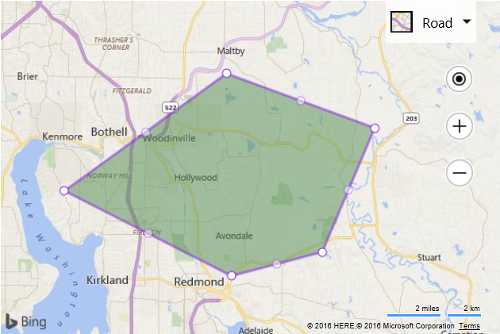

# Edit an Existing Shape
This example shows how to take an existing polygon and enable editing on it.

```
<!DOCTYPE html>
<html>
<head>
    <title></title>
    <meta charset="utf-8" />
	<script type='text/javascript'>
    function GetMap() {
        var map = new Microsoft.Maps.Map('#myMap', {});

        //Create a random polygon.
        var polygon = Microsoft.Maps.TestDataGenerator.getPolygons(1, map.getBounds());

        //Load the DrawingTools module.
        Microsoft.Maps.loadModule('Microsoft.Maps.DrawingTools', function () {
            //Create an instance of the DrawingTools class and bind it to the map.
            var tools = new Microsoft.Maps.DrawingTools(map);

            //Pass the polygon to the drawing tools to be edited.
            tools.edit(polygon);
        });
    }
    </script>
    <script type='text/javascript' src='http://www.bing.com/api/maps/mapcontrol?callback=GetMap&key=[YOUR_BING_MAPS_KEY]' async defer></script>
</head>
<body>
    <div id="myMap" style="position:relative;width:600px;height:400px;"></div>
</body>
</html>
```

Running this code in a browser will display a map with polygon on it. The vertices and edges of the polygon will have little handles on them so you can drag them to edit the shape of the polygon.



[Try it now](http://www.bing.com/api/maps/sdk/mapcontrol/isdk#dtEditPolygon+JS)