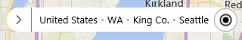

# MapOptions Object

The following map options can be used to customize the map. Some of the map options can be changed after the map has loaded by using the **setOptions** function on the map.

Name                      | Type                | Description
------------------------- | ------------------- | -------------------------------------------
`allowHidingLabelsOfRoad`   | boolean             | A boolean that, when set to true, allows the road labels to be hidden. Default: **false**  This property can only be set when using the Map constructor.
`allowInfoboxOverflow` | boolean | A boolean indicating if the infobox is allowed to overflow outside the bounds of the map. Default: **false**
`backgroundColor` | string _or_ [Color](color-class.md) | The color to use for the map control background. The default color is #EAE8E1.  This property can only be set when using the Map constructor.
`credentials`               | string              | **Deprecated.** The Bing Maps Key used to authenticate the application. This property can only be set when using the Map constructor.   It is recommended that the Bing Maps key be set as a URL parameter of the Bing Maps script reference as documented in the [Setting Map Control Parameters](../creating-and-hosting-map-controls/setting-map-control-parameters.md) document. This option will continue to work.
`customMapStyle` | CustomMapStyle | Custom map styles used to modify the look and feel of the base map. See [Custom Map Styles in Bing Maps](../../articles/custom-map-styles-in-bing-maps.md) for more information.
`disableBirdseye` | boolean | A boolean indicating whether to disable the bird’s eye map type. The default value is false. If this property is set to true, bird’s eye will be removed from the map navigation control and the birdseye MapTypeId is disabled. Additionally, the auto map type will only display road or aerial.  This property can only be set when using the Map constructor. Default: **false**
`disableKeyboardInput` | boolean | A boolean value indicating whether to disable the user’s ability to change the map type through the keyboard. Default: **false**
`disableMapTypeSelectorMouseOver` | boolean | A boolean value indicating if mousing over the map type selector should open it or not. Default: **false**
`disablePanning`            | boolean             | A boolean value indicating whether to disable the user's ability to pan the map. Default: **false**
`disableScrollWheelZoom`    | boolean             | Scrolling the mouse wheel over the map will zoom it in or out, but will not scroll the page. Setting this property to true disables the zooming of the map and instead reverts back to scrolling the page. Default: **false**
`disableStreetside` | boolean | A boolean indicating whether to disable streetside mode. If this property is set to true, streetside will be removed from the navigation bar, and the automatic coverage overlay will be disabled when zoomed in at lower zoom levels. Default **false**   This property can only be set when using the Map constructor.
`disableStreetsideAutoCoverage` | boolean | A boolean indicating whether to disable the automatic streetside coverage layer that appears when zoomed in at lower zoom levels. Default **false**   This property can only be set when using the Map constructor.
`disableZooming`            | boolean             | A boolean value indicating whether to disable the user's ability to zoom in or out. Default: **false**
`enableClickableLogo`       | boolean             | A boolean value indicating whether the Bing(TM) logo on the map is clickable. Default: true.  This property can only be set when using the Map constructor.
`enableCORS` | boolean | A boolean value indicating if CORS ([Cross-origin Resource Sharing](https://en.wikipedia.org/wiki/Cross-origin_resource_sharing)) should be enabled for tiles. Useful if directly accessing the canvas to generate an image of the map. Default: **false**  Known Limitations: • IE and Edge will not cache tiles when CORS is enabled. • Chrome throws errors when this property is set enabled and custom tile layers don’t have CORS enabled on the server.  This property can only be set when using the Map constructor.
`enableHighDpi` | boolean | Enables the map to use map tiles suitable for a higher DPI display, if the display supports it. When set to false and the map is loaded on a high DPI display, custom tile layers will load tiles at a higher zoom level and scale the image to increase the DPI. Default: **false**.  This property can only be set when using the Map constructor.
`enableInertia`            | boolean             | A boolean value indicating whether to use the inertia animation effect during map navigation. Default: **true**  This property can only be set when using the Map constructor.
`liteMode` | boolean | A boolean that indicates if the map should be rendered using lite mode. When set to true vector map labels are disabled and map labels are rendered directly into the map tiles. This offers improved performance, but will result in the labels being rendered behind data on the map and the labels will also not use collision detection with pushpins. If this property is not set, the map set this value based on the target device and browser as vector labels perform better in some scenarios than others. Find out more about vector labels in Bing Maps V8 [here](../articles/vector-map-labels.md).   This property can only be set when using the Map constructor.
`maxBounds`                 | [LocationRect](locationrect-class.md)        | A bounding area that restricts the map view. 
`maxZoom`                   | number              | The maximum zoom level that the map can be zoomed into.
`minZoom`                   | number              | The minimum zoom level that the map cab be zoomed out to.
`navigationBarMode`         | [NavigationBarMode](navigationbarmode-enumeration.md) | Specifies how the navigation bar should be rendered on the map.
`navigationBarOrientation`  | [NavigationBarOrientation](navigationbarorientation-enumeration.md) | A boolean whether what orientation should be used when laying out the navigation controls. 
`showBreadcrumb`            | boolean             | A boolean value indicating whether to display the "breadcrumb control". The breadcrumb control shows the current center location’s geography hierarchy. For example, if the location center is Seattle, the breadcrumb control displays that looks like this:    The default value is **false**. Requires the **showLocateMeButton** map option to be set to true. The breadcrumb control displays best when the width of the map is at least 400 pixels.
`showDashboard`             | boolean             | A boolean value indicating whether to show the map navigation control. Default: **true**   This property can only be set when using the Map constructor.
`showLocateMeButton`        | boolean             | A boolean value indicating whether to show a button that centers the map over the user's location in the map navigation control. Default: **true**   This property can only be set when using the Map constructor.
`showMapTypeSelector`       | boolean             | A boolean value indicating whether to show the map type selector in the map navigation control. Default: **true**  This property can only be set when using the Map constructor. 
`showScalebar`              | boolean             | A boolean value indicating whether to show the scale bar. Default: **true**  This property can only be set when using the Map constructor.
`showTrafficButton` | boolean | When using the minified navigation bar, a traffic button is displayed. Setting this option to false will hide this button.
`showTermsLink`             | boolean             | A boolean value indicating whether to show a link to the End User Terms of Use, which appears to the right of the copyrights, or not. Default: **True**  **Note**: The [Bing Maps Platform API’s Terms of Use](https://www.microsoft.com/maps/product/terms.html) state that you must provide a hypertext link to the [Bing Maps TOU](https://go.microsoft.com/?linkid=9710837): (i) at the bottom of each page in your Company Application where the Services can be viewed or accessed, or (ii) within the terms of use of your Company Application. Displaying this link on the map beside the copyright information addresses this requirement.  This property can only be set when using the Map constructor.
`showZoomButtons`           | boolean             | A boolean value indicating whether to show the zoom buttons in the map navigation control. Default: **true**  This property can only be set when using the Map constructor.
`streetsideOptions`         | [StreetsideOptions](streetsideoptions-object.md)  | A set of properties for the streetside mode of the map.
`supportedMapTypes` | [MapTypeId](maptypeid-enumeration.md)\[\] | Additional support map types that should be added to the navigation bar such as canvasDark, canvasLight, and grayscale.

