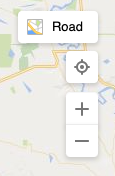

# NavigationBarMode Enumeration
The NavigationBarMode can be used to customize the layout and style of the navigation bar.

| Name | Description    | Example   
| ---- | -------------- | :------: |                                         
| `compact`  | A compact navigation bar that includes a smaller drop down for the map type and zoom buttons. Recommended for small maps or screen such as a mobile device. | 
| `default`  | The default navigation bar that has a drop down for the map type, a locate me button, and zoom buttons. Recommended for medium to large maps in desktop browsers.  | 
| `minified` | A minified navigation bar that has a button to toggle between road and aerial maps, zoom buttons, and a button to turn traffic information on and off. Recommended for small maps or screen such as a mobile device. | 
| `square` | A navigation bar that uses aligned square icons. It includes a drop down for map type, a locate me button, and zoom buttons. It is also the only mode that supports the floor switcher for [Venues](../../venues/index.md). | 
