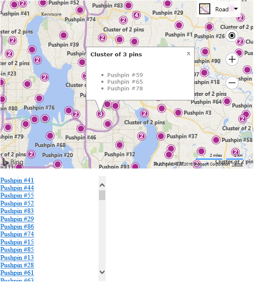

# Clusters with a List and Linking

[!INCLUDE [bing-maps-web-control-sdk-retirement](../../../includes/bing-maps-web-control-sdk-retirement.md)]

This example shows how to dynamically create a list of the pushpins that are currently displayed in the clustering layer and also link each list item back to the clustered pushpin. When any pushpin, clustered pushpin or item in the list of clicked a corresponding infobox will be displayed on the map.

```html
<!DOCTYPE html>
<html>
<head>
    <title></title>
    <meta charset="utf-8" />
	<script type="text/javascript">
    var map, clusterLayer, infobox;

	function GetMap() {
	    map = new Microsoft.Maps.Map('#myMap', {});

        //Add an infobox to the map.
	    infobox = new Microsoft.Maps.Infobox(map.getCenter(), { visible: false });
	    infobox.setMap(map);

        Microsoft.Maps.loadModule("Microsoft.Maps.Clustering", function () {
            //Create a clustering layer
            clusterLayer = new Microsoft.Maps.ClusterLayer(createCustomPushpins(100), {
                clusteredPinCallback: createCustomClusterPushpins,
                callback: createPushpinList
            });
            map.layers.insert(clusterLayer);
        });
	}

	function createCustomPushpins(size) {
        //Generate random pushpins within the map bounds.
	    var pins = Microsoft.Maps.TestDataGenerator.getPushpins(size, map.getBounds());

	    for (var i = 0; i < size; i++) {
	        //Create a title for each pushpin.
	        pins[i].setOptions({ title: 'Pushpin #' + i });

	        //Add handler for the pushpin click event.
	        Microsoft.Maps.Events.addHandler(pins[i], 'click', pushpinClicked);
	    }

	    return pins;
	}

	function createCustomClusterPushpins(cluster) {
	    //Create a title for the cluster.
	    cluster.setOptions({
	        title: 'Cluster of ' + cluster.containedPushpins.length + ' pins'
	    });

	    //Add handler for the cluster click event.
	    Microsoft.Maps.Events.addHandler(cluster, 'click', pushpinClicked);
	}

	function pushpinClicked(e) {
        //Show an infobox when a pushpin is clicked.
	    showInfobox(e.target);
	}

	function createPushpinList() {
	    //Create a list of displayed pushpins each time clustering layer updates.

	    if (clusterLayer != null) {
	        infobox.setOptions({ visible: false });

            //Get all pushpins that are currently displayed.
	        var data = clusterLayer.getDisplayedPushpins();
	        var output = [];

            //Create a list of links for each pushpin that opens up the infobox for it.
	        for (var i = 0; i < data.length; i++) {
	            output.push("<a href='javascript:void(0);' onclick='showInfoboxByGridKey(", data[i].gridKey, ");'>");
	            output.push(data[i].getTitle(), "</a><br/>");
	        }

	        document.getElementById('listOfPins').innerHTML = output.join('');
	    }
	}

	function showInfoboxByGridKey(gridKey) {
        //Look up the cluster or pushpin by gridKey.
        var clusterPin = clusterLayer.getClusterPushpinByGridKey(gridKey);

        //Show an infobox for the cluster or pushpin.
	    showInfobox(clusterPin);
	}

	function showInfobox(pin) {
	    var description = [];

        //Check to see if the pushpin is a cluster.
	    if (pin.containedPushpins) {

	        //Create a list of all pushpins that are in the cluster.
	        description.push('<div style="max-height:75px;overflow-y:auto;"><ul>');
	        for (var i = 0; i < pin.containedPushpins.length; i++) {
	            description.push('<li>', pin.containedPushpins[i].getTitle(), '</li>');
	        }
	        description.push('</ul></div>');
	    }

        //Display an infobox for the pushpin.
	    infobox.setOptions({
	        title: pin.getTitle(),
	        location: pin.getLocation(),
	        description: description.join(''),
	        visible: true
	    });
	}
    </script>
    <script type='text/javascript' src='https://www.bing.com/api/maps/mapcontrol?callback=GetMap&key=[YOUR_BING_MAPS_KEY]' async defer></script>
</head>
<body>
    <div id="myMap" style="position:relative; width:600px; height:400px;"></div>
    <br />
    <div id="listOfPins" style="max-height:250px;width:250px;overflow-y:scroll;"></div>
</body>
</html>
```

Running this code in a browser will generate 100 random pushpins, each with a different title value. All pushpins, including clustered pushpins have a click event on them which opens up an infobox. An infobox for a clustered pushpin shows a list of all the pushpins that are within that cluster. Below the map a list of all pushpins that are currently displayed on the map is shown. Clicking on any of these will also open up the corresponding infobox on the map. 

