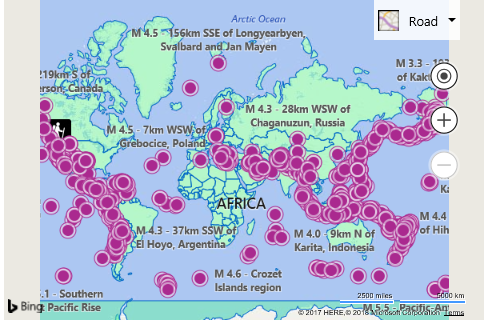

# Load a Configurable Map with Code Example

In addition to being able to load a map configuration file via an iframe, they can also be loaded in your application code as well, providing a nice jump start to your app development. When a configuration file is loaded, a map instance is created and your data sets loaded on it, a callback that you specified when loaded the configuration file is then called and receives a reference to the map instance so that you can continue developing against like you normally would in a Bing Maps V8 based web app. The following shows how to load a map configuration map in code. Once loaded this code will wait 5 seconds then change the maps zoom level using code.

```html
<!DOCTYPE html>
<html>
<head>
    <title></title>
    <meta charset="utf-8" />
    <script type='text/javascript'>
    var map;

    function GetMap()
    {
        Microsoft.Maps.ConfigurableMap.createFromConfig('#myMap',
            'https://bingmapsisdk.blob.core.windows.net/isdksamples/configmap2.json',
            false,
            null, 
            function (mapObj) {
                //Store a reference to the map object instance.
                map = mapObj;

                //You can use the map object to just as you would normally.
                //To demonstrate this, the following code will change the map view after 5 seconds.
                setTimeout(function () {
                    //Change the zoom level of the map.
                    map.setView({ zoom: 5 });
                }, 5000);
            }, function (errorMsg) {
                //An error occurred, display it.
                alert(message);
            });
    }
    </script>
    <script type='text/javascript' src='https://www.bing.com/api/maps/mapcontrol?callback=GetMap&key=[YOUR_BING_MAPS_KEY]' async defer></script>
</head>
<body>
    <div id="myMap" style="position:relative;width:800px;height:600px;"></div>
</body>
</html>
```

Here is a screenshot of the map that is rendered when loading this configuration file. 5 seconds after the map is loaded, the map will zoom in.



[Try it now](https://bingmapsv8samples.azurewebsites.net/#Load%20a%20Configurable%20Map%20with%20Code)
