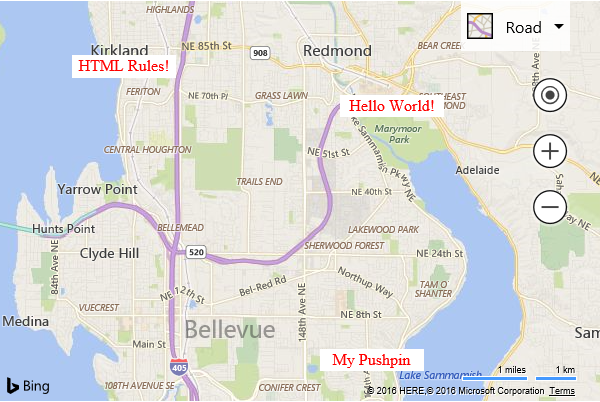

# HTML Pushpin Overlay

[!INCLUDE [bing-maps-web-control-sdk-retirement](../../includes/bing-maps-web-control-sdk-retirement.md)]

In Bing Maps V8 all data layers, with the exception of custom overlays, are rendered using an HTML5 canvas. This provides increased rendering performance, but has some limitions. The most notable being that HTML elements can’t easily be rendered as pushpins.
This example shows how to create a HTML Pushpin Layer using a custom overlay. Additionally, this example also stores the code for this custom overlay in a separate JavaScript file and exposes it as a custom module so that it can be easily reused in any Bing Maps V8 application. This JavaScript is stored in a file called **HtmlPushpinLayerModule.js** and contains the following code:

```javascript
//A simple class that defines a HTML pushpin.
var HtmlPushpin = function (loc, html, anchor) {
    this.location = loc;
    this.anchor = anchor;

    //A property for storing data relative to the pushpin.
    this.metadata = null; 

    //Create the pushpins DOM element.
    this._element = document.createElement('div'); 
    this._element.innerHTML = html;
    this._element.style.position = 'absolute';
};

//A reusable class for overlaying HTML elements as pushpins on the map.
var HtmlPushpinLayer = function () {
    //Store the pushpins.
    this._pushpins = null;

    //A variable to store the viewchange event handler id.
    this.viewChangeEventHandler = null;

    //A variable to store a reference to the container for the HTML pushpins.
    this.container = null;

    //Method to define the pushpins to display in the layer.
    this.setPushpins = function (pushpins) {
        //Store the pushpin data.
        this._pushpins = pushpins;

        //Clear the container.
        if (this.container) {
            this.container.innerHTML = '';

            if (pushpins) {
                //Add the pushpins to the container.
                for (var i = 0, len = pushpins.length; i < len; i++) {
                    this.container.appendChild(pushpins[i]._element);
                }
            }
        }

        this.updatePositions();
    };

    //A function that updates the position of a HTML pushpin element on the map.
    this._updatePushpinPosition = function (pin) {
        if (this.getMap()) {
            //Calculate the pixel location of the pushpin.
            var topLeft = this.getMap().tryLocationToPixel(pin.location, Microsoft.Maps.PixelReference.control);

            //Offset position to account for anchor.
            topLeft.x -= pin.anchor.x;
            topLeft.y -= pin.anchor.y;

            //Update the position of the pushpin element.
            pin._element.style.left = topLeft.x + 'px';
            pin._element.style.top = topLeft.y + 'px';
        }
    };

    //A function that updates the positions of all HTML pushpins in the layer.
    this.updatePositions = function () {
        if (this._pushpins) {
            for (var i = 0, len = this._pushpins.length; i < len; i++) {
                this._updatePushpinPosition(this._pushpins[i]);
            }
        }
    };
};

//Define a custom overlay class that inherts from the CustomOverlay class.
HtmlPushpinLayer.prototype = new Microsoft.Maps.CustomOverlay({ beneathLabels: false });

//Implement the onAdd method to set up DOM elements, and use setHtmlElement to bind it with the overlay.
HtmlPushpinLayer.prototype.onAdd = function () {
    //Create a div that will hold the pushpins.
    this.container = document.createElement('div');
    this.container.style.position = 'absolute';
    this.container.style.left = '0px';
    this.container.style.top = '0px';

    this.setHtmlElement(this.container);
};

//Implement the onLoad method to perform custom operations after adding the overlay to the map.
HtmlPushpinLayer.prototype.onLoad = function () {
    var self = this;

    //Reset pushpins as overlay is now loaded.
    self.setPushpins(self._pushpins);

    //Update the position of the pushpin when the view changes.
    this.viewChangeEventHandler = Microsoft.Maps.Events.addHandler(self.getMap(), 'viewchange', function () {
        self.updatePositions();
    });
};

HtmlPushpinLayer.prototype.onRemove = function () {
    //Remove the event handler that is attached to the map.
    Microsoft.Maps.Events.removeHandler(this.viewChangeEventHandler);
};

//Call the module loaded function.
Microsoft.Maps.moduleLoaded('HtmlPushpinLayerModule');
```

The following code shows how to implement this module by adding a simple HTML element to the center of the map.

```html
<!DOCTYPE html>
<html>
<head>
    <title></title>
    <meta charset="utf-8" />
	<script type='text/javascript'>
    var map;

    function GetMap()
    {
        map = new Microsoft.Maps.Map('#myMap', {});

        //Register the custom module.
        Microsoft.Maps.registerModule('HtmlPushpinLayerModule', 'HtmlPushpinLayerModule.js');

        //Load the module.
        Microsoft.Maps.loadModule('HtmlPushpinLayerModule', function () {
            //Create some HTML pushpins in random locations. 
            var locs = Microsoft.Maps.TestDataGenerator.getLocations(3, map.getBounds());

            //Create a simple reusable HTML template to keep things easy.
            var htmlTemplate = '<div style="color:red;background-color:white;width:100px;padding:2px;text-align:center;">{text}</div>';

            var pins = [
                new HtmlPushpin(locs[0], htmlTemplate.replace('{text}', 'Hello World!'), new Microsoft.Maps.Point(50, 12)),
                new HtmlPushpin(locs[1], htmlTemplate.replace('{text}', 'My Pushpin'), new Microsoft.Maps.Point(50, 12)),
                new HtmlPushpin(locs[2], htmlTemplate.replace('{text}', 'HTML Rules!'), new Microsoft.Maps.Point(50, 12))
            ];

            var layer = new HtmlPushpinLayer();
            layer.setPushpins(pins);

            //Add the HTML pushpin to the map.
            map.layers.insert(layer);
        });
    }
    </script>
    <script type='text/javascript' src='http://www.bing.com/api/maps/mapcontrol?callback=GetMap&key=[YOUR_BING_MAPS_KEY]' async defer></script>
</head>
<body>
    <div id="myMap" style="position:relative;width:600px;height:400px;"></div>
</body>
</html>
```

Running this code will display three HTML pushpins on the map that consist of a white box containing some red text.



A more in-depth code sample which includes support for dragging of HTML pushpins can be found [here](https://bingmapsv8samples.azurewebsites.net/#Html%20Pushpin%20Layer). 