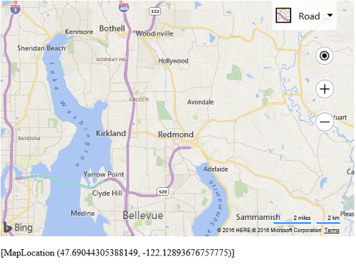

# Event Examples
The Bing Maps control provides many events to allow your application to respond to user actions. The Map, Pushpin, Polyline, Polygon and Layer classes along with many of the modules all have events. Here are a couple of examples of where you may want to use events:

 * If a user clicks on a shape, trigger an event that opens an infobox. 
 * If the map style changes you may want to change the color of items overlaid on the map so that they stand out better -- for example, using light colors on aerial maps and dark colors on road maps. 
 * If the user has moved the map you may wish to load in new data for the new viewing area. 

## Examples

* [Map Events](../map/map-events.md)
* [Pushpin Events](../pushpins/pushpin-events-example.md)
* [Polyline Events](../map-shapes-polylines-and-polygons/polyline-events.md)
* [Polygon Events](../map-shapes-polylines-and-polygons/polygon-events.md)
* [Data Layer Events](../layers/data-layer-events.md)
* [Right Click Events for Shapes](right-click-events-for-shapes.md)

## Related Topics

* [Events Class](../../map-control-api/events-class.md)
* [Map Class ](../../map-control-api/map-class.md)
* [Pushpin Class](../../map-control-api/pushpin-class.md)
* [Polyline Class](../../map-control-api/polyline-class.md)
* [Polygon Class](../../map-control-api/polygon-class.md)
* [Layer Class](../../map-control-api/layer-class.md)
* [MouseEventArgs Object](../../map-control-api/mouseeventargs-object.md)

## Basic Example

The following example shows how to add a viewchange event to the map and have the location information of the center of the map displayed and updated as the map moves. 

```
<!DOCTYPE html>
<html>
<head>
    <title></title>
    <meta charset="utf-8" />
	<script type='text/javascript'>
    function GetMap() {
        var map = new Microsoft.Maps.Map('#myMap', {
            credentials: ‘Your Bing Maps Key’
        });

        Microsoft.Maps.Events.addHandler(map, 'viewchange', function (e) {
            document.getElementById('output').innerHTML = map.getCenter();
        });
    }
    </script>
    <script type='text/javascript' src='http://www.bing.com/api/maps/mapcontrol?callback=GetMap' async defer></script>
</head>
<body>
    <div id="myMap" style="position:relative;width:600px;height:400px;"></div><br/>
    <div id="output"></div>
</body>
</html>
```

As you pan the map you will notice that the location information for the center of the map will appear below the map. 


 
**_Tip_**: Some of the events, such as the mouse related events, pass an event argument to the event handler. This event argument can contain important information such as a reference to the target object the event is attached to, or the pixel coordinates where the mouse event occurred. If you want to get the coordinates of a mouse event, use the `location` property of the event argument.
