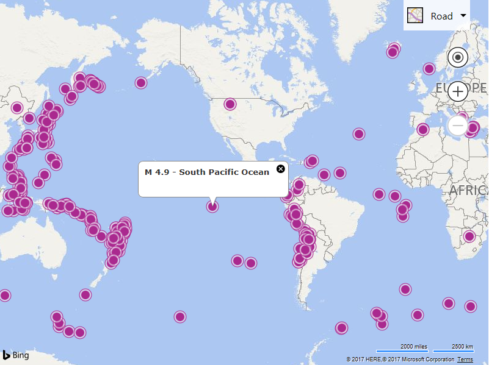

# Reading Geospatial XML Files Cross Domain

Reading XML files that are hosted on a different domain can pose some challenges. If the server in which the XML file is hosted has [CORs (Cross-origin resource sharing)](https://en.wikipedia.org/wiki/Cross-origin_resource_sharing) enabled, then simply passing in the URL into the read function of GeoXmlLayer. When the server does not have CORs enabled, the browser will not be able to directly access the file. To get around this you can setup a proxy service on your server which will request the XML file server side and bring the content to the same domain as your application. This sample shows how to create a simple proxy service using a [Generic Handler](https://msdn.microsoft.com/library/ms228090.aspx) in .NET to pass XML data to the GeoXml module.

**Important:** Only access files from domains you trust to prevent possible XSS attacks.

To create the proxy service, create a Generic Handler called **GeoXmlProxyService.ashx** and add the following code to it. This proxy service will take in a URL as a query parameter, call it and download its data, then transfer it back to your application.

```csharp
public class GeoXmlProxyService : IHttpHandler
{
    public void ProcessRequest(HttpContext context)
    {
        string url = context.Request.QueryString["url"];

        //Setup response caching for 5 minutes (adjust as you see fit).
        SetCacheHeaders(DateTime.UtcNow.AddMinutes(5), context);

        //Add CORs allowed origin.
        context.Response.AppendHeader("Access-Control-Allow-Origin", "*");

        //Generate response
        HttpWebRequest request = (HttpWebRequest)HttpWebRequest.Create(url);

        try
        {
            HttpWebResponse response = (HttpWebResponse)request.GetResponse();

            var contentType = response.Headers["Content-Type"];
            context.Response.ContentType = contentType;

            if (IsCompressedContentType(contentType))
            {
                using (var stream = response.GetResponseStream())
                {
                    context.Response.BufferOutput = false;
                    byte[] buffer = new byte[1024];
                    int bytesRead = 0;
                    while ((bytesRead = stream.Read(buffer, 0, buffer.Length)) > 0)
                    {
                        context.Response.OutputStream.Write(buffer, 0, bytesRead);
                    }
                }
            }
            else
            {
                //Assume the response is text or XML.
                StreamReader stream = new StreamReader(response.GetResponseStream(), Encoding.ASCII);
                context.Response.Write(stream.ReadToEnd());
            }
        }
        catch
        {
            //Unable to read URL. Return a null response.
            context.Response.Write(null);
        }

        context.ApplicationInstance.CompleteRequest();
    }

    public bool IsReusable
    {
        get
        {
            return true;
        }
    }

    private bool IsCompressedContentType(string contentType)
    {
        return (string.Compare(contentType, "application/vnd.google-earth.kmz") == 0 ||
            string.Compare(contentType, "application/zip") == 0 ||
            string.Compare(contentType, "application/octet-stream") == 0);
    }

    protected void SetCacheHeaders(DateTime length, HttpContext context)
    {
        if (length != null)
        {
            context.Response.Cache.SetExpires(length);
            context.Response.Cache.SetValidUntilExpires(true);
            context.Response.Cache.SetCacheability(HttpCacheability.Public);
        }
        else
        {
            //If no cache length specified, disable caching.
            context.Response.Cache.SetExpires(DateTime.UtcNow.AddDays(-1));
            context.Response.Cache.SetValidUntilExpires(false);
            context.Response.Cache.SetRevalidation(HttpCacheRevalidation.AllCaches);
            context.Response.Cache.SetCacheability(HttpCacheability.NoCache);
            context.Response.Cache.SetNoStore();
        }
    }}
```

Next is to create a simple web page that calls this proxy service. The URL that is passed as a query string parameter to the proxy service must be encoded otherwise its URL characters can cause issues with the URL for the proxy service. 

```html
<!DOCTYPE html>
<html>
<head>
    <title></title>
    <meta charset="utf-8" />
    <script type='text/javascript'>
    var map, layer;
    var proxyService = 'GeoXmlProxyService.ashx?url=';
    var xmlUrl = 'https://earthquake.usgs.gov/earthquakes/feed/v1.0/summary/4.5_month.atom';

    function GetMap() {
        map = new Microsoft.Maps.Map('#myMap', {
            credentials: 'Your Bing Maps Key',
            zoom: 1
        });

        //Load the GeoXml module.
        Microsoft.Maps.loadModule('Microsoft.Maps.GeoXml', function () {
            //Create an instance of the GeoXmlLayer and load data from a URL on another domain.
            layer = new Microsoft.Maps.GeoXmlLayer(proxyService + encodeURIComponent(xmlUrl), true);

            //Add the layer to the map.
            map.layers.insert(layer);
        });
    }
    </script>
    <script type='text/javascript' src='https://www.bing.com/api/maps/mapcontrol?callback=GetMap' async defer></script>
</head>
<body>
    <div id="myMap" style="position:relative;width:800px;height:600px;"></div>
</body>
</html>
```

Running this code, a map will load displaying the location of recent earthquakes. This data is hosted on the USGS Earthquake website.


 
[Try it now](https://bingmapsv8samples.azurewebsites.net/#GeoXmlLayer%20-%20Cross%20Domain)

**Note:** Not all file and mime types are enabled in all servers. If using .NET, it is recommended to add the following to the web.config file:

```xml
<configuration>
  <system.webServer>
    <staticContent>
      <remove fileExtension=".json"/>
      <mimeMap fileExtension=".json" mimeType="application/json" />
      <mimeMap fileExtension=".geojson" mimeType="application/json" />
      <mimeMap fileExtension=".gpx" mimeType="application/xml" />
      <mimeMap fileExtension=".georss" mimeType="application/xml" />
      <mimeMap fileExtension=".kml" mimeType="application/vnd.google-earth.kml+xml" />
      <mimeMap fileExtension=".kmz" mimeType="application/vnd.google-earth.kmz" />
    </staticContent>
</configuration>
```