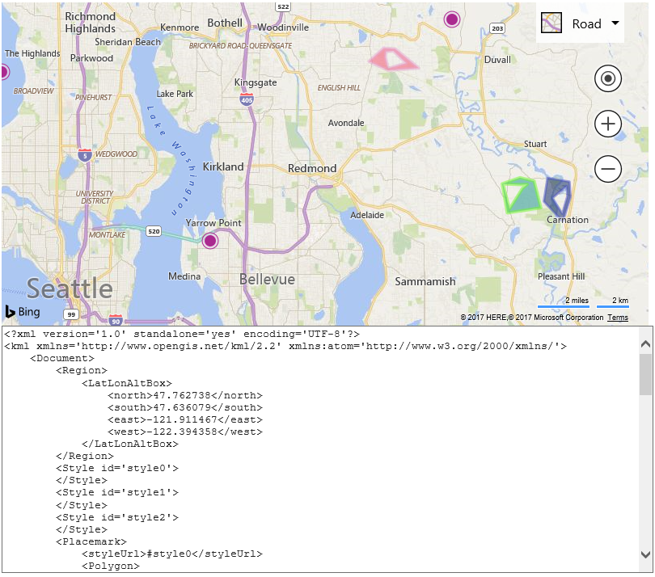

# Writing Geospatial XML data

[!INCLUDE [bing-maps-web-control-sdk-retirement](../../includes/bing-maps-web-control-sdk-retirement.md)]

The GeoXml module provides the ability to convert shapes into a spatial XML document. When writing you can pass in a map instance which will result in all shapes on the map being exported. Alternatively, you can also pass in a shape, an array of shapes, a layer, a ground overlay, or GeoXmlDataSet. In this sample we will export all shapes from the map as KML and display the XML in a text area below the map.

```html
<!DOCTYPE html>
<html>
<head>
    <title></title>
    <meta charset="utf-8" />
    <script type='text/javascript'>
    var map;
  
    function GetMap()
    {
        map = new Microsoft.Maps.Map('#myMap', {
            credentials: 'Your Bing Maps Key'
        });

        //Add a some random data to the map.
        var polygons = Microsoft.Maps.TestDataGenerator.getPolygons(3, map.getBounds(), 5, null, null, true);
        map.entities.push(polygons);

        var pushpins = Microsoft.Maps.TestDataGenerator.getPushpins(3, map.getBounds());
        map.entities.push(pushpins);

        //Load the GeoXml module.
        Microsoft.Maps.loadModule('Microsoft.Maps.GeoXml', function () {
            //Pass in the map to export all data on it into an XML string.
            var xml = Microsoft.Maps.GeoXml.write(map, {
                xmlFormat: Microsoft.Maps.GeoXmlFormat.kml,
                roundLocations: true,
                indentChars: '    ' //Use 4 spaces instead of \t for indenting as it looks better in the textarea.
            });

            //Display the XML in the text area.
            document.getElementById('xmlPanel').value = xml;
        });
    }
    </script>
    <script type='text/javascript' src='https://www.bing.com/api/maps/mapcontrol?callback=GetMap&branch=experimental' async defer></script>
</head>
<body>
    <div id="myMap" style="position:relative;width:800px;height:400px;"></div>
    
    <textarea id="xmlPanel" style="width:800px;height:300px;"></textarea>
</body>
</html>
```

If you run this sample you will see a map with some random pushpins and polygons on it, as well as a text area below the map which contains the KML markup for these shapes.


 
[Try it now](https://bingmapsv8samples.azurewebsites.net/#GeoXml%20-%20Write)
