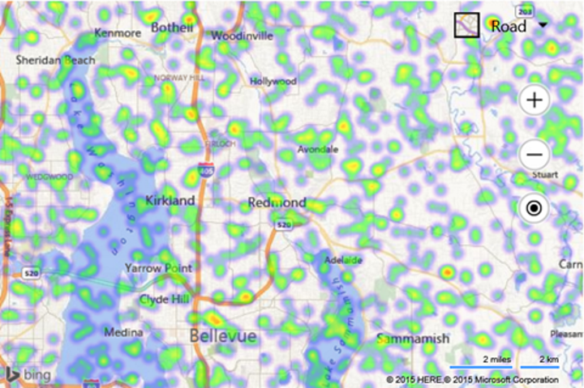

# Basic Heat Map Example

The following example loads 1,000 random locations into a heat map that are within the initial view of a loaded map.

```html
<!DOCTYPE html>
<html>
<head>
    <title></title>
    <meta charset="utf-8" />
	<script type='text/javascript'>
    function GetMap() {
        var map = new Microsoft.Maps.Map('#myMap', {
            credentials: ‘Your Bing Maps Key’
        });

        //Generate a 1,000 random locations that are within the bounds of the map view.
        var locs = Microsoft.Maps.TestDataGenerator.getLocations(1000, map.getBounds());

        //Load the HeatMap module.
        Microsoft.Maps.loadModule('Microsoft.Maps.HeatMap', function () {
            var heatmap = new Microsoft.Maps.HeatMapLayer(locs);
            map.layers.insert(heatmap);
        });
    }
    </script>
    <script type='text/javascript' src='http://www.bing.com/api/maps/mapcontrol?callback=GetMap' async defer></script>
</head>
<body>
    <div id="myMap" style="position:relative;width:600px;height:400px;"></div>
</body>
</html>
```

Here is what this random heat map looks like when the map is loaded over Redmond, WA. 

