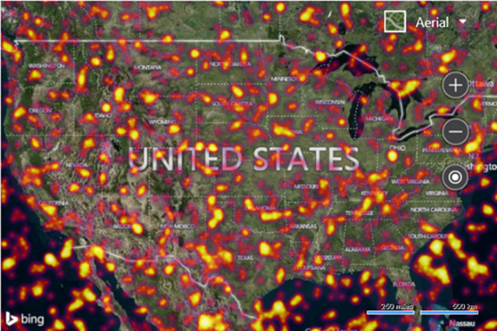

# Customized Heat Map Example
This example loads 50,000 random locations into the heat map layer. The heat map is customized such that the intensity is increased to 0.65, and a custom color gradient is used. The map is zoomed out over the USA and has the aerial imagery layer turned on so that the finer details of the heatmap can be easily seen.

```
<!DOCTYPE html>
<html>
<head>
    <title></title>
    <meta charset="utf-8" />
	<script type='text/javascript'>
    function GetMap() {
        var map = new Microsoft.Maps.Map('#myMap', {
            credentials: ‘Your Bing Maps Key’,
            mapTypeId: Microsoft.Maps.MapTypeId.aerial,
            center: new Microsoft.Maps.Location(39.5, -98.4),
            zoom: 4
        });
        //Generate a 50,000 random locations that are within the bounds of the map view.
        var locs = Microsoft.Maps.TestDataGenerator.getLocations(1000, map.getBounds());

        //Load the HeatMap module.
        Microsoft.Maps.loadModule('Microsoft.Maps.HeatMap', function () {
            var heatmap = new Microsoft.Maps.HeatMapLayer(locs, {
                intensity: 0.65,
                radius: 100000,
                unit: 'meters', 
                colorGradient: {
                    '0': 'Black',
                    '0.4': 'Purple',
                    '0.6': 'Red',
                    '0.8': 'Yellow',
                    '1': 'White'
                }
            });
            map.layers.insert(heatmap);
        });
    }
    </script>
    <script type='text/javascript' src='http://www.bing.com/api/maps/mapcontrol?callback=GetMap' async defer></script>
</head>
<body>
    <div id="myMap" style="position:relative;width:600px;height:400px;"></div>
</body>
</html>
```

Here is what this heat map looks like over the USA.



[Try it now](http://www.bing.com/api/maps/sdk/mapcontrol/isdk#customizedHeatMap+JS)