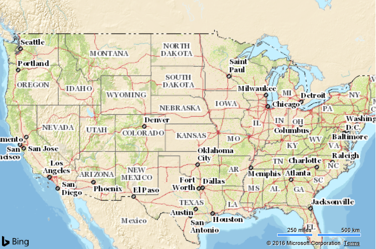

# Base Map Tile Layer Example
This example shows how to hide the base map tiles and display a custom map tile layer in its place. The source of the custom map tiles comes from the [ U.S. Geological Survey's - The Nation Map project](http://viewer.nationalmap.gov/help/HowTo.htm)

```
<!DOCTYPE html>
<html>
<head>
    <title></title>
    <meta charset="utf-8" />
    <script type='text/javascript'
            src='https://www.bing.com/api/maps/mapcontrol?callback=GetMap'
            async defer></script>

    <script type='text/javascript'>
        function GetMap() {
            var map = new Microsoft.Maps.Map('#myMap', {
                credentials: 'Your Bing Maps Key',
                mapTypeId: Microsoft.Maps.MapTypeId.mercator, //Hide the base map tile layer.
                maxZoom: 15, //Tiles are only available for the first 15 zoom levels.
                center: new Microsoft.Maps.Location(40, -99),
                zoom: 4,
                showDashboard: false 
            });

            //Define the tile source for the USGS Topo layer.
            var usgsTopoTileSource = new Microsoft.Maps.TileSource({
                uriConstructor: 'http://basemap.nationalmap.gov/arcgis/rest/services/USGSTopo/MapServer/tile/{zoom}/{y}/{x}',
                minZoom: 1,
                maxZoom: 15
            });

            //Create a tile layer from the tile source
            var usgsTopoTileLayer = new Microsoft.Maps.TileLayer({
                mercator: usgsTopoTileSource
            });

            //Add tile layer to the map.
            map.layers.insert(usgsTopoTileLayer);
        }
    </script>
</head>
<body>
    <div id="myMap" style="position:relative;width:600px;height:400px;"></div>
</body>
</html>
```

Running this code in a browser will display a map of the USA using the USGS National Map style. In addition to using different colors and label styles, additional map details appear at lower zoom levels such as elevation contour lines.


