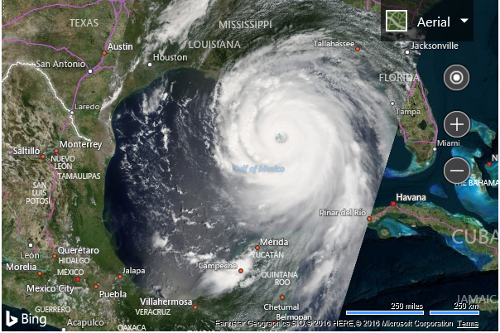

# Basic Tile Layer Example

The simplest implementation of the TileLayer class is to set the `mercator` property to a TileSource that has a `uriConstructor` property set to a URL which uses one or more of the tile URL parameters to access map tiles, such as the quadkey value. The following is an example of how to do this.

```javascript
//Create a tile layer source
var tileSource = new Microsoft.Maps.TileSource({
    uriConstructor: 'http://example.com/{quadkey}.png'
});

//Create a tile layer from the tile source
var tileLayer = new Microsoft.Maps.TileLayer({ mercator: tileSource });

//Add the tile layer to the map
map.layers.insert(tileLayer);
```

In order to add a tile layer to the map, you first need a source of map tile data. For this example, an [image of Huricane Katrina](https://earthobservatory.nasa.gov/NaturalHazards/view.php?id=15395) which was sourced from the [NASA/GSFC, Rapid Response team](https://earthdata.nasa.gov/earth-observation-data/near-real-time/rapid-response) was broken up into a set of tiles using a tool called [Microsoft MapCruncher](https://www.microsoft.com/download/details.aspx?id=22420). The generated tiles use a quadkey naming system and have been generated for the first 10 zoom levels of Bing Maps. The following code example shows how to add this tile layer to the map, by first defining a tile source which includes the URL to the tiles and the map bounds and zoom range of the tiles. By specifying the map bounds and zoom range of the tiles, we can save the map from requesting tiles in areas where we know there are none. Once the tile source is defined it can be used to create a tile layer.

```html
<!DOCTYPE html>
<html>
<head>
    <title></title>
    <meta charset="utf-8" />
	<script type='text/javascript'>
        function GetMap() {
            var map = new Microsoft.Maps.Map('#myMap', {
                credentials: 'Your Bing Maps Key',
                center: new Microsoft.Maps.Location(25, -90),
                zoom: 5,
                mapTypeId: Microsoft.Maps.MapTypeId.aerial
            });

            //Define the tile source using custom tiles of Hurricane Katrina for zoom level 1-10
            var katrinaTileSource = new Microsoft.Maps.TileSource({
                uriConstructor: 'https://bingmapsisdk.blob.core.windows.net/katrinatiles/{quadkey}.png',
                minZoom: 1,
                maxZoom: 10,
                bounds: Microsoft.Maps.LocationRect.fromEdges(35.176, -101.065, 14.01, -80.538)
            });

            //Create a tile layer from the tile source
            var katrinaTileLayer = new Microsoft.Maps.TileLayer({
                mercator: katrinaTileSource
            });

            //Add tile layer to the map.
            map.layers.insert(katrinaTileLayer);
        }
    </script>
    <script type='text/javascript' src='http://www.bing.com/api/maps/mapcontrol?callback=GetMap' async defer></script>
</head>
<body>
    <div id="myMap" style="position:relative;width:600px;height:400px;"></div>
</body>
</html>
```

Running this code will display an aerial map with a tile layer of hurricane Katrina overlaid on top. Notice that the image scales as you zoom the map. 



## Additional Resources

Here are some great tile layer sources that you may find useful:
* [Data.gov](https://catalog.data.gov/dataset?q=wms&sort=score+desc%2C+name+asc)
* [USGS](http://cumulus.cr.usgs.gov/services.php)
* [USGS (The National Map)](https://basemap.nationalmap.gov/arcgis/rest/services)
* [NOAA Weather Service](https://www.nws.noaa.gov/gis/services.html)
* [Iowa Environmental Mesonet of Iowa State University](https://mesonet.agron.iastate.edu/ogc/)
