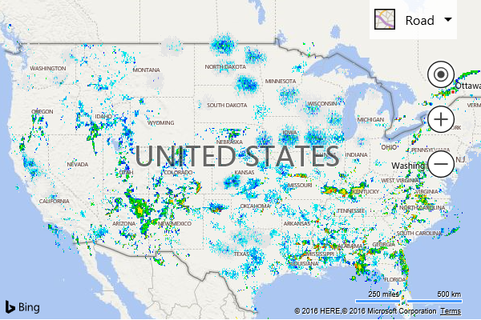

# WMS Tile Layer Example
[Web Mapping Services](https://en.wikipedia.org/wiki/Web_Map_Service) (WMS) is an Open Geospatial Consortium (OGC) standard for serving georeferenced map images. There are lots of data available in this format that can be overlaid on top of Bing Maps. 

WMS services usually require that certain information is specified such as the image width, height, bounding box and coordinate system. When using a WMS service as a tile layer, the width and height can be set to 256, which is the size of the map tiles used in Bing Maps. Coordinate systems supported by a WMS service varies from service to service. One that works well with Bing Maps in many cases is CRS:84 which is for the WGS 84 projection system which is used by GPS devices. 
When using a WMS service as a tile layer, the bounding box information of each map tile is used to request an image. When creating the WMS URL “{bbox}“ can be used as a placeholder for the bounding box information. The tile layer in Bing Maps will automatically file this in as needed. 

Note to be confused with the bounding box of the map tiles, WMS services usually publish the bounding box in which data is available. It is a good practice to specify this information when creating a tile layer as it will limit the tiles it requests to that area. 

This example shows how to take the [NOAA Base Reflective Weather Radar WMS service](http://www.nws.noaa.gov/gis/services.html) and display it as a tile layer on the map. 

```
<!DOCTYPE html>
<html>
<head>
    <title></title>
    <meta charset="utf-8" />
	<script type='text/javascript'>
        function GetMap() {
            var map = new Microsoft.Maps.Map('#myMap', {
                credentials: 'Your Bing Maps Key',
                center: new Microsoft.Maps.Location(40, -99),
                zoom: 4
            });

            var NOAAWeatherRadar = new Microsoft.Maps.TileLayer({
                mercator: new Microsoft.Maps.TileSource({
                    uriConstructor: 'http://idpgis.ncep.noaa.gov/arcgis/services/NWS_Observations/radar_base_reflectivity/MapServer/WmsServer?REQUEST=GetMap&SERVICE=WMS&VERSION=1.3.0&LAYERS=1&STYLES=default&FORMAT=image/png&TRANSPARENT=TRUE&CRS=CRS:84&BBOX={bbox}&WIDTH=256&HEIGHT=256',
                    minZoom: 3,
                    maxZoom: 10,
                    bounds: Microsoft.Maps.LocationRect.fromEdges(50.415613, -127.629361, 21.661516, -66.526907)
                })
            });

            map.layers.insert(NOAAWeatherRadar);
        }
    </script>
    <script type='text/javascript' src='http://www.bing.com/api/maps/mapcontrol?callback=GetMap' async defer></script>
</head>
<body>
    <div id="myMap" style="position:relative;width:600px;height:400px;"></div>
</body>
</html>
```

Running this code will display weather radar data over the USA.

