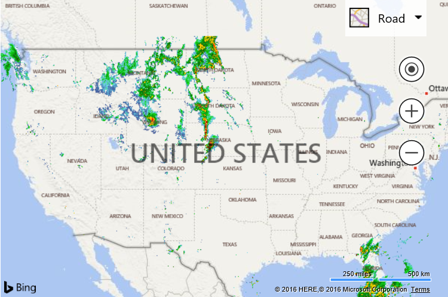

# X, Y, Zoom TileLayer

[!INCLUDE [bing-maps-web-control-sdk-retirement](../../includes/bing-maps-web-control-sdk-retirement.md)]

This example shows how to display a tile layer that uses an X, Y and Zoom tile URL schema. The source of this tile layer is a weather radar overlay from the [Iowa Environmental Mesonet of Iowa State University](https://mesonet.agron.iastate.edu/ogc/).

```html
<!DOCTYPE html>
<html>
<head>
    <title></title>
    <meta charset="utf-8" />
    <script type='text/javascript'
            src='https://www.bing.com/api/maps/mapcontrol?callback=GetMap'
            async defer></script>

    <script type='text/javascript'>
    var map;

    function GetMap() {
        map = new Microsoft.Maps.Map('#myMap', {
            credentials: 'You Bing Maps Key',
            center: new Microsoft.Maps.Location(40.75, -99.47),
            zoom: 4
        });

        //Weather radar tiles from Iowa Environmental Mesonet of Iowa State University
        var weatherTileLayer = new Microsoft.Maps.TileLayer({
            mercator: new Microsoft.Maps.TileSource({
                uriConstructor: 'https://mesonet.agron.iastate.edu/cache/tile.py/1.0.0/nexrad-n0q-900913/{zoom}/{x}/{y}.png'
            })
        });
        map.layers.insert(weatherTileLayer);
    }
    </script>
</head>
<body>
    <div id="myMap" style="position:relative;width:600px;height:400px;"></div>
</body>
</html>
```

Running this code in a browser will display a weather radar tile layer over top of the USA. 
 


[Try it now](https://www.bing.com/api/maps/sdk/mapcontrol/isdk#tileLayerPublicXYZoom+JS)
