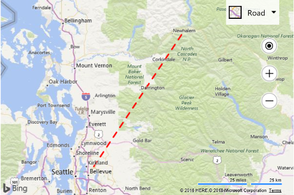

# Basic Polyline Example

The following code creates a polyline that is red in color, has a thickness of 3 pixels, and has a dash array where the stroke/gap sequence is "4, 4".  

```html
<!DOCTYPE html>
<html>
<head>
    <title></title>
    <meta charset="utf-8" />
	<script type='text/javascript'>
    function GetMap() {
        var map = new Microsoft.Maps.Map('#myMap', {});

        var center = map.getCenter();

        //Create array of locations
        var coords = [center, new Microsoft.Maps.Location(center.latitude + 1, center.longitude + 1)];

        //Create a polyline
        var line = new Microsoft.Maps.Polyline(coords, {
            strokeColor: 'red',
            strokeThickness: 3,
            strokeDashArray: [4, 4]
        });

        //Add the polyline to map
        map.entities.push(line);
    }
    </script>
    <script type='text/javascript' src='http://www.bing.com/api/maps/mapcontrol?callback=GetMap&key=[YOUR_BING_MAPS_KEY]' async defer></script>
</head>
<body>
    <div id="myMap" style="position:relative;width:600px;height:400px;"></div>
</body>
</html>
```

Here is what this polyline would look like when zoomed out. 


