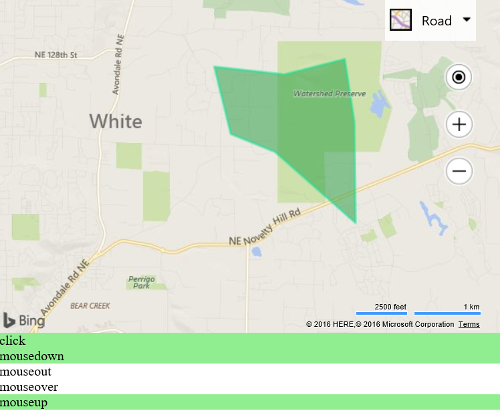

# Polygon Events

[!INCLUDE [bing-maps-web-control-sdk-retirement](../../includes/bing-maps-web-control-sdk-retirement.md)]

This example attaches several mouse events to a polygon. When these events fire they highlight a label to indicate which event fired. 

```html
<!DOCTYPE html>
<html>
<head>
    <title></title>
    <meta charset="utf-8" />
	<script type='text/javascript'>
    var map;

    function GetMap() {
        map = new Microsoft.Maps.Map('#myMap', {});

        //Create a random polygon.
        var polygon = Microsoft.Maps.TestDataGenerator.getPolygons(1, map.getBounds());

        //Add the polygon to map
        map.entities.push(polygon);

        //Add mouse events to the polygon.
        Microsoft.Maps.Events.addHandler(polygon, 'click', function () { highlight('polygonClick'); });
        Microsoft.Maps.Events.addHandler(polygon, 'mousedown', function () { highlight('polygonMousedown'); });
        Microsoft.Maps.Events.addHandler(polygon, 'mouseout', function () { highlight('polygonMouseout'); });
        Microsoft.Maps.Events.addHandler(polygon, 'mouseover', function () { highlight('polygonMouseover'); });
        Microsoft.Maps.Events.addHandler(polygon, 'mouseup', function () { highlight('polygonMouseup'); });
    }

    function highlight(id) {
        //Highlight the mouse event div to indicate that the event has fired.
        document.getElementById(id).style.background = 'LightGreen';

        //Remove the highlighting after a second.
        setTimeout(function () { document.getElementById(id).style.background = 'white'; }, 1000);
    }
    </script>
    <script type='text/javascript' src='http://www.bing.com/api/maps/mapcontrol?callback=GetMap&key=[YOUR_BING_MAPS_KEY]' async defer></script>
</head>
<body>
    <div id="myMap" style="position:relative;width:600px;height:400px;"></div>

    <div id="polygonClick">click</div>
    <div id="polygonMousedown">mousedown</div>
    <div id="polygonMouseout">mouseout</div>
    <div id="polygonMouseover">mouseover</div>
    <div id="polygonMouseup">mouseup</div>
</body>
</html>
```

If you run this code and hover and click the polygon you will see all these different events fire.



[Try it now](https://www.bing.com/api/maps/sdk/mapcontrol/isdk#polygonAllEvents+JS)