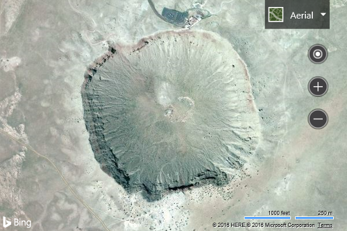

# Change the Map View

[!INCLUDE [bing-maps-web-control-sdk-retirement](../../../includes/bing-maps-web-control-sdk-retirement.md)]

There are two different ways to change the map view. One way is to use the **setView** function on the map. The other is to use the **setMapType** function. For most cases, you will likely use the **setView** method as this also allows you to specify other view settings, such as setting the center and zoom level. The following line of code can be used to center the map over [Barringer Crater](https://en.wikipedia.org/wiki/Meteor_Crater) located at coordinates 35.027222, -111.0225 and set the zoom level to 15.

```html
<!DOCTYPE html>
<html>
<head>
    <title></title>
    <meta charset="utf-8" />
	<script type='text/javascript'>
    function GetMap() {
        var map = new Microsoft.Maps.Map('#myMap',
        {});

        map.setView({
            mapTypeId: Microsoft.Maps.MapTypeId.aerial,
            center: new Microsoft.Maps.Location(35.027222, -111.0225),
            zoom: 15
        });
    }
    </script>
    <script type='text/javascript' src='http://www.bing.com/api/maps/mapcontrol?callback=GetMap&key=[YOUR_BING_MAPS_KEY]' async defer></script>
</head>
<body>
    <div id="myMap" style="position:relative;width:600px;height:400px;"></div>
</body>
</html>
```


[Try it now](https://www.bing.com/api/maps/sdk/mapcontrol/isdk#setMapViewOptions+JS)

One common scenario that developers come across is that they wish to display a set of objects on the map. They may mark these locations on the map using pushpins; however, this won’t set the map view to show those locations. You can use an array of locations used to create the Pushpins, and pass them into the **fromLocations** function on the **Microsoft.Maps.LocationRect** class. This function will return a **LocationRect** that encloses all the Location objects passed into it. This **LocationRect** can then be passed to the bounds setting property when setting the map view. Some developers may notice that this results in some pushpins being cut off at the maps edge. The reason for this is that the **fromLocations** function only calculates the bounding box based on the **Location** objects, and not on the additional area that the pushpin icons use. To accommodate this scenario, the padding setting can be used to buffer the view by a specified number of pixels. Generally setting this value to twice as large as the width/height of your pushpin icons works well. Here is a code sample that demonstrates how this can be done.

```javascript
var locs = [array of Microsoft.Maps.Location];
var rect = Microsoft.Maps.LocationRect.fromLocations(locs);

map.setView({ bounds: rect, padding: 80 });
```