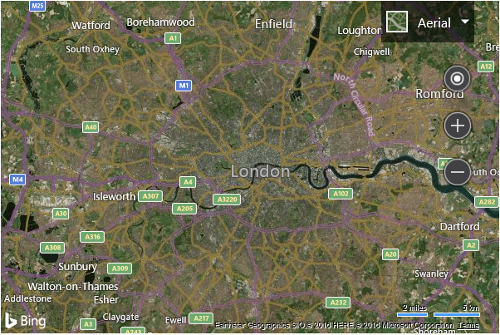

# Customize Map Options on Load

As mentioned before, you can customize the map when loading it. Use the following code to update how the map is loaded in the `GetMap` function such that it sets the type to aerial, the zoom level to 10, and the map center over London, UK (51.50632, -0.12714).

```html
<!DOCTYPE html>
<html>
<head>
    <title></title>
    <meta charset="utf-8" />

    <!-- Reference to the Bing Maps SDK -->
    <script type='text/javascript'
            src='http://www.bing.com/api/maps/mapcontrol?callback=GetMap' async defer></script>
    
    <script type='text/javascript'>
    function GetMap()
    {
        var map = new Microsoft.Maps.Map('#myMap', {
            credentials: 'Your Bing Maps Key',
            center: new Microsoft.Maps.Location(51.50632, -0.12714),
            mapTypeId: Microsoft.Maps.MapTypeId.aerial,
            zoom: 10
        });

        //Add your post map load code here.
    }
    </script>
</head>
<body>
    <div id="myMap" style="position:relative;width:600px;height:400px;"></div>
</body>
</html>
```

This results in the map being loaded, zoomed in over London, UK with the aerial imagery displayed.



[Try it now](https://www.bing.com/api/maps/sdk/mapcontrol/isdk#loadMapWithOptions+JS)