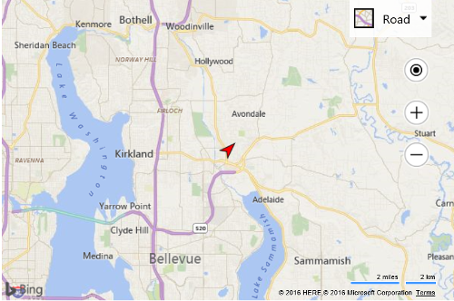

# Custom Canvas Pushpin Example

[!INCLUDE [bing-maps-web-control-sdk-retirement](../../includes/bing-maps-web-control-sdk-retirement.md)]

You can see how to dynamically create a custom image using an HTML5 canvas and use it to create a custom pushpin.

In this example, a function is created that takes in a heading and draws an arrow on a canvas such that it is rotated to point in the direction of the heading. This function then uses the HTML5 canvas `toDataURL` function to generate a base64 image string which is then passed into the `icon` property of the pushpin.

```html
<!DOCTYPE html>
<html>
<head>
    <title></title>
    <meta charset="utf-8" />
	<script type='text/javascript'>
    function GetMap() {
        var map = new Microsoft.Maps.Map('#myMap', {});

        var center = map.getCenter();

        //Create custom Pushpin using an HTML5 canvas.
        var pin = new Microsoft.Maps.Pushpin(center, {
            icon: createRedArrow(45),
            anchor: new Microsoft.Maps.Point(12, 12)
        });

        //Add the pushpin to the map
        map.entities.push(pin);
    }

    function createRedArrow(heading) {
        var c = document.createElement('canvas');
        c.width = 24;
        c.height = 24;

        var ctx = c.getContext('2d');
    
        //Offset the canvas such that we will rotate around the center of our arrow
        ctx.translate(c.width * 0.5, c.height * 0.5);

        //Rotate the canvas by the desired heading
        ctx.rotate(heading * Math.PI / 180);

        //Return the canvas offset back to it's original position
        ctx.translate(-c.width * 0.5, -c.height * 0.5);
    
        ctx.fillStyle = '#f00';

        //Draw a path in the shape of an arrow.
        ctx.beginPath();
        ctx.moveTo(12, 0);
        ctx.lineTo(5, 20);
        ctx.lineTo(12, 15);
        ctx.lineTo(19, 20);
        ctx.lineTo(12, 0);
        ctx.closePath();
        ctx.fill();
        ctx.stroke();

        //Generate the base64 image URL from the canvas.
        return c.toDataURL();
    }
    </script>
    <script type='text/javascript' src='http://www.bing.com/api/maps/mapcontrol?callback=GetMap&key=[YOUR_BING_MAPS_KEY]' async defer></script>
</head>
<body>
    <div id="myMap" style="position:relative;width:600px;height:400px;"></div>
</body>
</html>
```

Here is what this pushpin looks like on the map.
 


[Try it now](https://www.bing.com/api/maps/sdk/mapcontrol/isdk#createPushpinFromCanvas+JS)