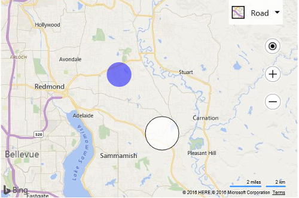

# Dynamically create SVG Pushpin Example

This code sample shows how to dynamically create SVG circles for pushpins icons. This is useful when you want to customize a pushpin icon apparence, such as color and size, based on some data metric. The following code has a function called createCirclePushpin which takes in the location of the pushpin, a radius for the circle icon, a fill and strok color, and a stroke width value. This function then uses this information to create an SVG string for the pushpin and sets the anchor of the pushpin to the center of the circle. 

```html
<!DOCTYPE html>
<html>
<head>
    <title></title>
    <meta charset="utf-8" />
	<script type='text/javascript'>
    function GetMap() {
        var map = new Microsoft.Maps.Map('#myMap', {});

        //Generate 2 random locations within the current map view.
        var locs = Microsoft.Maps.TestDataGenerator.getLocations(2, map.getBounds());

        //Create a blue circle that has a 25 pixel radius as a pushpin and add to map.
        var pin1 = createCirclePushpin(locs[0], 25, 'rgba(0, 0, 255, 0.5)');
        map.entities.push(pin1);

        //Create a white circle that has a 35 pixel radius and a black outline as a pushpin and add to map.
        var pin2 = createCirclePushpin(locs[1], 35, 'rgba(255, 255, 255, 0.8)', 'black', 1);
        map.entities.push(pin2);
    }

    function createCirclePushpin(location, radius, fillColor, strokeColor, strokeWidth) {
        strokeWidth = strokeWidth || 0;

        //Create an SVG string of a circle with the specified radius and color.
        var svg = ['<svg xmlns="http://www.w3.org/2000/svg" width="', (radius * 2),
            '" height="', (radius * 2), '"><circle cx="', radius, '" cy="', radius, '" r="',
            (radius - strokeWidth), '" stroke="', strokeColor, '" stroke-width="', strokeWidth, '" fill="', fillColor, '"/></svg>'];

        //Create a pushpin from the SVG and anchor it to the center of the circle.
        return new Microsoft.Maps.Pushpin(location, {
            icon: svg.join(''),
            anchor: new Microsoft.Maps.Point(radius, radius)
        });
    }
    </script>
    <script type='text/javascript' src='http://www.bing.com/api/maps/mapcontrol?callback=GetMap&key=[YOUR_BING_MAPS_KEY]' async defer></script>
</head>
<body>
    <div id="myMap" style="position:relative;width:600px;height:400px;"></div>
</body>
</html>
```

Running this code adds two circle pushpins of different radii at random locations on the map. One is white with a black outline and the other is blue.



**Note:** You can also add the text “{color}” into your SVG string and the pushpin will replace this placeholder with the value of the `color` property of the specified pushpin option.