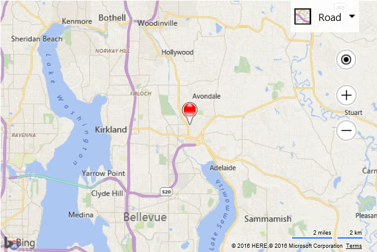

# Image and Canvas Pushpin Example

Its fairly easy to create a custom pushpin using an HTML5 canvas, however if you are trying to draw an image on your canvas it can be a bit tricky. Images load asynchronously, as such you need to load them before you can draw them to the canvas. This code example shows how to create custom colored pushpins that use an image as a template. The template image looks like this:

 &nbsp; TransparentPushpin.png

Note that the circular part of the pushpin has some transparency. By drawing a circle filled with a desired color on a canvas and then overlaying this image on top we end up with a nice easy way to create custom colored pushpins that fit an image template.

 ```html
<!DOCTYPE html>
<html>
<head>
    <title></title>
    <meta charset="utf-8" />
	<script type='text/javascript'>
    function GetMap() {
        var map = new Microsoft.Maps.Map('#myMap', {});

        createColoredPushpin(map.getCenter(), 'red', function (pin) {
            map.entities.push(pin);
        });        
    }

    function createColoredPushpin(location, color, callback) {
        var img = new Image();
        img.onload = function () {
            var c = document.createElement('canvas');
            c.width = img.width;
            c.height = img.height;

            var context = c.getContext('2d');

            //Draw a colored circle behind the pin
            context.beginPath();
            context.arc(13, 13, 11, 0, 2 * Math.PI, false);
            context.fillStyle = color;
            context.fill();

            //Draw the pushpin icon
            context.drawImage(img, 0, 0);

            var pin = new Microsoft.Maps.Pushpin(location, {
                //Generate a base64 image URL from the canvas.
                icon: c.toDataURL(),
                anchor: new Microsoft.Maps.Point(12, 39)
            });

            if (callback) {
                callback(pin);
            }
        };

        img.src = 'images/TransparentPushpin.png';
    }
    </script>
    <script type='text/javascript' src='http://www.bing.com/api/maps/mapcontrol?callback=GetMap&key=[YOUR_BING_MAPS_KEY]' async defer></script>
</head>
<body>
    <div id="myMap" style="position:relative;width:600px;height:400px;"></div>
</body>
</html>
```

Here is what this pushpin looks like on the map.


