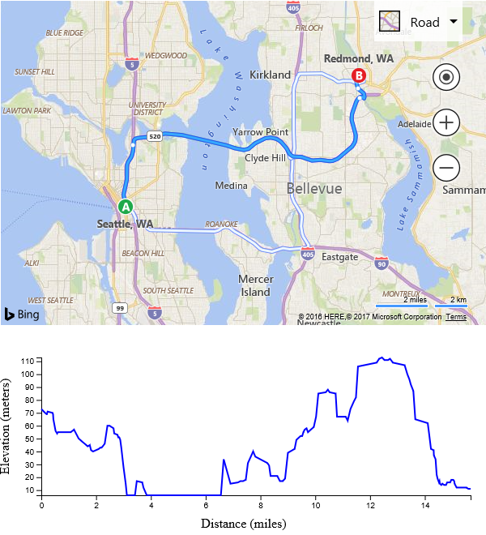

# Elevation Profiles
The Bing Maps REST services provides a number of useful services. The [Elevation API](../rest-services/elevations/index.md) provides elevation data from around the world. This code sample shows how to generate an elevation profiles along a route. 

```
<!DOCTYPE html>
<html>
<head>
    <title></title>
    <meta charset="utf-8" />
    <script type='text/javascript' src='https://www.bing.com/api/maps/mapcontrol?callback=GetMap' async defer></script>

    <!-- Load external jQuery and D3 libraries. -->
    <script type='text/javascript' src="http://ajax.aspnetcdn.com/ajax/jQuery/jquery-3.1.1.min.js"></script>
    <script src="https://d3js.org/d3.v4.min.js"></script>

    <script type='text/javascript'>
    var map, sessionKey;
    var elevationServiceURL = 'https://dev.virtualearth.net/REST/v1/Elevation/List';
    var maxElevationSteps = 300;

    function GetMap()
    {
        map = new Microsoft.Maps.Map('#myMap', {
            credentials: 'Your Bing Maps Key'
        });

        //Get a session key from the map and use with the REST services to make requests non-billable transactions.
        map.getCredentials(function (c) {
            sessionKey = c;
        });

        //Load the directions and spatial math modules.
        Microsoft.Maps.loadModule(['Microsoft.Maps.Directions', 'Microsoft.Maps.SpatialMath'], function () {
            //Create an instance of the directions manager.
            directionsManager = new Microsoft.Maps.Directions.DirectionsManager(map);
            directionsManager.setRequestOptions({
                routeMode: Microsoft.Maps.Directions.RouteMode.driving
            });

            //Create waypoints to route between.
            var start = new Microsoft.Maps.Directions.Waypoint({ address: 'Seatle, WA' });
            directionsManager.addWaypoint(start);

            var end = new Microsoft.Maps.Directions.Waypoint({ address: 'Redmond, WA' });
            directionsManager.addWaypoint(end);

            //Add an event handler to the directions manager.
            Microsoft.Maps.Events.addHandler(directionsManager, 'directionsUpdated', directionsUpdated);

            //Calculate directions.
            directionsManager.calculateDirections();
        });
    }

    function directionsUpdated(e) {
        //Get the current route index.
        var routeIdx = directionsManager.getRequestOptions().routeIndex;

        var route = e.route[routeIdx];

        var locs = [];
        var distances = [0];
        var incrementer = 1;

        //If there are too many locations, the URL to the elevation service will be too long for the browser.
        //For simplicity skip every n'th location.
        if (route.routePath.length > maxElevationSteps) {
            incrementer = Math.ceil(route.routePath.length / maxElevationSteps);
        }

        var distance = 0;
        var loc = route.routePath[0];

        for (var i = 1; i < route.routePath.length; i += incrementer) {
            //Calculate the current distance along the route path.
            distance += Microsoft.Maps.SpatialMath.getDistanceTo(loc, route.routePath[i], Microsoft.Maps.SpatialMath.DistanceUnits.Miles);
            distances.push(distance);

            //Add the current location to the location array.
            loc = route.routePath[i];
            locs.push(loc);            
        }

        //Request elevation data from the Bing Maps REST Elevation Service.
        $.ajax({
            url: elevationServiceURL,
            data: {
                //Encode the location array as required by the elevation service.
                points: Microsoft.Maps.PointCompression.encode(locs),
                key: sessionKey,
            },
            dataType: "jsonp",
            jsonp: "jsonp",
            context: this,
            success: function (data) {
                if (data != null &&
                        data.resourceSets &&
                        data.resourceSets.length > 0 &&
                        data.resourceSets[0].resources &&
                        data.resourceSets[0].resources.length > 0) {

                    var elevations = data.resourceSets[0].resources[0].elevations;

                    createElevationProfile(distances, elevations);
                }
            },
            error: function (e) {
                alert(e);
            }
        });
    }

    function createElevationProfile(distances, elevations) {
        var data = [];

        //Combine the distances and elevations into a x/y data set that the chart control can understand.
        for (var i = 0; i < elevations.length; i++) {
            data.push({ x: distances[i], y: elevations[i] });
        }

        //Get the chart area SVG.
        var svg = d3.select('#chartArea');

        //Remove any previously generated chart content.
        svg.selectAll('*').remove();

        //Get the height and width of the SVG area.
        var width = svg.attr('width');
        var height = svg.attr('height');

        //Specify some margins around the chart.
        var margins = {
            top: 40,
            right: 20,
            bottom: 40,
            left: 50
        };

        //Create the x and y ranges.
        var xRange = d3.scaleLinear().range([margins.left, width - margins.right])
            .domain([d3.min(data, function (d) {
                return d.x;
            }), d3.max(data, function (d) {
                return d.x;
            })]);

        var yRange = d3.scaleLinear().range([height - margins.top, margins.bottom])
            .domain([d3.min(data, function (d) {
                return d.y;
            }), d3.max(data, function (d) {
                return d.y;
            })]);

        //Create the x-axis.
        svg.append('g')
            .attr('transform', 'translate(0,' + (height - margins.bottom) + ')')
            .call(d3.axisBottom(xRange));

        svg.append('text')
            .attr('x', width/2)
            .attr('y', height)
            .style('text-anchor', 'middle')
            .text('Distance (miles)');

        //Create the y-axis.
        svg.append('g')
            .attr('transform', 'translate(' + (margins.left) + ',0)')
            .call(d3.axisLeft(yRange));

        svg.append('text')
            .attr('x', -(height / 2))
            .attr('y', 10)
            .attr('transform', 'rotate(-90)')
            .style('text-anchor', 'middle')
            .text('Elevation (meters)');

        //Create a function for getting the points for the SVG path.
        var lineFunc = d3.line()
              .x(function (d) {
                  return xRange(d.x);
              })
              .y(function (d) {
                  return yRange(d.y);
              });
       
        //Create the elvation profile line.
        svg.append('svg:path')
            .attr('d', lineFunc(data))
            .attr('stroke', 'blue')
            .attr('stroke-width', 2)
            .attr('fill', 'none');
    }
    </script>
</head>
<body>
    <div id="myMap" style="position:relative;width:600px;height:400px;"></div>
    <svg id="chartArea" width="600" height="250"></svg>
</body>
</html>
```

If you run this code in a browser, you will see a map with a route from Seattle, WA to Redmond, WA displayed. Below the map will be a chart displaying the elevation profile of the route.


