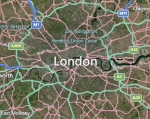
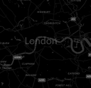
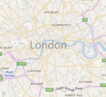
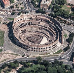
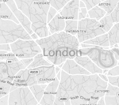
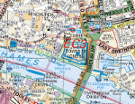
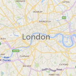
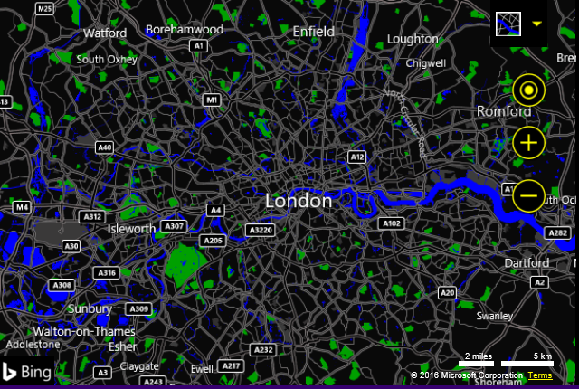

# MapTypeId Enumeration
This enumeration is used to specify the type of map style that should be displayed by the map.  It is specified as `Microsoft.Maps.MapTypeId.[Name]` where `[Name]` can be any of the following values.

Name             | Description                        | Example
---------------- | ---------------------------------- | :------------------------:
`aerial`         | The map displays aerial imagery.   |  
`canvasDark`     | A dark version of the road maps. | 
`canvasLight`    | A lighter version of the road maps which also has some of the details such as hill shading disabled. | 
`birdseye` | High resolution aerial imagery taken at 45 degrees to the ground, from 4 different directions. | 
`grayscale`      | A grayscale version of the road maps. | 
`mercator`       | The map does not display any imagery. Use this option if you want to display custom imagery instead of Bing Maps imagery. | 
`ordnanceSurvey` | The map displays Ordnance Survey imagery. Ordnance Survey imagery is only available in the UK. Bing Maps provides the 1:25,000 OS Explorer Map and 1:50,000 OS Landranger maps. When the map is panned or zoomed out of range, road map imagery will be displayed. Map culture must be set to en-GB. 	    | 
`road`           | The map displays road imagery.	    | 
`streetside`     | Provides streetside panoramas from the street level.  | 

## High Contrast Support

To make Bing Maps more accessible, high contrast support has been added. When the user’s computer is in high contrast mode, a high contrast version of the road maps will be displayed. 
 

