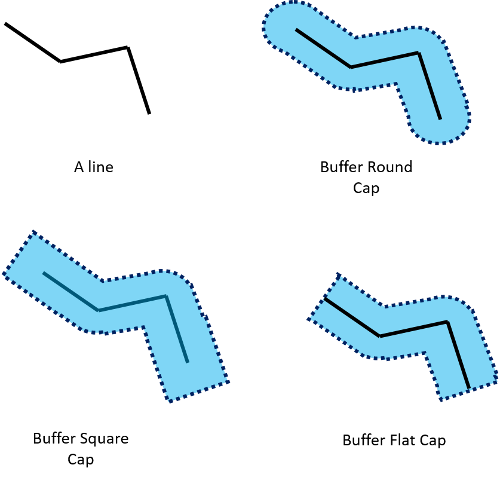

# BufferEndCap Enumeration

[!INCLUDE [bing-maps-web-control-sdk-retirement](../../../includes/bing-maps-web-control-sdk-retirement.md)]

This enumeration defines how the end of a line should be buffered. You can access this enumeration with the `Microsoft.Maps.SpatialMath.Geometry.BufferEndCap` namespace.

| Name | Description |
|------|-------------|
| Round | Adds a rounded end to a buffered line. |
| Flat | Adds a flat end to a buffered line that touches the end of the line. |
| Square | Adds a square end to a buffered line that has a buffer area at the end of the line |

The following diagram shows the different between these different end caps.

