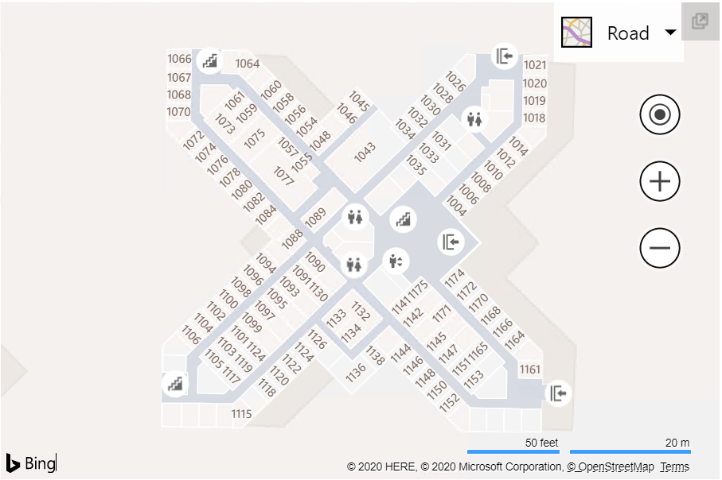

# Venue Maps Module

**Module Name**: Microsoft.Maps.VenueMaps

**Namespace**: Microsoft.Maps.VenueMaps

[Venue](../../../venues/venue.md) is a JSON format defined by Microsoft for representing venues. The Bing Maps V8 Web Control uses the Venue Maps Module to dynamically display venues on the map.

Venue maps are created using the [VenueMapFactory](venuemapfactory-class.md) class. A [VenueMap](venuemap-class.md) is associated with a [Map](../../map-control-api/map-class.md) instance. 

 <b> VenueMap </b>  
                                              
 

## API Reference

* [VenueMapFactory Class](venuemapfactory-class.md)
* [VenueMap Class](venuemap-class.md)
* [VenueMapOptions Object](venuemapoptions-object.md)

## Examples

  * [Load Venue Map Using Metadata Url](https://www.bing.com/api/maps/mapcontrol/isdk/vmmetadataurl)
  * [Load Venue Map Using Metadata Url with JSONP](https://www.bing.com/api/maps/mapcontrol/isdk/vmmetadataurljsonp)
  * [Load Venue Map Using Metadata loader](https://www.bing.com/api/maps/mapcontrol/isdk/vmmetadataloader)
  * [Set Active Floor](https://www.bing.com/api/maps/mapcontrol/isdk/setactivefloor)
  * [Hide Venue Map](https://www.bing.com/api/maps/mapcontrol/isdk/hidevenuemap)
  * [Show Floor Switcher](https://www.bing.com/api/maps/mapcontrol/isdk/showfloorswitcher)
  