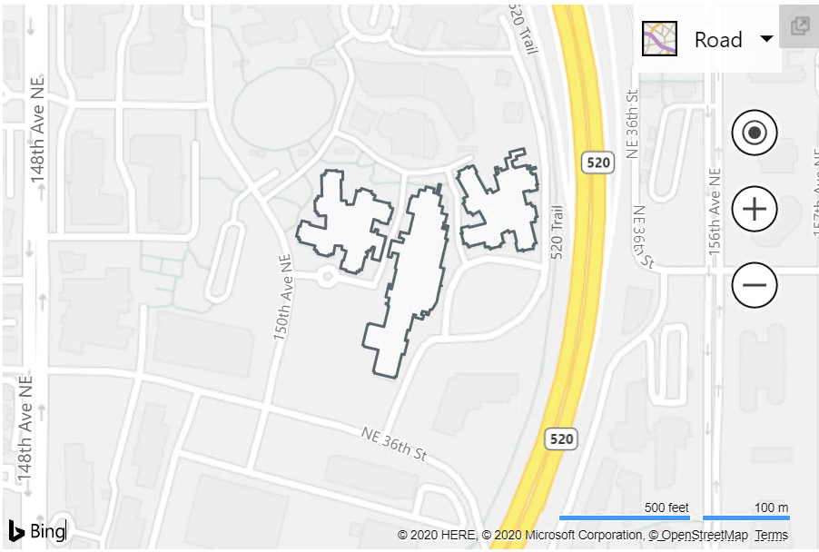

# Venue Maps Module

**Module Name**: Microsoft.Maps.VenueMaps

**Namespace**: Microsoft.Maps.VenueMaps

[Venue](../../venues/venue.md) is a JSON format defined by Microsoft for representing venues. [VenueTile](../../venues/venueTile.md) is a JSON format defined by Microsoft that contains footprints that overlap the tile. The Bing Maps V8 Web Control uses the Venue Maps Module to dynamically display venues and venue tiles on the map.

Venue maps are created using the [VenueMapFactory](venuemapfactory-class.md) class. A [VenueMap](venuemap-class.md) is associated with a [Map](../../map-control-api/map-class.md) instance. 

The VenueMapFactory can also create a venue map footprints layer. A [VenueMapFootprintsLayer](venuemapfootprintslayer-class.md) is also associated with a map instance.

Venue Map                                                            | Venue Map Footprints Layer
---------------------------------------------------------------- | ---------------------------- 
 | 

## API Reference

* [VenueMapFactory Class](venuemapfactory-class.md)
* [VenueMap Class](venuemap-class.md)
* [VenueMapOptions Object](venuemapoptions-object.md)
* [VenueMapFootprintsLayerOptions Object](venuemapfootprintslayeroptions-object.md)

## Examples

  * [Create a Venue Map](https://www.bing.com/api/maps/mapcontrol/isdk/createvenuemap)
  * [Create a Venue Map with Options](https://www.bing.com/api/maps/mapcontrol/isdk/createvenuemapwithoption)
  * [Set Active Floor](https://www.bing.com/api/maps/mapcontrol/isdk/setactivefloor)
  * [Get Venue Info](https://www.bing.com/api/maps/mapcontrol/isdk/getvenueinfo)
  * [Hide Venue Map](https://www.bing.com/api/maps/mapcontrol/isdk/hidevenuemap)
  * [Custom Venue Map Metadata Url](https://www.bing.com/api/maps/mapcontrol/isdk/customvenuemapmetadataurl)
  * [Custom Venue Map Metadata Loader](https://www.bing.com/api/maps/mapcontrol/isdk/customvenuemapmetadataloader)
  * [Custom Venue Map Footprints Metadata Loader](https://www.bing.com/api/maps/mapcontrol/isdk/venuemapfootprintsmetadata)