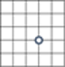
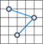
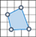
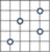
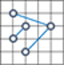
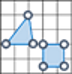
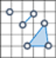

# Well Known Text Module

[!INCLUDE [bing-maps-web-control-sdk-retirement](../../includes/bing-maps-web-control-sdk-retirement.md)]

**Module Name**: Microsoft.Maps.WellKnownText

**Namespace**: Microsoft.Maps.WellKnownText

Well Known Text (WKT) is an Open Geospatial Consortium (OGC) standard that is used to represent spatial data in a textual format. Most OGC-compliant systems support Well Known Text. Spatial functionality in SQL Server 2008, 2012, and SQL Azure can easily convert between a spatial object in the database and WKT. A WKT can only store the information for a single spatial object and this spatial data format is usually used as part of a larger file format or web service response. The following are examples of each of the geometry types represented as Well Known Text and the equivalent Bing Maps class that is generated when parsing a Well Known Text string. 

Geometry Type             | Graphic                                                                | Example                                                                                              | Equivalent Bing Maps Class
------------------------- | --------------------------------------------------------------- | ---------------------------------------------------------------------------------------------------- | ---------------------------------------------------
Point                     |               | POINT(-122.349 47.651)                                                                               | Pushpin
LineString                |     | LINESTRING(-122.360 47.656, -122.343 47.656)                                                                   | Polyline
Polygon                   |           | POLYGON((-122.358 47.653, -122.348 47.649, -122.348 47.658, -122.358 47.658, -122.358 47.653))                 | Polygon
MultiPoint                |     | MULTIPOINT(-122.360 47.656, -122.343 47.656)                                                                   | Pushpin[]
MultiLineString           |          | MULTILINESTRING ((-122.358 47.653, -122.348 47.649, -122.348 47.658), (-122.357 47.654, -122.357 47.657, -122.349 47.657, -122.349 47.650))  |  Polyline[]
MultiPolygon	 	      |          | MULTIPOLYGON(((-122.358 47.653, -122.348 47.649, -122.358 47.658, -122.358 47.653)), ((-122.341 47.656, -122.341 47.661, -122.351 47.661, -122.341 47.656)))  | Polygon[]
GeometryCollection        |          | GEOMETRYCOLLECTION ( POINT(-122.34900 47.65100), LINESTRING(-122.360 47.656, -122.343 47.656))                 | (Pushpin _or_ Polyline _or_ Polygon)[]

The coordinates in a WKT shape are ordered as “longitude latitude” which is important to remember as this is the opposite convention used by Bing Maps. The reasoning for this ordering is to be more consistent with geometric (X, Y) coordinate conventions. Since WKT is nothing more than a string with a defined format, they can be easily created and parsed.

The WellKnownText module only has one static class called WellKnownText that allows you to read and write Well Known Text data. 

## Static Methods

Name                                         | Return Value                   | Description
-------------------------------------------- | ------------------------------ | ----------------------------------------
read(wkt: string, styles?: [StylesOptions](../map-control-api/stylesoptions-object.md))         | [IPrimitive](../map-control-api/iprimitive-class.md) _or_ [IPrimitive](../map-control-api/iprimitive-class.md)[]   | Reads the data in well known text format and returns the shapes.
write(data: [IPrimitive](../map-control-api/iprimitive-class.md) _or_ [IPrimitive](../map-control-api/iprimitive-class.md)[])          | string                         | Writes the data as a well known text.

## Examples

  * [Read Well Known Text](../map-control-concepts/well-known-text-examples/well-known-text-read-example.md)
  * [Write Well Known Text](../map-control-concepts/well-known-text-examples/well-known-text-write-example.md)
  
  

