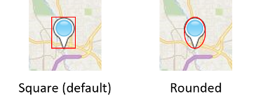

# PushpinOptions Object
When creating a pushpin, a location must be passed as an argument to the constructor. Optionally pushpin options can also be passed in as an argument. The following pushpin option properties can be used to create customized pushpins.

| Name                 | Type     | Description     |
|----------------------|----------|-----------------|
| `anchor`             | [Point](Point%20Class.md) | The point on the pushpin icon, in pixels, which is anchored to the pushpin location. An anchor of (0,0) is the top left corner of the icon.    |
| `color`              | string _or_ [Color](Color%20Class.md) | Specifies what color to make the default pushpin.     |
| `cursor`             | string       | The css cursor to show when pushpin has mouse events on it. Default value is **pointer** (hand). |
| `draggable`          | boolean      | A boolean indicating whether the pushpin can be dragged to a new position with the mouse or by touch.|
| `enableClickedStyle` | boolean      | Specifies whether to enable the clicked style on the pushpin. To unselect a pushpin, simply click it again. Alternatively, you can disable then reenable this property.  |
| `enableHoverStyle`   | boolean      | Specifies whether to enable the hover style on the pushpin.                                                                                   |
| `icon`               | string       | Defines the the icon to use for the pushpin. This can be a URL to an Image or SVG file, an image data URI, or an inline SVG string.  **Tip**: When using inline SVG, you can pass in placeholders `{color}` and `{text}` in your SVG string. This placeholder will be replaced by the pushpins color or text property value when rendered.  **Note:** SVG’s are converted into a static image before being rendered as a pushpin. As such embedded images should use data URI’s and not links to files as the file will not load before the SVG is rendered. CSS classes are also not supported on SVG’s, however inline styles are.                  |                             
| `roundClickableArea` | boolean      | A boolean indicating whether the clickable area of pushpin should be an ellipse instead of a rectangle. By default, a rectangular area the size of the icon is used to create the cliackable area. Depending on the shape of your icon, there could be a lot of empty space in the corners of these square areas where the icon has no content, but is clickable. If another pushpin was below this area empty area it wouldn’t be clickable. When this option is set to true, a rounded clickable area (ellipse) is created from the width/height of the icon. This often reduces a lot of the empty are for many non-rectangular icons.    |
| `subTitle`           | string       | A secondary title label value to display under the pushpin. Uses label collision detection. This label automatically changes color between white and dark grey depending on which map style is selected. Requires the title label to be set. |
| `title`              | string       | The title label value to display under the pushpin. This label automatically changes color between white and dark grey depending on which map style is selected. Pushpin Titles support label collision detection, as described below.       |
| `text`               | string       | A short string of text that is overlaid on top of the pushpin.  |
| `textOffset`         | [Point](Point%20Class.md)         | The amount the text is shifted from the pushpin icon. The default value is (0,5).  |
| `visible`            | boolean      | A boolean indicating whether to show or hide the pushpin. The default value is true. A value of false indicates that the pushpin is hidden, although it is still an entity on the map.                                                       |

The **title** and **subTitle** labels render below the pushpin but may not always be displayed. If a label on the map collides with the pushpins label, the maps label will either move out of the way, or will be hidden. If a lot of pushpins are displayed on the, some colliding pushpin labels will be hidden to so that the displayed labels are readable.